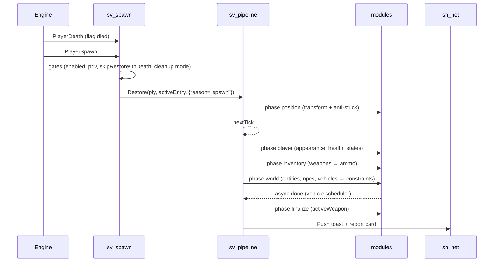
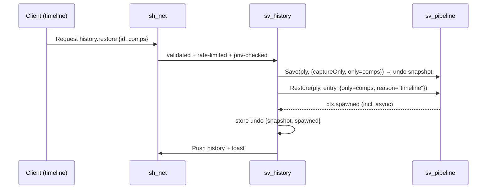

# Rareload v5 — Full Rewrite Plan

> **Status:** proposal · **Work branch:** `Rareload_Rewrite_Branch` · **Baseline:** v4 (`origin/main` @ `58a3d92`)
> **End state:** v4 frozen on `legacy/v4`; v5 merged into `main` and becomes the only maintained version.
>
> **Goal:** rebuild Rareload from scratch with **every v4 feature**, in about **half the code and a third of the files**, with exactly **one way to do each thing**.

---

## Contents

**Part I — Context**
0. [How to use this document](#0-how-to-use-this-document)
1. [TL;DR](#1-tldr)
2. [Goals, non-goals, success metrics](#2-goals-non-goals-success-metrics)
3. [Branch & release strategy](#3-branch--release-strategy)
4. [Audit of v4](#4-audit-of-v4)
5. [Lessons learned from v4 history](#5-lessons-learned-from-v4-history)

**Part II — Requirements**
6. [Feature parity inventory](#6-feature-parity-inventory)
7. [Gameplay edge cases](#7-gameplay-edge-cases)
8. [Security model](#8-security-model)
9. [Performance budgets](#9-performance-budgets)

**Part III — Design**
10. [Architecture](#10-architecture)
11. [Target file tree & line budgets](#11-target-file-tree--line-budgets)
12. [Old → new file mapping](#12-old--new-file-mapping)
13. [Core APIs](#13-core-apis)
14. [State modules](#14-state-modules)
15. [Save & restore pipeline](#15-save--restore-pipeline)
16. [Data format v5 & migration](#16-data-format-v5--migration)
17. [Networking](#17-networking)
18. [Settings & permissions model](#18-settings--permissions-model)
19. [Anti-stuck](#19-anti-stuck)
20. [Vehicles](#20-vehicles)
21. [Client architecture](#21-client-architecture)
22. [Logging & debug](#22-logging--debug)
23. [Commands](#23-commands)
24. [Public API for other addons](#24-public-api-for-other-addons)
25. [Localization](#25-localization)

**Part IV — Execution**
26. [Coding conventions](#26-coding-conventions)
27. [Tooling & CI](#27-tooling--ci)
28. [Roadmap](#28-roadmap)
29. [Definition of done](#29-definition-of-done)
30. [Testing strategy](#30-testing-strategy)
31. [Risks & mitigations](#31-risks--mitigations)
32. [v4 bugs not to carry over](#32-v4-bugs-not-to-carry-over)
33. [Open decisions](#33-open-decisions)

**Appendices:** [A. Hook & event reference](#appendix-a--hook--event-reference) · [B. Glossary](#appendix-b--glossary)

---

# Part I — Context

## 0. How to use this document

- **Sections 6–9 are the requirements.** Nothing is "done" until it meets them.
- **Sections 10–25 are the design.** If the code has to differ from the design, update this document in the same PR. The plan and the code must never disagree.
- **Section 28 is the work queue.** Each checkbox is roughly one PR.
- IDs are stable so commits and PRs can cite them: **F**-features (§6), **E**-edge cases (§7), **S**-security rules (§8), **L**-lessons (§5), **B**-v4 bugs (§32), **D**-decisions (§33).
- Commit messages and PR descriptions reference IDs, e.g. `Add ammo module (F9, L9)`.

## 1. TL;DR

| | v4 (today) | v5 (target) |
|---|---|---|
| Lua code files (excl. lang) | **118** | **~37** |
| Lines of code (excl. lang) | **~24,100** | **~13,500** |
| Settings systems | **5** (convars, `RARELOAD.settings`, player settings, tunables, `AntiStuck.CONFIG`) | **1** registry |
| Net message names | **25** | **2** channels + opcodes |
| Console commands | **21** | **1** dispatcher (`rareload …`) + `save_position` alias |
| Include list | ~80 hand-ordered lines | auto-loader |
| Global functions | 9 | 0 (only `RARELOAD`) |
| Files touched to add a saved state | 6+ | **1** module file (+ lang keys) |
| Restore ordering | timer guesses (`0.05 / 0.1 / 0.5 / 0.6 / 1 s`) | explicit phases + dependencies + readiness waits |
| Restore implementations | 2 (respawn providers, timeline `ApplyHistoryComponents`) | 1 pipeline |
| Save storage | current save **and** history hold separate copies | current = pointer into history; heavy data deduped by hash |
| Automated checks | none | lint + offline unit tests in CI + in-game `rareload selftest` |

The three ideas that do most of the work:

1. **Module = feature.** One file declares the save, restore, settings, permissions and summary for one piece of state. The timeline, report cards, world display and inspector all use it.
2. **Setting = declaration.** One declaration generates the convar, the per-player override, the menu control, the net validation and the clamping.
3. **Pipeline = one path.** Respawn restore, timeline restore, partial restore, reload-key restore and undo all go through the same phased runner.

## 2. Goals, non-goals, success metrics

### Goals
- **100% parity** with v4 (§6). A user-visible feature can only disappear through an explicit decision in §33.
- **Drop-in upgrade**: v4 data imports automatically (§16.5), server convar names keep working, CAMI privilege names stay the same, and a `save_position` key bind still works.
- **Extensible**: a new saved state is one file. A new setting is one declaration. A new vehicle base is one adapter table. Other addons can do all three through a documented API (§24).
- **Deterministic**: restores never depend on guessed delays.
- **Safe by default**: no player can affect other players' data or the map without a privilege (§8).
- **Readable**: no file over ~800 lines, most under 450, one responsibility each.

### Non-goals
- New features during the rewrite. Park them in the `v5.1` list (§28).
- A visual redesign. Keep the current look and only consolidate the code behind it.
- Any entity transport other than the duplicator.
- Keeping v4's internal Lua API (`RARELOAD.SaveRespawnPoint`, etc.). Only the external contracts stay: convars, privileges, commands, data.

### Success metrics (checked in Phase 8)
- [ ] Every F-item in §6 passes the test matrix (§30.3).
- [ ] Every L-item in §5 has a named test or checklist line.
- [ ] `find lua -name '*.lua' ! -path '*/lang/*' | wc -l` ≤ 40.
- [ ] Code lines (excl. lang) ≤ 15,000.
- [ ] No `timer.Simple` in `server/sv_pipeline.lua` or `server/modules/`.
- [ ] `grep -rnE "^\s*function [A-Z]" lua` → nothing (no globals).
- [ ] `net.Start` / `net.Receive` appear only in `sh_net.lua`.
- [ ] `file.Write` / `file.Read` / `file.Delete` / `file.Rename` appear only in `sv_storage.lua` and `sh_lang.lua`.
- [ ] CI is green: lint, unit tests, and the lang key check.
- [ ] Every performance budget in §9 is met on the reference scene.

---

## 3. Branch & release strategy

### 3.1 Current state (verified)

| Ref | Commit | Notes |
|---|---|---|
| `origin/main` | `58a3d92` "Update README.md" | the real last v4 commit |
| local `main` | `50c35fc` | 1 commit behind `origin/main` |
| `Rareload_Rewrite_Branch` | `50c35fc` | same as local `main`; no rewrite commits yet |
| tag `4.0` | `af80e15` | 6 commits older than `origin/main` |
| stale branches | `feat/localization`, `feat/rareload-4-phase3-timeline`, `refactor/save-restore-overhaul` | all already merged into `main`, safe to delete |

### 3.2 Branch layout

```
legacy/v4  ─────●  58a3d92  (frozen; security fixes only)      tag: 4.0.1
                │
main       ─────●───────────────────────────────────────●  merge "Rareload v5"   tag: 5.0.0
                 \                                      /
Rareload_Rewrite_Branch ──●──●──●── … ──●── rc tags ──●
                          │
                          └─ first commit: "Remove v4 tree, add v5 skeleton"
```

### 3.3 Step by step

**Phase 0 (before any code):**
1. `git fetch origin && git switch main && git merge --ff-only origin/main`, which brings in the README commit.
2. `git branch legacy/v4 origin/main && git push -u origin legacy/v4`.
3. `git tag -a 4.0.1 origin/main -m "Final v4 release" && git push origin 4.0.1`. Existing tags use `N.N`, and `4.0.1` marks "4.0 plus the fixes that came after it".
4. On GitHub, protect `legacy/v4`: no force-push, PR required.
5. `git switch Rareload_Rewrite_Branch && git merge main` so the rewrite branch includes `58a3d92`.
6. Commit this plan, then do the "Remove v4 tree" commit.
7. Delete the stale branches once `git branch --merged main` confirms they are merged.

**During development:**
- Work in small branches (`v5/<area>`, e.g. `v5/config`, `v5/world-module`) and open PRs into `Rareload_Rewrite_Branch`. Solo work can commit directly, but keep commits PR-sized (§28).
- `main` gets **no** commits except the final merge. Urgent v4 fixes go to `legacy/v4` (§3.4).
- Pre-release tags on the rewrite branch: `5.0.0-alpha.N` (from Phase 3), `5.0.0-beta.N` (from Phase 6), `5.0.0-rc.N` (Phase 8).

**Cutover:**
1. Every §2 metric is ticked and `5.0.0-rc.N` has had at least one multiplayer session with no blocking issues.
2. Open the PR `Rareload_Rewrite_Branch → main` titled "Rareload v5". Use a **merge commit**, not a squash, so the rewrite history stays browsable.
3. Tag `5.0.0` on `main` and publish a GitHub release with the notes from §3.5.
4. Put a banner at the top of the `legacy/v4` README: *"Maintenance only. Rareload v5 is on `main`."*
5. Delete `Rareload_Rewrite_Branch` after the merge. The tags keep its history.

### 3.4 Legacy maintenance policy
- `legacy/v4` only receives **security and data-loss fixes**, for about 3 months after 5.0.0. After that it is archived.
- If a fix also applies to v5, land it on v5 first and cherry-pick it to `legacy/v4` (`git cherry-pick -x`).
- Legacy releases are tagged `4.0.2`, `4.0.3`, …

### 3.5 Release notes template (5.0.0)
- **Upgrading**: data imports automatically on first boot, and the old data is moved to `data/rareload/_legacy_v4/`. To go back, restore that folder and switch to `legacy/v4`.
- **Changed defaults / security**: death cleanup and debug became server-only settings (B2, B3).
- **Renamed commands**: table from §23, noting that the old names still work.
- **Removed**: only the items decided in §33.

---

## 4. Audit of v4

### 4.1 Size by area

| Area | Files | Lines | Notes |
|---|---:|---:|---|
| `client/saved_entity_display` (SED) | 22 | 5,839 | Panel content alone is 1,030 lines (`SED_panel_builder_collectors.lua`); the renderer is split into 5 files sharing one context |
| `client/` other | 13 | 3,227 | 3 theme sources, 2 widget kits |
| `anti_stuck/` | 17 | 2,026 | loader → core → system chain; 3 safe-position caches |
| `core/vehicles/` | 14 | 1,401 | Good design, too many tiny files (adapters are 37–119 lines each) |
| `ui/` | 2 | 1,352 | `rareload_tool_ui.lua` is a second widget kit |
| `debug/` | 8 | 1,134 | 3 logging APIs: `Debug.Log`, `Debug.Write`, `DebugHelpers.MakeWriter` |
| `core/` save/restore/history/settings | ~25 | ~5,000 | one concept split across providers, save_helpers and respawn_handlers |
| `utils/` | 8 | ~1,970 | grab-bag |
| `shared/` (excl. lang) | 6 | ~1,500 | convars + tunables + permissions + snapshot utils |
| `shared/lang/` | 9 | ~5,100 | fine, it's data (≈520 keys) |

### 4.2 Structural problems

1. **Five overlapping settings systems**: convars, `RARELOAD.settings`/`GetDefaultSettings`, per-player JSON (`ALLOWED_CLIENT_SETTINGS` with hand-written clamps), tunables (their own net and file), and `AntiStuck.CONFIG`. Call sites check several of them at once (`GetPlayerSetting(...) or RARELOAD.settings.retainVehicles`).
2. **A hand-ordered include list** (~80 lines) plus ad-hoc `include()` calls inside files. One example is `crossConstraints.restore`, which re-includes the duplicator bridge at restore time. Another is `SED.Require`.
3. **Two restore implementations**: providers for respawn and `ApplyHistoryComponents` for the timeline. They already behave differently (B4).
4. **Timer-driven ordering**: `restoreDelay` of `0.1 / 0.5 / 1`, `timer.Simple(0.6)` for the active weapon, and `0.1 s` + `0.15 s` to toggle solidity.
5. **Duplicated storage**: `player_positions/…` and `history/…` each hold copies, and `ActivateHistoryEntry` deep-copies between them.
6. **25 net messages**, each with its own validation, rate limit (or none) and permission check.
7. **Globals**: `GetDefaultSettings`, `SaveAddonState` (empty stub), `LoadAddonState`, `SaveGlobalInventory`, `LoadGlobalInventory`, `SyncData`, `SyncPlayerPositions`, `ShowNotification`, `ShowNextNotification`, `RareloadDeepCopySettings`, and the `SED` alias.
8. **Scattered features**: *ammo* alone touches `save_ammo.lua`, `state_providers`, `sv_rareload_history`, `permissions_def` (3 aliases), `convars`, `sv_player_settings`, `SED_panel_builder_collectors`, `SED_phantom`, `cl_history_panel`, the spawn report's `detailFor`, and 9 lang files.
9. **WAC workarounds in 3 places**: `autorun/client/cl_rareload_wac_failsafe.lua`, the client block in `rareload_init.lua`, and `sv_rareload_wac_compat.lua`.
10. **Summaries implemented 4 times**: the spawn report's `detailFor`, the save report's `countDetail`, history's `BuildSummary`, and the SED collectors.
11. **Design knowledge sits in a gitignored folder**: `docs/VEHICLE_MODULE_PLAN.md` holds important vehicle-base findings, but `/docs` is in `.gitignore`. v5 copies them into §20 and tracks `docs/`.

---

## 5. Lessons learned from v4 history

These fixes came from 250 commits, mostly found the hard way. **Every row must be handled on purpose in v5.** The "v5 answer" column says where.

| ID | Lesson (source commit) | v5 answer |
|---|---|---|
| L1 | Anti-stuck methods returned enum values that didn't exist, so every successful unstuck was thrown away (`c0e75d5`) | Methods return `Vector` or `nil`, with no status enums. A unit test covers the resolver contract (§19) |
| L2 | A per-player `PlayerTick` hook ran for **all** players (N²) and leaked when the player left (`1ff45df`) | One `SetupMove` watcher over a `watching[ply]` table, cleared on disconnect (§15.3) |
| L3 | A deferred NPC restore used a fixed hook name, so a second player overwrote the first player's queued NPCs (`1ff45df`) | A map-ready **queue** with per-request entries (§14.3) |
| L4 | `EntIndex` gets reused across reconnects (`dc83de6`) | Key players by `SteamID64` and connections by `UserID` |
| L5 | NaN/inf reached vectors from data or commands (`dc83de6`, `f2075f9`) | `Util.ToVector` rejects non-finite values. Every command and net argument is validated against a schema (§8) |
| L6 | Plain `file.Write` could leave a truncated file (`dc83de6`) | Atomic write: tmp file → rename, plus a `.bak` copy for recovery (§16.4) |
| L7 | Re-broadcasting heavy buckets on every autosave (`dc83de6`) | Separate `saves` / `saves.heavy` topics, and heavy data is only sent when its hash changes (§17) |
| L8 | The saved model path was concatenated into a `ConCommand` (`61c06fa`) | No `ConCommand` with data. Appearance is applied server-side after sandbox's `PlayerSetModel` (§14.1, B17) |
| L9 | Invalid or missing weapon classes in saved inventories (`61c06fa`) | Check `weapons.GetStored(class)` or the engine weapon list before `Give`, and report what was skipped |
| L10 | The position cache grew without limit (`61c06fa`) | Capped, spatially bucketed cache (§19) |
| L11 | NPCs were delayed twice in queued restores (`61c06fa`) | Readiness comes from the pipeline, so there is no per-module delay |
| L12 | Displacement search caused hitches (`f2075f9`) | Each method has a time and trace budget, and the resolver has a total deadline (§19) |
| L13 | A live vehicle skipped as a duplicate kept stale seats and state (`bf9b6c3`) | Skipped IDs are re-queued into the vehicle scheduler (§20) |
| L14 | Vehicle bases reset runtime state after a duplicator paste | Adapters re-apply runtime state **after** a readiness probe (§20) |
| L15 | Vehicle health was captured but never re-applied; LVS stores HP on sub-entities | The adapter contract covers components (§20) |
| L16 | Singleplayer saves leaked into multiplayer on the same machine (`16fa060`, `7d970a5`, `153eab0`) | SP and MP live in **separate directories** (§16, D1) |
| L17 | Identical adjacent props got the same entity ID (`2e647ab`) | The ID includes `GetCreationID()`. Every captured def gets an ID at capture time (L32) |
| L18 | `Color` lost its type in the duplicator encode step (`2e647ab`) | The encoder checks for Vector/Angle/Color **before** the generic table branch. Covered by a unit test |
| L19 | Owner resolution was O(entities × undo) (`2e647ab`) | Resolve owners in a batch per save pass (`sv_ownership`) |
| L20 | The global inventory was restored twice (`2e647ab`) | Global inventory is a *source* for the `weapons` module, not a separate module (§14.2) |
| L21 | A quick death and respawn has to cancel the pending restore (`2e647ab`) | Restore token plus `ctx:isCurrent()` checked by every deferred step (§15) |
| L22 | NPC AI needs its squad set **before** spawn and portable enemy refs (`f36d5b3`) | `npcs` module: set the squad keyvalue before `Spawn`, and reapply AI state and enemies in a post pass (§14.3) |
| L23 | `env_*` helper entities must not be saved (`f36d5b3`) | `Snapshot.EXCLUDED_CLASSES` table in one place |
| L24 | Frameworks override duplicator IDs, and gravity must go through `NoGrav` (`2a20aab`) | Handled in `sv_snapshot` restore post-processing |
| L25 | Render hooks ran during depth, skybox and RT passes (`853bc4f`) | One `Render.ShouldDraw(bDepth, bSky)` guard in every world-draw hook |
| L26 | Phantoms have no physics, so `NearestPoint` fails (`693123e`, `fc71b95`) | Panel placement projects onto the OBB surface (§21.7) |
| L27 | Panels drawn every frame were too expensive (`93db1cf`, `19a5803`) | RTT baking plus a memoized layout (§21.7) |
| L28 | A full rebuild on every sync caused stutter (`772e870`) | A dirty flag with incremental reconciliation (§21.1) |
| L29 | The server read a client-only language convar (`2b88e93`) | The server never localizes. It sends keys and arguments (§25) |
| L30 | ULib's CAMI requires the callback form (from the `permissions_def` notes) | `sh_perms` always uses the callback form and captures the result synchronously |
| L31 | Two net handlers for one message broke delete (`2182f6d`) | `Net.Handle` raises an error if an opcode is registered twice |
| L32 | Entities without a Rareload ID couldn't be deleted (`9055b09`) | IDs are assigned at capture time, so no def is ever stored without one |
| L33 | Timeline teleport ignored the anti-stuck setting (`f30c46a`) | Timeline restores run through the same `transform` module |
| L34 | Chat messages appeared twice (`f30c46a`) | One `toast` topic. Callers never print directly |
| L35 | Inventory or active-weapon changes must count as a changed save (`300c45a`) | A generic "unchanged" check compares every light module's output (§15.2) |
| L36 | With the addon disabled, players spawned without weapons (`300c45a`) | When disabled, the spawn hook returns before touching anything. Covered by a test |
| L37 | WAC client hooks crashed when `lp.wac` was nil (`rareload_init.lua`) | `client/cl_wac.lua` guard, loaded only when WAC is detected |

Before a v4 file is removed from consideration, run `git log -p --follow <file>` on it and add any new lesson to this table.

---

# Part II — Requirements

## 6. Feature parity inventory

This is the Phase-0 checklist. v5 isn't finished until every row is ticked.

### 6.1 Player-facing features

| # | Feature | v4 location | v5 owner |
|---|---|---|---|
| F1 | Save position + view angles + movetype (tool left-click = aim point, right-click = own position, `save_position`) | stool, `save_point.lua` | `modules/player.lua`, stool |
| F2 | Respawn at the saved spot on spawn and after death | `handler_player_spawn.lua` | `sv_spawn.lua` + pipeline |
| F3 | "No custom respawn on death" | spawn handler | `sv_spawn.lua` |
| F4 | Anti-stuck on respawn (5 methods, priorities, safe-position cache, toggles kept across reboots) | `anti_stuck/*` | `sv_antistuck.lua` |
| F5 | Keep health & armor | provider | `player.lua` |
| F6 | Keep player states: god, notarget, frozen, noclip, flashlight, velocity | provider | `player.lua` |
| F7 | Keep appearance: model, skin, bodygroups, player/weapon color, material, render color | `save/restore_appearance` | `player.lua` |
| F8 | Keep inventory + active weapon | inventory files | `inventory.lua` |
| F9 | Keep ammo + clip1/clip2 | `save_ammo`, provider | `inventory.lua` |
| F10 | Global (cross-map) inventory | `handler_global_inventory`, `sv_rareload.lua` | `inventory.lua` |
| F11 | Save/restore owned props & entities (duplicator snapshot, constraints, entity health, gravity flag) | save/handler entities, dup utils, snapshot utils | `world.lua` + `sv_snapshot.lua` |
| F12 | Save/restore owned NPCs incl. health, AI state, schedule, squad, enemies, relationships | `save_npcs`, `handler_npc` | `world.lua` |
| F13 | Cross-category constraints (prop ↔ vehicle) | provider + dup bridge | `world.lua` |
| F14 | "Overwrite modified" vs "preserve existing" merge on save | `MergePreserveExisting` | `sv_snapshot.lua` |
| F15 | No duplicates of saved entities that already exist on restore (existing-ID filter) | `snapshot_restore` | `sv_snapshot.lua` |
| F16 | Vehicles: capture/restore, runtime state, component health, settle physics, reseat every occupant, per-player cap | `core/vehicles/*` | `vehicles.lua` |
| F17 | Vehicle bases: Source, simfphys, LVS, Glide, LFS, WAC (+ WAC input/exit fixes) | adapters, wac_compat, client failsafe | `vehicle_adapters.lua`, `cl_wac.lua` |
| F18 | Death cleanup: full map / owned only / saved only | spawn handler | `sv_spawn.lua` |
| F19 | Clean up owned entities on disconnect | hooks | `sv_spawn.lua` |
| F20 | Save on disconnect (position + movetype) | `rareload_core.lua` | `sv_spawn.lua` |
| F21 | Save before `game.CleanUpMap` | PreCleanupMap hooks | `sv_spawn.lua` |
| F22 | Auto-save: interval, movement/angle threshold, safe-to-save checks, tool-screen progress | `rareload_autosave.lua` | `sv_autosave.lua` |
| F23 | Save Timeline: list, pin, note (≤256 chars), delete, clear, max size, pinned entries survive pruning | history files | `sv_history.lua` |
| F24 | Timeline: make an entry the respawn point (active indicator) | history | `sv_history.lua` |
| F25 | Timeline: partial restore by component (position/health/inventory/ammo/appearance/states/world) | history | pipeline `only` |
| F26 | Timeline: undo the last restore (player state + remove spawned objects) | history | `sv_history.lua` |
| F27 | Timeline: in-world preview (player + object phantoms, green/red hull-clear, live collision recheck) | `cl_history_preview` | `cl_history.lua` |
| F28 | Tool reload key modes `set_previous` / `restore_current` / `restore_previous` + component mask, stored per player; walking back through history | stool, history | stool + `sv_history.lua` |
| F29 | Object inspector: browse the objects in any entry, freeze/gravity flags, delete (single + bulk), JSON edit, highlight, teleport, look-at, copy menu | `entity_viewer/*`, history `ObjAction` | `cl_inspector.lua` + `sv_history.lua` |
| F30 | World display: floating info panels, categories, scrolling, cam-lock interaction, sized to the entity | SED | `client/world/*` |
| F31 | World display: player phantoms at other players' saves (LOD info, seated-vehicle pose) | `SED_phantom` | `world/cl_phantoms.lua` |
| F32 | World display: object phantoms for saved-but-missing objects, vehicle sub-models | `SED_object_phantom`, `SED_shared` | `world/cl_phantoms.lua` |
| F33 | World display: piles (grouping overlapping panels, peek cards, badge) | `SED_pile` | `world/cl_interact.lua` |
| F34 | World display: RTT baking, per-frame draw budget, depth sorting | `SED_panel_rtt`, `SED_panel_queue`, `depth_sorted_renderer` | `world/cl_panels.lua` |
| F35 | Highlights: halos, beams, labels; highlight all / link live→phantom / players / clear | `SED_highlight` | `world/cl_highlight.lua` |
| F36 | Tool screen: status, auto-save progress bar, reload-state animations, permission denied, feature list | `rareload_toolscreen.lua` | `cl_toolscreen.lua` |
| F37 | Tool control panel: categories, toggles, sliders, action buttons, language dropdown | stool + `rareload_tool_ui` | `cl_menu.lua` (generated) |
| F38 | Advanced parameters (anti-stuck, world display, toast) | `cl_tunables_menu`, `tunables` | `cl_menu.lua` Advanced page |
| F39 | Localization: 9 languages, `rareload_language`, live switching | `sh_lang`, `lang/*` | same |
| F40 | CAMI permissions with default tiers, `rareload_perms` listing | `permissions_def` | `sh_perms.lua` |
| F41 | Debug: report cards (save / respawn / anti-stuck), HUD toasts, watches, profiler timings, diag | `debug/*` | `sv_log.lua`, `cl_debug.lua` |
| F42 | Admin tools: teleport to coords, look-at, test anti-stuck, set anti-stuck method state | `sv_rareload_commands` | `sv_commands.lua` |
| F43 | Data maintenance: cleanup, cache migrate, history dump/clear | various | `sv_commands.lua` + `sv_storage` |
| F44 | Separate SP and MP saves (security isolation) | `rareload_core.lua` | `sv_storage` directory split (D1) |
| F45 | Legacy data import (all v3 and v4 layouts) | `rareload_core.lua` | `sv_storage` migration |

### 6.2 Settings (v4 convar names kept)

| Convar | v4 key | v5 key | Default | v5 scope | Notes |
|---|---|---|---|---|---|
| `sv_rareload_enabled` | addonEnabled | `enabled` | 1 | player | |
| `sv_rareload_spawn_mode` | spawnModeEnabled | `antiStuck` | 1 | player | |
| `sv_rareload_auto_save` | autoSaveEnabled | `autoSave` | 0 | player | |
| `sv_rareload_auto_save_interval` | autoSaveInterval | `autoSaveInterval` | **5** | player | v4 convar default is 0 and settings default is 5 (B6) |
| `sv_rareload_angle_tolerance` | angleTolerance | `autoSaveAngleThreshold` | **10** | player | v4 describes it as "entity restoration", but only autosave uses it (B5) |
| `sv_rareload_no_custom_death` | nocustomrespawnatdeath | `skipRestoreOnDeath` | 0 | player | |
| `sv_rareload_debug` | debugEnabled | `debug` | 0 | **server** + `rareload_debug` | B3 |
| `sv_rareload_keep_health` | retainHealthArmor | `keepHealth` | 1 | player | |
| `sv_rareload_keep_states` | retainPlayerStates | `keepStates` | 1 | player | |
| `sv_rareload_keep_appearance` | retainAppearance | `keepAppearance` | 1 | player | |
| `sv_rareload_keep_inventory` | retainInventory | `keepInventory` | 1 | player | |
| `sv_rareload_keep_ammo` | retainAmmo | `keepAmmo` | 1 | player | |
| `sv_rareload_global_inventory` | retainGlobalInventory | `globalInventory` | 0 | player | |
| `sv_rareload_keep_map_entities` | retainMapEntities | `keepEntities` | 1 | player | |
| `sv_rareload_keep_map_npcs` | retainMapNPCs | `keepNPCs` | 1 | player | |
| `sv_rareload_keep_vehicles` | retainVehicles | `keepVehicles` | 1 | player | B8 |
| `sv_rareload_auto_overwrite` | autoOverwriteModified | `overwriteModified` | 0 | player | |
| `sv_rareload_cleanup_map` + `_owned_only` + `_only_saved` | 3 bools | `deathCleanupMode` enum `off/all/owned/saved` | off | **server** | B2; 3 bools could contradict each other |
| `sv_rareload_cleanup_on_disconnect` | cleanupOwnedEntitiesOnDisconnect | `disconnectCleanup` | 0 | server | |
| `sv_rareload_history_size` | maxHistorySize | `historySize` | 125 | player, capped by `historySizeMax` | |
| — | — | `historySizeMax` (new convar `sv_rareload_history_size_max`) | 150 | server | stops players from filling the disk |
| `sv_rareload_max_vehicles` | maxRestoredVehicles | `maxVehicles` | 0 | server | |
| `sv_rareload_veh_settle_ticks` / `_interval` / `_restore_velocity` | — | `vehSettleTicks` / `vehSettleInterval` / `vehRestoreVelocity` | 8 / 0.05 / 0 | server, advanced | |
| — | maxDistance | **removed** | — | — | declared, never read (B7) |
| tunables `anti_stuck_*` (5) | — | `asMaxAttempts`, `asMaxSearchTime`, `asSafeDistance`, `asHorizontalRange`, `asMaxDistance` | as v4 | server, advanced | |
| tunables `sed_*` (7) | — | `wdMaxDrawPerFrame`, `wdDrawDistance`, `wdInteractDistance`, `wdPanelSizeRatio`, `wdPanelMinWidth`, `wdPanelMaxWidth`, `wdPanelMaxViewFactor` | as v4 | **client** | purely visual |
| tunable `toast_hold_time` | — | `toastHold` | as v4 | client | |
| `rareload_language` | — | `language` | auto | client | |

### 6.3 CAMI privileges (names unchanged)

`rareload_admin` (umbrella), `rareload_manage_objects`, `rareload_teleport`, `rareload_debug`, `rareload_anti_stuck`, `rareload_data_cleanup`, `rareload_settings`, `rareload_use_tool`, `rareload_save`, `rareload_restore`, `rareload_{save,restore}_{inventory,ammo,health_armor,appearance,states,entities,npcs,vehicles}`, `rareload_global_inventory`.

The internal alias table is removed (`KEEP_/RETAIN_/RESTORE_INVENTORY` all pointed at one privilege). Call sites use privilege names directly.

### 6.4 Integrations
CAMI (ULX/SAM/ServerGuard/…), CPPI owners, the undo list and cleanup list, the duplicator (incl. Wiremod dupe info and EntityModifiers), simfphys, LVS, Glide, LFS, WAC, the nav mesh and node graph.

---

## 7. Gameplay edge cases

Each case gets a manual-test row (§30.3). "Expected" is the required v5 behaviour.

| ID | Scenario | Expected |
|---|---|---|
| E1 | Player dies and respawns within 100 ms, twice | Only the last restore finishes; nothing is duplicated (L21) |
| E2 | Player dies **inside a vehicle** they saved | Vehicle restored once and the player reseated; no second copy |
| E3 | Saved position is inside a prop that now exists | Anti-stuck moves the player to the nearest safe spot, and the report says so |
| E4 | Saved position is out of the map / in the skybox (map updated) | Resolver fallback chain ends at a spawn point; a warning toast is shown |
| E5 | Map changes while a restore is in progress | Pending steps are cancelled by the token; the store flushes on `ShutDown` |
| E6 | Two players die at the same time with `deathCleanupMode=all` | One cleanup runs, both players respawn afterwards (re-entrancy guard) |
| E7 | Save references weapons/entities/NPCs/models from an addon that was removed | Skipped entries are counted and reported; the rest restores; the save file is **not** modified |
| E8 | Hand-edited or corrupted save file | JSON decode fails, so load `.bak`; if that fails too, rename to `.corrupt-<time>` and keep going with no save |
| E9 | Bot players | Keyed by `BOT_<name>`; autosave is off for bots |
| E10 | Listen-server host vs singleplayer on the same machine | SP and MP data never mix (L16, D1) |
| E11 | Player joins while another player's heavy save is syncing | Chunked transfers stay independent (transfer IDs) |
| E12 | 500+ saved props on one player | Save < 250 ms, restore spread over ticks, sync chunked; `maxEntities` cap is respected |
| E13 | Timeline restore while seated in a vehicle | Player exits the vehicle first, then the transform is applied |
| E14 | Undo after a restore whose vehicles finish spawning later | Undo removes them anyway (`ctx.spawned` is filled by async callbacks, B13) |
| E15 | Addon disabled for a player | Spawn is completely untouched (L36) |
| E16 | Player lacks `rareload_restore_entities` but has saved entities | The entities stay in the save but are not restored; the UI shows them as locked |
| E17 | `game.CleanUpMap()` called by an admin | The world is saved for each player first (F21) unless Rareload started the cleanup |
| E18 | Player restores a save containing noclip without `keepStates` | Movetype is forced to walk |
| E19 | Duplicator-blocked or admin-only entity class in a save (`duplicator.IsAllowed` false) | Skipped and reported (S7) |
| E20 | Sandbox limits (`sbox_maxprops` …) would be exceeded on restore | Governed by D10 |

---

## 8. Security model

**Threats:** a malicious client (crafted net messages, spamming, oversized payloads); a hand-edited data file (someone with file access, or a downloaded save); a regular player using settings to affect others.

| ID | Rule | Enforced in |
|---|---|---|
| S1 | Every client→server request goes through `Net.Handle` with a privilege, rate limit and **argument schema**. Unknown opcodes are dropped and logged | `sh_net.lua` |
| S2 | A request payload can be at most 64 KB and a chunked transfer at most 4 MB. Payloads over the limit are dropped | `sh_net.lua` |
| S3 | Settings that affect other players or the world are **server scope** (`deathCleanupMode`, `debug`, `maxVehicles`, `disconnectCleanup`, `historySizeMax`) | `sh_config.lua` |
| S4 | File paths come only from `Store.Path(kind, map, sid64)`. Map names and IDs are sanitized to `[%w_%-]` | `sv_storage.lua` |
| S5 | No data value is ever concatenated into `ConCommand`, `RunConsoleCommand`, `RunString` or `game.ConsoleCommand` | review rule + grep in CI |
| S6 | `object.edit` only accepts **existing keys** of the def with the **same types**. It can't change `Class`/`Model` or add new top-level keys unless the caller has `rareload_admin` | `sv_history.lua` |
| S7 | On restore, classes rejected by `duplicator.IsAllowed` and a denylist (`lua_run`, `point_servercommand`, `point_clientcommand`, `game_*` command entities) are never created, even from a hand-edited file | `sv_snapshot.lua` |
| S8 | Players only ever read and write **their own** saves. The only exception is `rareload_manage_objects`, which is checked per request | `sv_history.lua` |
| S9 | Anything a client sends back is treated as untrusted, including entity IDs (resolved server-side, not by index) | all handlers |
| S10 | Other players' saves are only synced as light data (position, model, summary) unless the viewer has `rareload_manage_objects`. Nobody can download everyone's full inventories | `sh_net` topics |

---

## 9. Performance budgets

Reference scene: gm_construct, 1 player, 200 props (40 welded), 10 NPCs, 3 vehicles (1 simfphys, 1 LVS, 1 Jeep) with 1 passenger.

| Operation | Budget | Measured with |
|---|---|---|
| Full save (server) | ≤ 100 ms (v4 entities alone: 29 ms quiet map) | `Log.Time` in the pipeline report |
| Autosave tick (light) | ≤ 2 ms | same |
| Respawn → player controllable | ≤ 1 frame after `PlayerSpawn` + anti-stuck | report |
| Respawn → world fully restored | ≤ 1.5 s (vehicle settling included) | report |
| Anti-stuck resolve (worst case) | ≤ `asMaxSearchTime` (default 1.5 s), typical < 20 ms | report |
| Join sync (light, 10 players) | ≤ 32 KB | `Net` byte counter |
| Heavy sync per player | compressed; streamed at ≤ 1 chunk per tick | `Net` byte counter |
| Client world display, 100 panels in view | ≤ 1.0 ms/frame CPU | `SysTime` around the draw hook, shown in debug HUD |
| Disk write after a timeline edit | debounced to at most 1 write per 0.5 s per file | storage log |
| Memory for the safe-position cache | ≤ 512 positions per map | cap |

---

# Part III — Design

## 10. Architecture

### 10.1 Principles

1. **One global**: `RARELOAD`. Everything else is `local` or a sub-table.
2. **Layered, one-way dependencies** (§10.2).
3. **Declarative registration** for settings, privileges, modules, net opcodes, commands, vehicle adapters and anti-stuck methods.
4. **Single owners**: `sv_storage` is the only file touching `file.*`, `sh_net` the only one touching `net.*`, and `sv_pipeline` the only one deciding order and gating.
5. **Pure cores, thin shells**: serialization, config resolution, merging, migration transforms and phase ordering are pure functions with injected dependencies, so they can be tested offline (§27.3).
6. **Fail soft per item**: one bad entity, weapon or module never aborts the whole save or restore. It is skipped, counted and reported.

### 10.2 Layers

```
            ┌─────────────────────────── client ────────────────────────────┐
  UI        │ cl_menu · cl_toolscreen · cl_history · cl_inspector · world/* │
            │                      cl_ui (widgets/theme)                    │
  State     │                      cl_state (synced store)                  │
            └───────────────────────────────▲───────────────────────────────┘
                                            │  rareload.sync  /  rareload.req
            ┌─────────────────────────── server ────────────────────────────┐
  Features  │ sv_spawn · sv_history · sv_autosave · sv_commands · stool     │
  Engine    │ sv_pipeline  ◄── modules/player · inventory · world · vehicles │
  Services  │ sv_snapshot · sv_antistuck · sv_ownership · vehicle_adapters  │
  Infra     │ sv_storage · sv_log                                            │
            └───────────────────────────────────────────────────────────────┘
  Shared    sh_core · sh_util · sh_config · sh_perms · sh_net · sh_lang
```

A file may only call its own layer or lower ones. Upward communication uses hooks (Appendix A).

### 10.3 Load order & lifecycle

1. `autorun/rareload.lua` includes the 6 shared files in a fixed order, then `server/*`, `server/modules/*`, `client/*` and `client/world/*` alphabetically.
2. At include time, files only **define and register**. They start no timers, read no files and send no net messages.
3. `hook.Run("RareloadLoaded")` runs after all includes. It freezes the registries (a late `Register` call errors, except through the public API in §24) and generates convars.
4. `Initialize` loads config and runs migrations. `InitPostEntity` marks the map ready, loads map data and starts timers. `ShutDown` flushes storage.

---

## 11. Target file tree & line budgets

```
addon.json ..................................... workshop metadata + ignore list (§27.5)
lua/
├─ autorun/rareload.lua ........................ 60   loader
├─ weapons/gmod_tool/stools/rareload_tool.lua .. 200  left/right/reload → pipeline/history; CPanel → cl_menu
└─ rareload/
   ├─ sh_core.lua ............................. 150  RARELOAD table, version, API version, registry helpers
   ├─ sh_util.lua ............................. 450  vec/ang ser, IDs, vehicle class tests, text fmt, hash, finite checks
   ├─ sh_config.lua ........................... 350  settings registry, convar gen, resolution, clamp, locks, sync
   ├─ sh_perms.lua ............................ 150  CAMI privileges, Can(ply, priv)
   ├─ sh_net.lua .............................. 350  2 channels, opcodes, schemas, chunking, compression, rate limits
   ├─ sh_lang.lua ............................. 120  L(), locale loading, language setting
   ├─ lang/ ................................... 9 files, unchanged format
   ├─ server/
   │  ├─ sv_storage.lua ....................... 500  atomic IO, .bak, debounce, paths, blobs, schema, migrations
   │  ├─ sv_log.lua ........................... 300  loggers, sessions/report cards, ring buffer, timings, watches
   │  ├─ sv_ownership.lua ..................... 350  CPPI / undo / creator / cleanup-list, batch cache
   │  ├─ sv_snapshot.lua ...................... 700  duplicator capture/restore, IDs, merge, filters, denylist
   │  ├─ sv_pipeline.lua ...................... 350  Save(), Restore(), phases, ctx, gating, tokens, summaries
   │  ├─ sv_spawn.lua ......................... 250  spawn/death/disconnect/cleanup/PreCleanupMap/ShutDown
   │  ├─ sv_history.lua ....................... 400  timeline ops, undo, reload modes, object ops
   │  ├─ sv_autosave.lua ...................... 150
   │  ├─ sv_commands.lua ...................... 300  `rareload` dispatcher, aliases, selftest runner
   │  ├─ sv_antistuck.lua ..................... 700  IsStuck, Resolve, 5 methods, 1 cache, map/nav data
   │  └─ modules/
   │     ├─ player.lua ........................ 300  transform, health, states, appearance
   │     ├─ inventory.lua ..................... 300  weapons, ammo, activeWeapon, global inventory source
   │     ├─ world.lua ......................... 450  entities, npcs (+AI), constraints
   │     ├─ vehicles.lua ...................... 700  capture, restore, scheduler, seats
   │     └─ vehicle_adapters.lua .............. 450  source/simfphys/lvs/glide/lfs/wac (+WAC server fixes)
   └─ client/
      ├─ cl_state.lua ......................... 200  synced store + change hooks
      ├─ cl_ui.lua ............................ 600  theme, fonts, scale, widgets, toasts, dialogs
      ├─ cl_menu.lua .......................... 400  CPanel + Advanced page, generated from sh_config
      ├─ cl_toolscreen.lua .................... 550
      ├─ cl_history.lua ....................... 900  timeline panel + in-world preview
      ├─ cl_inspector.lua ..................... 600  object browser + JSON editor
      ├─ cl_debug.lua ......................... 200  report toasts, debug HUD
      ├─ cl_wac.lua ........................... 40   client WAC guard (L37)
      └─ world/
         ├─ cl_tracking.lua ................... 250  saved lookup, live↔saved link, dirty flag
         ├─ cl_phantoms.lua ................... 550  player + object phantoms, sub-models, LOD
         ├─ cl_panels.lua ..................... 800  formatters, layout, draw, RTT, queue, depth sort
         ├─ cl_interact.lua ................... 450  aim, focus, piles, scroll, cam-lock
         └─ cl_highlight.lua .................. 300
tests/ .......................................... offline unit tests + fixtures (§27.3)
tools/ .......................................... lang checker, fixture anonymizer (§27.4)
docs/ ........................................... ARCHITECTURE.md (short), VEHICLES.md (from VEHICLE_MODULE_PLAN)
```

**Totals:** 37 code files, ≈13,700 lines. The budgets flag possible problems but are not hard limits. A file that goes more than 25% over should be checked for doing two jobs.

---

## 12. Old → new file mapping

| v4 file(s) | → v5 |
|---|---|
| `autorun/rareload_init.lua` | `autorun/rareload.lua`; WAC client guard → `client/cl_wac.lua` |
| `autorun/client/cl_rareload_wac_failsafe.lua` | `client/cl_wac.lua` |
| `core/rareload_core.lua`, `core/sv_rareload.lua` | `sv_storage` (IO), `sh_net` (sync), `inventory.lua` (global inv) |
| `core/sv_rareload_hooks.lua` | `sv_spawn.lua` |
| `core/sv_player_settings.lua`, `client/cl_player_settings.lua`, `shared/rareload_convars.lua`, `shared/rareload_tunables.lua` | `sh_config.lua` |
| `anti_stuck/sv_anti_stuck_config.lua`, `sv_deepcopy_utils.lua` | `sh_config.lua` / removed (`table.Copy`) |
| `shared/permissions_def.lua` | `sh_perms.lua` |
| `shared/sh_lang.lua`, `shared/lang/*` | `sh_lang.lua`, `lang/*` |
| `core/rareload_state_registry.lua`, `core/rareload_state_providers.lua`, `save_helpers/rareload_save_point.lua` | `sv_pipeline.lua` + `modules/*` |
| `save_helpers/rareload_save_appearance.lua`, `respawn_handlers/sv_rareload_restore_appearance.lua` | `modules/player.lua` |
| `save_helpers/rareload_save_{inventory,ammo}.lua`, `respawn_handlers/sv_rareload_handler_{inventory,global_inventory}.lua`, `sv_rareload_inventory_common.lua` | `modules/inventory.lua` |
| `save_helpers/rareload_save_{entities,npcs}.lua`, `respawn_handlers/sv_rareload_handler_{entities,npc}.lua` | `modules/world.lua` |
| `save_helpers/rareload_duplicator_utils.lua`, `shared/rareload_snapshot_utils.lua`, `respawn_handlers/sv_rareload_snapshot_restore.lua`, `core/rareload_entity_identity.lua`, `core/rareload_state_utils.lua` | `sv_snapshot.lua` |
| `respawn_handlers/sv_rareload_handler_player_spawn.lua` | `sv_spawn.lua` + `sv_pipeline.lua` + `player.lua` |
| `save_helpers/rareload_position_history.lua`, `core/sv_rareload_history.lua` | `sv_storage` (persistence) + `sv_history` (ops) |
| `core/vehicles/rareload_vehicle{s,_capture,_restore,_scheduler,_schema,_seats}.lua` | `modules/vehicles.lua` |
| `core/vehicles/rareload_vehicle_adapters.lua`, `adapters/*`, `respawn_handlers/sv_rareload_wac_compat.lua` | `modules/vehicle_adapters.lua` |
| `anti_stuck/*` (17), `utils/rareload_position_cache.lua` | `sv_antistuck.lua` |
| `debug/sv_debug_{core,api,helpers,net,state}.lua` | `sv_log.lua` |
| `debug/sv_debug_commands.lua` | `sv_commands.lua` |
| `debug/cl_debug_hud.lua` | `cl_debug.lua` |
| `utils/rareload_ownership.lua` | `sv_ownership.lua` |
| `utils/rareload_autosave.lua` | `sv_autosave.lua` |
| `utils/sv_rareload_commands.lua`, `core/commands/save_position.lua` | `sv_commands.lua` |
| `utils/rareload_data_cleanup.lua` | `sv_storage` (only the parts still relevant) |
| `utils/rareload_data_utils.lua`, `utils/rareload_text_utils.lua` | `sh_util.lua` |
| `utils/rareload_fonts.lua`, `client/shared/theme_utils.lua`, `client/shared/cl_rareload_ui.lua`, `entity_viewer/cl_entity_viewer_theme.lua`, `entity_viewer/cl_entity_viewer_utils.lua`, `ui/rareload_tool_ui.lua` | `cl_ui.lua` |
| `client/cl_tunables_menu.lua`, stool `BuildCPanel` | `cl_menu.lua` |
| `ui/rareload_toolscreen.lua` | `cl_toolscreen.lua` |
| `client/cl_data_sync.lua` | `cl_state.lua` |
| `client/history_panel/*` | `cl_history.lua` |
| `entity_viewer/cl_entity_viewer_{main,json_editor}.lua` | `cl_inspector.lua` |
| `client/shared/depth_sorted_renderer.lua` | `world/cl_panels.lua` |
| `SED_init`, `SED_entity_tracking`, `SED_hooks` (tracking) | `world/cl_tracking.lua` |
| `SED_phantom`, `SED_object_phantom`, `SED_shared` (phantom helpers) | `world/cl_phantoms.lua` |
| `SED_panel_builder*`, `SED_panel_renderer*`, `SED_panel_rtt`, `SED_panel_queue`, `SED_render_utils`, `SED_shared` (placement) | `world/cl_panels.lua` |
| `SED_interaction_system`, `SED_pile`, `SED_hooks` (input) | `world/cl_interact.lua` |
| `SED_highlight` | `world/cl_highlight.lua` |

---

## 13. Core APIs

### 13.1 Loader — `autorun/rareload.lua`

```lua
RARELOAD = RARELOAD or {}
RARELOAD.version = "5.0.0"
RARELOAD.API = 1                       -- bump on breaking public-API changes (§24)

local SHARED = { "sh_core", "sh_util", "sh_config", "sh_perms", "sh_net", "sh_lang" }

local function each(dir, fn)
    local files = file.Find("rareload/" .. dir .. "*.lua", "LUA")
    table.sort(files)
    for _, f in ipairs(files) do fn("rareload/" .. dir .. f) end
end
local function shared(p) if SERVER then AddCSLuaFile(p) end include(p) end
local function client(p) if SERVER then AddCSLuaFile(p) else include(p) end end

for _, n in ipairs(SHARED) do shared("rareload/" .. n .. ".lua") end
each("lang/", function(p) if SERVER then AddCSLuaFile(p) end end)   -- loaded by sh_lang
if SERVER then
    each("server/", include)
    each("server/modules/", include)
end
each("client/", client)
each("client/world/", client)

hook.Run("RareloadLoaded")
```

### 13.2 Settings — `sh_config.lua`

```lua
RARELOAD.Setting("keepAmmo", {
    type     = "bool",           -- bool | int | float | enum | string
    default  = true,
    convar   = "sv_rareload_keep_ammo",
    scope    = "player",         -- server | player | client
    category = "inventory",      -- menu grouping
    advanced = false,            -- true → Advanced page only
})

RARELOAD.Setting("deathCleanupMode", {
    type = "enum", values = { "off", "all", "owned", "saved" }, default = "off",
    scope = "server", category = "cleanup",
    fromLegacy = function(cv)    -- v4 convars → v5 value, run once by the migration
        if not cv("sv_rareload_cleanup_map") then return "off" end
        if cv("sv_rareload_cleanup_owned_only") then return "owned" end
        if cv("sv_rareload_cleanup_only_saved") then return "saved" end
        return "all"
    end,
})

RARELOAD.Setting("historySize", {
    type = "int", min = 1, max = 150, default = 125, scope = "player",
    capBy = "historySizeMax",    -- effective = min(player value, server cap)
})
```

Resolution: `RARELOAD.Get(ply, key)`

| scope | value |
|---|---|
| `server` | convar |
| `player` | server **lock**? → convar : (player override ?? convar) → then `capBy` |
| `client` | client convar (client realm only) |

Generated from each declaration: the convar, the type/range/enum validation used by `settings.set`, the menu control, lang keys `setting.<key>.label` / `.help`, player-override persistence, the `rareload settings` listing and the README settings table (`rareload settings --md`).

### 13.3 Permissions — `sh_perms.lua`

```lua
RARELOAD.Priv("rareload_restore_ammo", "user", "Restore saved ammo on spawn")
RARELOAD.Can(ply, "rareload_restore_ammo")   --> bool; rareload_admin always passes; console always passes
```

Uses the CAMI callback form (L30). Without CAMI it falls back by tier: `superadmin` → `IsSuperAdmin()`, `admin` → `IsAdmin()`, `user` → true.

### 13.4 Networking — `sh_net.lua`

```lua
-- server → client
RARELOAD.Net.Push(target, "saves", payload, { delta = true })   -- target: ply | {ply} | nil (all)
-- client
RARELOAD.Net.On("saves", function(payload, meta) end)

-- client → server
RARELOAD.Net.Request("history.pin", { id = 42, pinned = true })
-- server
RARELOAD.Net.Handle("history.pin", {
    priv = "rareload_restore",
    rate = 0.2,
    args = { id = "uint", pinned = "bool" },   -- uint|int|number|bool|string(max)|vector|table(schema)
    fn   = function(ply, a) ... end,
})
```

Encoding: JSON → `util.Compress` → one message if ≤ 60 KB, otherwise chunks `{transferId, index, total}`. The receiver reassembles with a 10 s timeout. Requests are capped at 64 KB (S2). Registering an opcode twice is an error (L31).

### 13.5 Storage — `sv_storage.lua`

```lua
Store.Player(sid64)                     --> { settings, globalInventory, reload }  (cached)
Store.SavePlayer(sid64)                 -- debounced
Store.Saves(mode, map, sid64)           --> saves doc (§16.2), cached
Store.SaveSaves(mode, map, sid64)       -- debounced atomic write
Store.Blob.Put(mode, map, tbl) --> hash / Store.Blob.Get(mode, map, hash) / Store.Blob.GC(mode, map)
Store.Server() / Store.SaveServer()     -- server.json
Store.Flush()                           -- ShutDown
Store.Migrate()                         -- once, on Initialize
```

Write path: encode → write `x.tmp` → copy the current `x` to `x.bak` → rename `x.tmp` to `x`. If the rename fails, write `x` directly. Read path: `x` → `x.bak` → quarantine (E8).

### 13.6 Logging — `sv_log.lua`
See §22.

### 13.7 Utilities — `sh_util.lua`
`Util.Vec(v) → {x,y,z}`, `Util.ToVector(t|str|Vector) → Vector|nil` (finite only), the same pair for angles, `Util.Key(sid)`, `Util.SID64(ply|sid)`, `Util.IsRootVehicle(ent)`, `Util.IsVehiclePart(ent)`, `Util.CompactClass(c)`, `Util.Hash(str)` (`util.SHA256` truncated), `Util.Finite(n)`, `Util.Count(t)`.

---

## 14. State modules

### 14.0 Module contract

```lua
RARELOAD.Module({
    id          = "ammo",                     -- unique, also the key in entry.data
    phase       = "inventory",                -- position | player | inventory | world | finalize
    after       = { "weapons" },              -- same-phase dependencies
    setting     = "keepAmmo",                 -- restore gate (and save gate unless saveAlways)
    privSave    = "rareload_save_ammo",
    privRestore = "rareload_restore_ammo",
    heavy       = false,                      -- true → stored as blob, synced on heavy topic
    component   = "ammo",                     -- timeline component group (§15.4)

    save    = function(ply, ctx) return data end,         -- nil = nothing to store
    restore = function(ply, data, ctx) end,               -- sync; or call ctx:async() and later ctx:done()
    equal   = function(a, b) return bool end,             -- optional; default deep-equal (for "unchanged")
    summary = function(data) return { key = "summary.ammo", args = { n } } end,
    migrate = { [4] = function(v4entry) return data end }, -- optional per-module import
})
```

| Field | Required | Notes |
|---|---|---|
| `id`, `phase`, `save`, `restore` | yes | |
| `after` | no | only within the same phase; cycles are an error at `RareloadLoaded` |
| `setting`, `privSave`, `privRestore` | no | when missing, the module is always on |
| `heavy` | no | entities, npcs and vehicles are heavy |
| `summary` | recommended | used by the timeline, report card and history rows |
| `migrate` | no | the v4 importer calls it with the whole v4 entry |

### 14.1 `modules/player.lua`

| id | phase | data | restore |
|---|---|---|---|
| `transform` | position | `pos`, `ang`, `moveType` | exit vehicle if seated → anti-stuck (if `antiStuck`) → `SetPos` / `SetEyeAngles` / movetype (noclip only if `keepStates`, E18) → start the safe-position watcher |
| `health` | player | `hp`, `armor`, `maxHp` | |
| `states` | player | `god`, `notarget`, `frozen`, `noclip`, `flashlight`, `vel` | **symmetric**: sets and clears (B4) |
| `appearance` | player | `model`, `skin`, `bodygroups`, `playerColor`, `weaponColor`, `material`, `color` | applied in phase 2, which runs after sandbox's `PlayerSetModel`. Model validated with `util.IsValidModel`. Hands via `SetupHands`. **No `ConCommand`** (L8, B17) |

### 14.2 `modules/inventory.lua`

| id | phase | data | restore |
|---|---|---|---|
| `weapons` | inventory | class list | strip, then give. Unknown classes are skipped (L9). If `globalInventory` is on and allowed, the list comes from `Store.Player(sid).globalInventory` instead (L20) |
| `ammo` | inventory, after `weapons` | `{ [class] = {p, s, c1, c2} }` | |
| `activeWeapon` | finalize | class | `SelectWeapon` if present |

Saving with `globalInventory` on also writes `Store.Player(sid).globalInventory`.

### 14.3 `modules/world.lua`

| id | phase | data | restore |
|---|---|---|---|
| `entities` | world | snapshot of owned entities that are not excluded and not vehicles | `Snapshot.Restore` with the existing-ID filter, owner = player, the denylist (S7), health and gravity (L24). Entities overlapping the player are made non-solid **only for entities spawned in this restore**, until the player's hull is clear (B12) |
| `npcs` | world | snapshot + per-NPC AI record `{state, schedule, squad, enemy="ply:<sid64>"/"npc:<id>"}` | waits for **map ready** through the queue (L3). Squad keyvalue is set before spawn, AI and enemies reapplied on the next tick (L22) |
| `constraints` | world, after `entities` + `vehicles` | cross-category constraint list | links once both ends exist (readiness wait, not a delay) |

### 14.4 `modules/vehicles.lua` — see §20.

---

## 15. Save & restore pipeline

### 15.1 Context object (`ctx`)

| Member | Meaning |
|---|---|
| `ctx.ply`, `ctx.entry`, `ctx.reason`, `ctx.only` | inputs |
| `ctx.prev` | previous active entry (saves only) |
| `ctx:isCurrent()` | false once a newer restore started for this player or they left (L21) |
| `ctx:nextTick(fn)` | the **only** "wait a frame" tool, and it's guarded by `isCurrent` |
| `ctx:waitFor(pred, timeout, fn, onTimeout)` | polls `pred` once per tick (used for readiness) |
| `ctx:async()` / `ctx:done()` / `ctx:fail(err)` | for modules that finish later |
| `ctx:step(status, title, detail)` | adds a line to the report card |
| `ctx.spawned` | every entity created by this restore, including async ones (E14) |
| `ctx.shared` | scratch space shared by modules in one run (e.g. raw capture targets for constraints) |

### 15.2 Save — `RARELOAD.Pipeline.Save(ply, opts)`

`opts = { at?, ang?, reason = "tool"|"command"|"auto"|"disconnect"|"cleanup", only?, silent?, captureOnly? }`

1. Check the gate: `enabled`, `rareload_save`, and the `RareloadCanSave` hook (§24).
2. For each module in phase order that passes its privilege and setting check: `data[id] = mod.save(ply, ctx)`. Errors are caught per module and reported (principle 6).
3. **Unchanged check**: every light module's output is compared with `prev` using `equal`. If nothing changed and no heavy module produced new data, return `"unchanged"` (L35).
4. Heavy data: `hash = Store.Blob.Put(…)`. An identical hash reuses the existing blob.
5. `captureOnly` → return the entry (used by undo). Otherwise `History.Append` → it becomes active → pruning (pinned entries survive) → debounced write.
6. Push a light `saves` delta; push `saves.heavy` only if a heavy hash changed (L7).
7. Fire `RareloadSaved`, show a toast (unless silent), and finish the report card.

### 15.3 Restore — `RARELOAD.Pipeline.Restore(ply, entry, opts)`

| # | Phase | Modules | Starts after |
|---|---|---|---|
| 1 | `position` | transform | immediately |
| 2 | `player` | appearance, health, states | `ctx:nextTick` (sandbox has applied its spawn defaults) |
| 3 | `inventory` | weapons → ammo | phase 2 done |
| 4 | `world` | entities, npcs, vehicles → constraints | phase 3 done; npcs also wait for map ready |
| 5 | `finalize` | activeWeapon, report, `RareloadRestored` | phase 4 done, or a 10 s world timeout reported as partial |

`opts = { only = {…}, reason = "spawn"|"timeline"|"reload_key"|"undo" }`

The safe-position watcher: after a successful restore the player is added to `watching[ply] = {pos, t}`. One `SetupMove` hook stores the position in the anti-stuck cache after the player moves 64 units, and removes them after 5 s (L2).

### 15.4 Timeline components → modules

| Component | Modules |
|---|---|
| `position` | transform |
| `health` | health |
| `inventory` | weapons, activeWeapon |
| `ammo` | ammo |
| `appearance` | appearance |
| `states` | states |
| `world` | entities, npcs, vehicles, constraints |

### 15.5 Sequences





### 15.6 Spawn and lifecycle hooks — `sv_spawn.lua`

```
PlayerDeath        → ply.rareloadDied = true
PlayerSpawn        → if not Get(enabled) or not Can(rareload_restore) → return (E15)
                     entry = History.Active(ply); if none → return
                     if died and skipRestoreOnDeath → clear, return
                     if died and deathCleanupMode ~= "off" → Cleanup(mode)   ("all": re-entrancy guard, respawn after, E6)
                     Pipeline.Restore(ply, entry, {reason="spawn"})
PlayerDisconnected → Pipeline.Save(ply, {only={transform}, reason="disconnect", silent=true}); disconnectCleanup
PreCleanupMap      → unless Rareload started it: Save world modules for each player (silent)  (E17)
ShutDown           → Store.Flush()
```

### 15.7 Undo
Undo is `{snapshot = captureOnly entry, spawned = ctx.spawned}`. Running it removes everything still valid in `spawned`, then calls `Restore(ply, snapshot, {only = same comps, reason = "undo"})`. Only one level of undo per player, the same as v4.

---

## 16. Data format v5 & migration

### 16.1 Layout

```
data/rareload/
├─ version.txt                           "5"
├─ server.json                           anti-stuck methods (order/enabled), preference locks, misc
├─ players/<sid64>.json                  { v, settings = {…}, globalInventory = {…}, reload = {mode, comps} }
├─ sp/<map>/<sid64>.json                 saves doc — singleplayer   (D1, L16)
├─ mp/<map>/<sid64>.json                 saves doc — multiplayer
├─ {sp,mp}/<map>/_blobs/<hash>.json      heavy buckets, content-addressed
├─ {sp,mp}/<map>/_safe_positions.json    anti-stuck cache
└─ _legacy_v4/                           original v4 tree, moved after import (never deleted automatically)
```

### 16.2 Saves doc

```json
{
  "v": 5,
  "sid64": "76561198000000000",
  "activeId": 42,
  "nextId": 43,
  "entries": [
    {
      "id": 42, "time": 1790000000, "reason": "tool", "pinned": false, "note": "",
      "data": {
        "transform":    { "pos": [1, 2, 3], "ang": [0, 90, 0], "moveType": 2 },
        "health":       { "hp": 100, "armor": 50, "maxHp": 100 },
        "states":       { "god": false, "noclip": false },
        "appearance":   { "model": "models/player/kleiner.mdl", "skin": 0, "bodygroups": { "1": 2 } },
        "weapons":      ["weapon_crowbar", "weapon_physgun"],
        "ammo":         { "weapon_smg1": { "p": 90, "s": 1, "c1": 45, "c2": -1 } },
        "activeWeapon": "weapon_physgun",
        "entities":     { "$blob": "a1b2c3d4e5f6" },
        "npcs":         { "$blob": "d4e5f6a1b2c3" },
        "vehicles":     { "$blob": "0719aa55bb00" }
      }
    }
  ]
}
```

- Vectors and angles are 3-element arrays.
- Unknown module ids are **kept** on load and save, so a newer v5.x file survives a downgrade.
- Summaries are **not stored**. They are computed when needed and cached in memory.

### 16.3 Blobs
- Named by content hash, so identical world snapshots across 100 entries take one file.
- GC runs on prune and delete: it scans the docs of that map and mode and deletes unreferenced blobs. It is cheap because it only runs on those events.

### 16.4 Integrity
- Atomic write with `.bak` (§13.5). If loading fails: `.bak`, then quarantine as `.corrupt-<unix>` with a console warning (E8).
- A debounced writer per path, plus `Flush()` on `ShutDown` and on map change.

### 16.5 Migration

`sv_storage` keeps `MIGRATIONS[fromVersion] = fn`. The v4 → v5 import runs when `version.txt` is missing and any v4 path exists:

| v4 source | v5 target |
|---|---|
| `player_positions/<map>/<sid>.json` (`sp_data`, `mp_data`, legacy `playerData`) | `sp|mp/<map>/<sid64>.json`, current save as the newest entry if it isn't already in history |
| `player_positions_<map>.json` (v3 single file) | same |
| `history/<map>/<sid>.json` | entries (ids, pinned, notes, active id kept) |
| `player_settings/<sid>.json` | `players/<sid64>.json.settings` (keys renamed per §6.2) |
| `global_inventory.json` | `players/<sid64>.json.globalInventory` |
| `history_config.json` | `players/<sid64>.json.reload` |
| `cached_pos_*`, anti-stuck cache | `{sp,mp}/<map>/_safe_positions.json` |
| anti-stuck method toggles/priorities, tunables | `server.json` + convars |
| v4 cleanup convars | `deathCleanupMode` via `fromLegacy` |

Per-entry conversion is done by each module's `migrate[4]`, so v4 knowledge stays next to the code it concerns. The importer is **idempotent** (it does nothing when `version.txt` = 5), supports a dry run (`rareload data migrate --dry` prints counts only), and moves the originals to `_legacy_v4/`. Data from before v3 is out of scope (v4 already migrated it).

---

## 17. Networking

### 17.1 Channels
| Name | Dir | Purpose |
|---|---|---|
| `rareload.sync` | S→C | topic push, chunked and compressed |
| `rareload.req` | C→S | opcode request: schema, rate limit, privilege |

### 17.2 Topics (S→C)
| Topic | Content | When | Audience |
|---|---|---|---|
| `settings` | resolved settings + locks + server values | join, change | self |
| `saves` | light active entry per player (transform, model, summaries) | join, save | everyone on the map (S10) |
| `saves.heavy` | heavy data of an active entry | join, heavy hash change | the owner; everyone with `rareload_manage_objects` |
| `history` | own timeline rows with summaries (≤ 512) | request, change | self |
| `history.preview` | one entry's transform + objects | request | self |
| `history.objects` | objects of an entry | request | self / managers |
| `toast` | `{key, args, kind, sound?}` | results of actions | target |
| `autosave` | progress / triggered / moved | ≤ 2 Hz | self |
| `debug` | events + report cards | debug on | subscribers with `rareload_debug` |

### 17.3 Opcodes (C→S)
| Opcode | Priv | Rate (s) | Args |
|---|---|---|---|
| `settings.set` | none (player scope) / `rareload_settings` (server scope, locks) | 0.1 | `{key, value}` |
| `settings.get` | — | 0.75 | — |
| `save` | `rareload_save` | 0.3 | `{at?, ang?}` (only from the stool or command path) |
| `history.get` / `preview` / `objects` | `rareload_restore` | 0.3 | `{id?}` |
| `history.pin` / `note` / `delete` / `clear` | `rareload_restore` | 0.2 | `{id, pinned|note(≤256)}` |
| `history.restore` / `activate` / `undo` | `rareload_restore` + component privs | 0.3 | `{id, comps}` |
| `history.reloadMode` | `rareload_use_tool` | 0.5 | `{mode, comps}` |
| `object.flag` / `delete` / `edit` | `rareload_manage_objects` | 0.2 | `{entryId, objectId, …}` (S6) |
| `admin.teleport` / `lookat` | `rareload_teleport` | 0.2 | `{pos}` finite (L5) |
| `antistuck.config` | `rareload_anti_stuck` | 0.2 | `{method, enabled?, order?}` |
| `debug.subscribe` / `diag` | `rareload_debug` | 1 | — |

---

## 18. Settings & permissions model

| Kind | Changed by | Stored | Examples |
|---|---|---|---|
| **Server policy** | admins with `rareload_settings` | convar | `deathCleanupMode`, `maxVehicles`, `debug`, `historySizeMax`, anti-stuck tuning |
| **Player preference** (default from server) | each player, for themselves | `players/<sid64>.json` | `keepAmmo`, `autoSave`, `historySize` |
| **Client visual** | each player, locally | client convar | world display distances, toast time, language |
| **Capability** | admins, in their admin mod | CAMI | `rareload_restore_ammo` |

- A feature runs when `Can(priv) AND Get(ply, setting)`.
- **Locks** (D3): admins can lock any player preference to the server value from the Advanced page. Locks are stored in `server.json`. A locked control appears disabled with a lock icon.
- Menu visibility: preferences are shown to everyone; server policy only to players with `rareload_settings`; features the player lacks the privilege for appear disabled with a tooltip explaining why.

---

## 19. Anti-stuck

One file, three sections:

1. **Validation**: `IsStuck(pos, ply) → bool, reason`. Checks a hull trace with tolerance, ground within `MIN_GROUND_DISTANCE`, map bounds, and water/skybox/`CONTENTS_PLAYERCLIP`.
2. **Methods**: an ordered registry. Each method returns `Vector|nil` (L1) and receives a `budget {deadline, traces}` (L12).
   ```lua
   AntiStuck.Method({ id = "cached",       cost = 0.3, fn = TryCached })
   AntiStuck.Method({ id = "displacement", cost = 0.5, fn = TryDisplacement })
   AntiStuck.Method({ id = "navmesh",      cost = 1.0, fn = TryNavMesh })       -- nav areas, node-graph fallback
   AntiStuck.Method({ id = "mapEntities",  cost = 0.7, fn = TryMapEntities })   -- spawn points, info_* entities
   AntiStuck.Method({ id = "emergency",    cost = 0.2, fn = TryEmergency })     -- guaranteed: a spawn point
   ```
   Enabled state and order are stored in `server.json` and edited through `antistuck.config` or `rareload antistuck method`.
3. **Resolver**: runs the enabled methods in order within `asMaxSearchTime` and `asMaxAttempts`, and returns `pos, methodId`. Map data (bounds, spawn points, nav areas) is built lazily once per map. There is **one** safe-position cache: a spatial hash with 256-unit cells, capped at 512 entries (L10), persisted through a debounced write.

Removed from v4: the stats module, `OptimizePerformance`, the method-cache invalidation, the per-method timeout multiplier table (replaced by `cost`), and the periodic memory-cleanup timer.

---

## 20. Vehicles

This section brings in the findings of `docs/VEHICLE_MODULE_PLAN.md`. Move that file to `docs/VEHICLES.md` and stop gitignoring `docs/`.

### 20.1 Facts the design has to follow
- **The duplicator is the transport**: it carries the model, skin, physics, tuning, dupe data and constraints. Native spawn functions are **not** used, because they lose tuning, Wiremod info and constraints.
- **Every base wipes runtime state after a paste** (simfphys `PostEntityPaste`, LVS `sv_duping`, Glide's DT filter). Runtime state must be re-applied **after** the base has finished its own init (L14).
- **Don't re-apply what the base already restores.** Glide's `DuplicatorNetworkVariables` are tuning values and Glide restores them itself.
- **Health is component-based on some bases**: LVS keeps HP on engine, rotor and ammorack sub-entities; Glide keeps chassis, engine and tire health on the root; simfphys uses root `CurHealth`/`MaxHealth` (L15).
- **Readiness probes exist**: LVS `GetlvsReady()`, WAC `isfunction(ent.receiveInput)`, Glide/simfphys valid physics object plus one tick.

### 20.2 Adapter contract

```lua
Vehicles.Adapter({
    id = "lvs", priority = 20,
    matches           = function(ent) return bool end,
    isReady           = function(ent) return bool end,                  -- default: phys valid + 1 tick
    captureRoot       = function(ent) return tbl end,                   -- runtime state the base wipes
    applyRoot         = function(ent, tbl) end,
    captureComponents = function(ent) return { [subId] = tbl } end,     -- optional
    applyComponents   = function(ent, map) end,                         -- optional
    resolveSeat       = function(ent, seatDesc) return seat end,        -- default: Seats.Resolve
    onSeatEnter       = function(ent, seat, ply) end,                   -- optional (WAC binding)
    init              = function() end,                                 -- optional one-time setup (WAC input wrapper)
})
```

### 20.3 Restore state machine (one scheduler timer)

```
PASTED → WAIT_READY (isReady, timeout 5 s) → APPLY_STATE → SETTLE (vehSettleTicks) → RESEAT (all occupants) → DONE
                    └─ timeout → DONE(partial, reported)
```

- Skipped duplicates that are still alive are re-queued at `APPLY_STATE` (L13).
- `maxVehicles` is applied before pasting, newest first.
- Every step checks `ctx:isCurrent()`. Every created entity is added to `ctx.spawned`.

---

## 21. Client architecture

### 21.1 `cl_state.lua`
One store: `RARELOAD.State = { settings, locks, saves = {[sid64] = light}, heavy = {[sid64] = {…}}, history, map }`. It merges light and heavy data, bumps a per-player revision, and fires `RareloadStateChanged(what, sid64)`. UI code only reads from the store and never listens to net directly. Consumers keep dirty flags keyed by revision (L28).

### 21.2 `cl_ui.lua`
- One set of **theme tokens** (the current dark palette), `UI.S` scale factor, and fonts registered from a data table.
- Widgets: `Category`, `Toggle`, `Slider`, `Dropdown`, `Button`, `Scroll`, `Search`, `ModelPreview`, `ConfirmDialog`, `Toast`, `Badge`, `LockHint`.
- Rule: panels are built only from these widgets. Custom `Paint` code belongs in `cl_ui` or in the world display.

### 21.3 `cl_menu.lua`
Built **from the settings registry**, grouped by `category` and filtered by scope, privilege and locks. The only hand-written part is a small actions table (save, timeline, advanced, highlights). Changing a language rebuilds the panel.

### 21.4 `cl_toolscreen.lua`
Same visuals as v4. It reads from `cl_state` and the `toast` / `autosave` topics instead of four dedicated net messages.

### 21.5 `cl_history.lua`
List, detail, components, reload-mode picker, notes and pin, all using server summaries. The preview uses `world/cl_phantoms.lua`, so there is no second phantom implementation. Hull-clear coloring is rechecked at 5 Hz.

### 21.6 `cl_inspector.lua`
Object grid, detail, flags, actions (highlight, teleport, look-at, copy, delete, bulk delete) and the JSON editor (DHTML/Ace, sent in chunks as today). Opened from the timeline.

### 21.7 World display (`client/world/`)

| File | Responsibility |
|---|---|
| `cl_tracking.lua` | builds `savedById` from the store, links live entities by Rareload ID (`OnEntityCreated` / `EntityRemoved`), rebuilds on revision change only |
| `cl_phantoms.lua` | clientside models for player saves and missing objects, sub-models, LOD, reveal rules, culling |
| `cl_panels.lua` | **formatter table per module id**, layout (wrap, categories, sidebar, memoized, L27), RTT bake cache, per-frame draw budget, depth sort, OBB-surface placement (L26) |
| `cl_interact.lua` | aim hit-test, focus, piles (group, peek, badge), scroll, cam-lock, key handling |
| `cl_highlight.lua` | halos, beams, HUD labels, highlight commands |

Every world-draw hook starts with `if not Render.ShouldDraw(bDepth, bSky) then return end` (L25).

Formatter example (replaces the 1,030-line collectors):

```lua
Panels.Format("ammo", function(data, add)
    for class, a in SortedPairs(data) do
        add("inventory", Util.CompactClass(class), ("%d / %d"):format(a.p or 0, a.s or 0))
    end
end)
```

Unknown module ids fall back to a generic key/value formatter, so a third-party module (§24) shows up without any client code.

---

## 22. Logging & debug

```lua
local log = RARELOAD.Log("vehicles")
log:info("restored %d vehicles", n)
log:verbose("seat %s → %s", a, b)          -- formatted only if a sink wants verbose
local t = log:time("capture") ... t:stop()  -- goes into the active session / profiler

local s = RARELOAD.Log.Session("respawn", ply, "Respawn restore")
s:step("ok", "Anti-stuck", "moved 48u")
s:finish(true)                              -- report card → subscribers
RARELOAD.Log.Watch("players", function() return #player.GetAll() end)
```

- Levels: `error`, `warn`, `info`, `verbose`.
- Sinks: the server console (≥ info when `debug` is on, always ≥ warn), a ring buffer (500 events), and subscribers holding `rareload_debug`. Floods are throttled per category.
- The pipeline adds a report step for each module using its `summary`, so there is no hand-written `detailFor` (§4.2 #10).

---

## 23. Commands

A single `rareload` concommand with subcommands, help and autocomplete:

```lua
Cmd.Register("tp", { priv = "rareload_teleport", usage = "<x> <y> <z>",
    args = { "number", "number", "number" }, fn = function(ply, x, y, z) ... end })
```

| v4 | v5 |
|---|---|
| `save_position` | kept as an alias for `rareload save` |
| `rareload_history`, `rareload_save_timeline` | `rareload timeline` |
| `rareload_history_dump` / `_clear` | `rareload history dump|clear [map]` |
| `rareload_teleport_to`, `rareload_look_at` | `rareload tp <x y z>`, `rareload lookat <x y z>` |
| `rareload_test_antistuck`, `rareload_antistuck_method` | `rareload antistuck test|method …` |
| `rareload_cleanup_data`, `rareload_standardize_cache`, `rareload_migrate_cache` | `rareload data cleanup|migrate [--dry]` |
| `rareload_debug` | `rareload debug on|off|diag|recent [n]` |
| `rareload_perms` | `rareload perms` |
| `rareload_tunables` | `rareload menu advanced` |
| `rareload_highlight_{all,link_all,players,clear}` | `rareload highlight all|link|players|clear` |
| `rareload_preview_off` | `rareload preview off` |
| — | `rareload settings [--md]`, `rareload selftest`, `rareload version` |
| `wac_air_input` (override) | kept inside the WAC adapter `init` |

The old names stay as hidden aliases that print a one-time deprecation hint. They are removed in v6 (D9).

---

## 24. Public API for other addons

A small, versioned surface (`RARELOAD.API = 1`) so other addons don't need to patch internals:

| API | Purpose |
|---|---|
| `RARELOAD.Module(def)` | add a saved state (e.g. a DarkRP job, a custom HUD value) |
| `RARELOAD.Vehicles.Adapter(def)` | support a new vehicle base |
| `RARELOAD.AntiStuck.Method(def)` | add a resolver method |
| `RARELOAD.Setting(key, def)` | declare settings for an extension module (prefix the key with the addon name) |
| `RARELOAD.Pipeline.Save(ply, opts)` / `.Restore(ply, entry, opts)` | trigger saves and restores |
| `RARELOAD.History.Active(ply)` / `.List(ply)` | read-only access |

Registrations after `RareloadLoaded` are allowed **only** through these functions. They re-sort the registry and log the addon name.

Hooks are listed in Appendix A. Anything not listed there is internal and may change in any release.

---

## 25. Localization

- **Key scheme**: `area.thing[.variant]`, e.g. `setting.keepAmmo.label`, `summary.ammo`, `toast.save.unchanged`, `timeline.component.world`.
- **The server never localizes** (L29). It sends `{key, args}` and the client calls `L(key, unpack(args))`.
- **Reuse v4 keys** where the meaning is the same. `tools/lang_map.lua` maps renamed keys so the 8 translations can be carried over by a script instead of by hand.
- **CI check** (`tools/check_lang.lua`): fails on keys used in code but missing from `en`, and warns on keys unused in code and on keys present in `en` but missing from another language (the fallback is English).
- `en.lua` is the source of truth. Contributors only edit the other files.

---

# Part IV — Execution

## 26. Coding conventions

- **File header**: 1–3 comment lines stating the file's responsibility and layer.
- **Naming**: `RARELOAD.<Area>` in PascalCase, locals in camelCase, constants in UPPER_SNAKE, hook identifiers `"Rareload.<Area>.<What>"`, own events `Rareload<Event>`.
- **Realm**: `sh_` / `sv_` / `cl_` prefixes must match the folder. A server file starts with `if not SERVER then return end` only if it could be included by mistake (the loader already separates them).
- **No** `timer.Simple` in the pipeline or modules; use `ctx:nextTick` / `ctx:waitFor`. Other timers are named `timer.Create("Rareload.X", …)`.
- **No** defensive checks on things load order guarantees (`if RARELOAD.X and RARELOAD.X.Y then …`).
- **`pcall` only around third-party code** (other addons, duplicator callbacks, JSON decoding of data files).
- **User-facing text only through `L()`**. Log text is English.
- **Data vectors** are always `Util.Vec` / `Util.ToVector`.
- **Style** follows `.editorconfig` (4 spaces, LF, max 120 columns), enforced by `glualint`.
- **Comments** explain *why*, never *what*. No commented-out code; git history keeps it.

## 27. Tooling & CI

### 27.1 Repository files
```
.github/workflows/ci.yml     lint + unit tests + lang check on every push/PR
.glualint.json               lint config
addon.json                   workshop metadata + ignore list
tests/                       offline unit tests, fixtures (v4 → v5 golden files)
tools/                       check_lang.lua, lang_map.lua, anonymize_fixture.lua
docs/                        ARCHITECTURE.md (1 page, links here), VEHICLES.md
```
Remove `/docs` from `.gitignore`.

### 27.2 Lint
Run `glualint` (GLuaFixer) in CI on `lua/**`. Also a grep step that fails on `RunString`, on `ConCommand(` with concatenation (S5), on `net.Start` outside `sh_net.lua`, and on `file.Write` outside the allowed files.

### 27.3 Offline unit tests
- LuaJIT (the same VM GMod uses) plus `tests/stub/gmod.lua`, which provides `Vector`, `Angle`, `Color`, `util.TableToJSON/JSONToTable` (via a vendored `dkjson`, tests only), `hook`, `timer` (a manual clock), `CreateConVar`.
- Test targets are the pure parts: `sh_util`, `sh_config` resolution, `sh_net` chunk encode/decode, `sv_snapshot` encode and merge helpers, `sv_storage` migration transforms (IO injected), `sv_pipeline` phase ordering, tokens, `after` cycles and unchanged detection with fake modules, and the `sv_antistuck` resolver contract with fake methods.
- Run with `luajit tests/run.lua`. The target is < 2 s.

### 27.4 In-game `rareload selftest`
A short runner that repeats a subset of the tests against the **real** engine (JSON round-trip of real Vectors, `util.Compress`, `duplicator.IsAllowed`, CAMI availability) and prints PASS/FAIL. Run it on every alpha, beta and rc build.

### 27.5 Packaging
`addon.json` with `"type": "tool"`, `"tags": ["build","fun"]` and `"ignore": ["*.md", "tests/*", "tools/*", "docs/*", ".github/*", ".vscode/*", ".glualint.json", ".editorconfig"]`. `gmad create` must produce an addon with only `lua/` (plus materials if any are added).

---

## 28. Roadmap

Each phase ends with the addon loading cleanly and its acceptance checks passing. Each checkbox is roughly one PR or commit. IDs in brackets point to the requirements it satisfies.

### Phase 0 — Groundwork (½ day)
- [ ] Branch steps 1–7 from §3.3 (`legacy/v4`, tag `4.0.1`, merge `origin/main`)
- [ ] Commit this plan; move the vehicle plan to `docs/VEHICLES.md`; un-ignore `docs/`
- [ ] Capture fixtures: copy a real `data/rareload/` (SP and MP, with history, vehicles and NPCs) and anonymize it into `tests/fixtures/v4/`
- [ ] Remove the v4 `lua/rareload` tree and `autorun`; add the empty loader, `addon.json`, `.glualint.json`, the CI skeleton
- **Accept:** the game boots and prints `Rareload 5.0.0 loaded`; CI is green.

### Phase 1 — Shared infrastructure (2 days)
- [ ] `sh_core`, `sh_util` (+ tests)
- [ ] `sh_config` with every §6.2 setting (+ tests) [S3]
- [ ] `sh_perms` [F40, L30]
- [ ] `sh_net` (+ chunk tests) [S1, S2, L31]
- [ ] `sh_lang` + `lang/` + `tools/check_lang.lua` [F39, L29]
- [ ] `sv_storage` (IO, `.bak`, debounce, paths; no migrations yet) [S4, L6, E8]
- [ ] `sv_log` [F41]
- [ ] `sv_commands` skeleton: `settings`, `perms`, `version`, `selftest`
- **Accept:** every convar exists; a player's preference survives a reconnect; a server-scope change by a non-admin is rejected; selftest passes.

### Phase 2 — Core loop (3 days)
- [ ] `sv_pipeline` (ctx, phases, tokens, unchanged check, report) (+ ordering tests) [L21, L35]
- [ ] `modules/player.lua` [F1, F5–F7, L8, B4, B17]
- [ ] `modules/inventory.lua` [F8–F10, L9, L20]
- [ ] `sv_antistuck.lua` (+ resolver tests) [F4, L1, L10, L12]
- [ ] `sv_spawn.lua` without world cleanup [F2, F3, F20, L2, E1, E15, E18]
- [ ] Minimal stool (left/right click) + `save_position`
- **Accept:** F1–F10 and F20 pass; E1, E3, E4, E15 and E18 pass; the respawn report card shows each module.

### Phase 3 — World & vehicles (4 days) → tag `5.0.0-alpha.1`
- [ ] `sv_ownership` [L19]
- [ ] `sv_snapshot` (+ encode/merge tests) [F14, F15, L17, L18, L23, L24, L32, S7]
- [ ] `modules/world.lua` [F11–F13, L3, L22, B12]
- [ ] `modules/vehicles.lua` + `vehicle_adapters.lua` + `cl_wac.lua` [F16, F17, L13–L15, L37]
- [ ] Death and disconnect cleanup, PreCleanupMap [F18, F19, F21, E6, E17]
- **Accept:** the reference scene (§9) saves and restores with no duplicates after 3 respawns; the welded prop and vehicle come back welded; E2, E6, E7 and E12 pass; the performance budgets for save and restore are met.

### Phase 4 — Timeline & autosave (2–3 days)
- [ ] Blob store + GC in `sv_storage`
- [ ] `sv_history`: append, prune, pin, note, delete, clear, activate, restore by component, undo, reload modes [F23–F26, F28, E13, E14]
- [ ] Object ops with edit validation [F29 server, S6, S8]
- [ ] `sv_autosave` [F22]
- **Accept:** 150 saves of an unchanged world produce one blob; undo removes the async vehicles (E14); an object edit adding a new key is rejected.

### Phase 5 — Client foundation (3 days)
- [ ] `cl_state`, `cl_ui`
- [ ] `cl_menu` generated from the registry, with locks [F37, F38]
- [ ] `cl_toolscreen`, full stool reload key [F28, F36]
- [ ] `cl_debug` [F41]
- **Accept:** every §6.2 setting is visible in the right place with correct lock and privilege behaviour; switching language updates everything live.

### Phase 6 — Rich client UI (5–7 days) → tag `5.0.0-beta.1`
- [ ] `cl_history` + preview [F23–F28 UI, F27]
- [ ] `cl_inspector` [F29]
- [ ] `world/cl_tracking` → `cl_phantoms` → `cl_panels` → `cl_interact` → `cl_highlight` [F30–F35, L25–L28]
- **Accept:** visual parity with v4 in side-by-side screenshots; the client budget in §9 is met with 100 panels.

### Phase 7 — Migration & compatibility (2 days)
- [ ] v4 importer + per-module `migrate[4]` (+ golden-file tests against the fixtures) [F44, F45]
- [ ] Convar `fromLegacy`, command aliases
- **Accept:** importing the fixtures matches the golden files; running the import twice does nothing; `_legacy_v4/` holds the original files byte-for-byte.

### Phase 8 — Hardening & release (2–3 days) → tag `5.0.0-rc.1` → cutover
- [ ] Full manual matrix (§30.3), including a multiplayer session with 3 or more players and ULX
- [ ] Performance pass against §9
- [ ] Security pass against §8 (try every opcode with bad arguments)
- [ ] README rewrite (settings table from `rareload settings --md`), release notes (§3.5)
- [ ] Cutover (§3.3)
- **Accept:** every §2 metric is ticked.

**Total:** about 24–30 focused days.

**`v5.1` parking lot** (ideas that come up during the rewrite, not done now): named save slots, save sharing between players, restoring a snapshot for another player (admin), a server-wide world snapshot, per-map settings.

## 29. Definition of done

A PR or commit is done when:
- [ ] It does one thing and references its IDs (F/E/S/L/B).
- [ ] CI is green (lint, unit tests, lang check).
- [ ] New pure logic has unit tests; new behaviour has a manual-matrix row.
- [ ] No new globals, no `timer.Simple` in pipeline or module code, no `net`/`file` calls outside their owner files.
- [ ] User-facing strings are added to `en.lua`.
- [ ] This plan is updated if the design changed.
- [ ] The file is within budget, or the overrun is explained in the PR.

## 30. Testing strategy

### 30.1 Offline unit tests
See §27.3. They run on every push.

### 30.2 In-game selftest
See §27.4. Run it on every tagged build and after each phase.

### 30.3 Manual matrix (`tests/MATRIX.md`, one tick column per release candidate)

| Environment | Covers |
|---|---|
| Singleplayer, no admin mod | all F-items, E1–E5, E7, E8, E12–E15, E18 |
| Listen server + 1 client | S10, phantoms of the other player, E10, E11 |
| Dedicated + ULX with a restricted group | every `rareload_*` privilege denied → feature off, UI locked (E16) |
| Dedicated, 3+ players | E6, E9, E17, sync sizes (§9) |
| Each vehicle base installed / none installed | F16, F17, graceful degradation |
| Map change mid-restore | E5 |
| Upgrade from v4 fixtures and a live v4 install | F44, F45 |

### 30.4 Regression rule
Any bug found after alpha gets a unit test, if the logic is pure, or a matrix row before it is fixed.

## 31. Risks & mitigations

| Risk | Impact | Mitigation |
|---|---|---|
| Hidden v4 behaviour is lost | regressions | the §5 lessons table + per-file `git log -p` review + tag `4.0.1` for comparison |
| Engine timing needs appear (models, physics, AI init) | flaky restores | only `ctx:nextTick` / `ctx:waitFor` with a documented reason per wait; a 10 s phase timeout reports a partial restore instead of hanging |
| Vehicle bases change their APIs | broken adapters | `pcall` around base calls, readiness timeouts, adapter-level failure reported but not fatal |
| An import bug destroys saves | trust lost | originals are never deleted, the import is idempotent with a dry run, golden-file tests |
| Scope creep | never finishes | the v5.1 parking lot; phase acceptance gates |
| World display performance regresses | FPS loss | client budget in §9 measured in Phase 6; RTT and draw budget kept |
| Offline stubs drift from the real engine | false confidence | the in-game selftest repeats the key checks with real engine functions |
| Burnout on a 5–6 week solo rewrite | it stalls halfway | alpha after Phase 3 is already playable; v4 stays usable on `legacy/v4` the whole time |

## 32. v4 bugs not to carry over

| ID | Bug | v5 fix |
|---|---|---|
| B1 | The spawn handler includes `rareload/anti_stuck/sv_anti_stuck_init.lua`, which does not exist | the loader owns all includes |
| B2 | **Any player can enable full-map cleanup on their own death** (`cleanupMapAfterDeath` is in `ALLOWED_CLIENT_SETTINGS`) | server scope (S3) |
| B3 | Any player can turn on debug mode (`debugEnabled` is a player setting) | server scope + `rareload_debug` |
| B4 | Respawn restore only *enables* god/notarget/frozen; timeline restore also *disables* them | one symmetric `states` module |
| B5 | `angleTolerance` is described as "entity restoration" (default 100) but only autosave uses it (fallback 10) | renamed `autoSaveAngleThreshold`, one default |
| B6 | `autoSaveInterval`: convar default 0, settings default 5 | one declaration |
| B7 | `maxDistance` is declared and clamped but never read | removed |
| B8 | `GetPlayerSetting(ply,"retainVehicles",true) or RARELOAD.settings.retainVehicles`: players can't turn vehicles off when the server has them on | normal resolution |
| B9 | `SaveAddonState` is an empty stub that still gets called | removed |
| B10 | `LoadGlobalInventory` always rewrites the file after a successful read | storage only writes on change |
| B11 | `object.edit` merges any client table into saved defs | S6 |
| B12 | Solidity toggling after restore affects **every** Rareload entity on the map, including other players' | only `ctx.spawned` near the player |
| B13 | Undo diffs `ents.GetAll()` synchronously, so vehicles spawned later are never removed | `ctx.spawned` includes async entities |
| B14 | `RARELOAD.version` is set in two places; the README says 3.9 | one constant; README generated at release |
| B15 | Three safe-position caches with different formats (`SavePositionToCache` and `AntiStuck.CacheSafePosition` both exist) | one cache |
| B16 | Permission aliases lead to mixed checks (`GLOBAL_INVENTORY` vs `RETAIN_GLOBAL_INVENTORY`, `KEEP_` + `RETAIN_`) | privilege names directly |
| B17 | Appearance restore runs `ConCommand("cl_playermodel …")`, which **permanently changes the player's own playermodel preference** | apply the model server-side after `PlayerSetModel`; never touch client convars |
| B18 | v4 restores the world even when a player can't spawn those classes on this server (ignores `duplicator.IsAllowed`) | S7 + D10 |

## 33. Open decisions

| # | Question | Options | Recommendation |
|---|---|---|---|
| D1 | SP vs MP save separation | field per entry · **separate directories** · none | **Separate directories.** It was added for security (L16), and separate folders isolate the data by construction |
| D2 | Keep v4 convar names? | keep · rename | **Keep**; v5 keys are only internal |
| D3 | How admins lock player preferences | per-setting lock convars · lock list in `server.json` | **Lock list**, edited from the Advanced page |
| D4 | World display scope for 5.0 | full parity · drop piles/RTT until 5.1 | **Full parity**, built last so it can't block the core |
| D5 | Where summaries and formatters live | server-sent summaries + client formatter table · shared module files | **Server summaries + client formatters**, with a generic fallback |
| D6 | Global name | `RARELOAD` · `Rareload` | **Keep `RARELOAD`** |
| D7 | Rewrite strategy | clean slate · replace v4 one subsystem at a time | **Clean slate.** v4's globals and include-order coupling make piecemeal replacement cost more than it saves |
| D8 | Heavy data storage | blob files · inline | **Blob files** (small docs, dedupe, fast timeline sync) |
| D9 | Old command aliases | forever · one major version | **Until v6**, with a deprecation hint |
| D10 | Respect sandbox spawn hooks and limits (`PlayerSpawnProp`/`SENT`/`NPC`/`Vehicle`, `sbox_max*`) on restore? | never · always · server setting | **Server setting `respectSpawnLimits`**, default **on in multiplayer, off in singleplayer** |
| D11 | Is v4 data out in the wild (GitHub/Workshop users)? | yes → full importer · no → import only from your own fixtures | **Assume yes.** Tags 1.0–4.0 are public on GitHub |
| D12 | Should the rewrite branch be renamed (e.g. `v5`)? | keep `Rareload_Rewrite_Branch` · rename | **Keep.** Renaming changes nothing, and the branch is deleted after the merge |

---

## Appendix A — Hook & event reference

**Public (stable within `RARELOAD.API = 1`):**

| Hook | Realm | Args | Return |
|---|---|---|---|
| `RareloadLoaded` | shared | — | — |
| `RareloadCanSave` | server | `ply, reason` | `false` blocks the save |
| `RareloadPreSave` | server | `ply, entry, ctx` | — (may add `entry.data[myId]`) |
| `RareloadSaved` | server | `ply, entry` | — |
| `RareloadCanRestore` | server | `ply, entry, reason` | `false` blocks the restore |
| `RareloadRestored` | server | `ply, entry, report` | — |
| `RareloadShouldCaptureEntity` | server | `ply, ent` | `false` excludes the entity |
| `RareloadVehiclesRestored` | server | `ply, stats` | — (kept from v4) |
| `RareloadStateChanged` | client | `what, sid64` | — |
| `RareloadLanguageChanged` | client | `code` | — |

**Internal (may change):** `Rareload.Pipeline.*`, `Rareload.Store.*`, and every `hook.Add` identifier of the form `"Rareload.<Area>.<What>"`.

## Appendix B — Glossary

| Term | Meaning |
|---|---|
| **Entry** | one save in a player's timeline (§16.2) |
| **Active entry** | the entry used for respawn and the reload key; replaces v4's separate "current save" |
| **Module** | a declared unit of saved state with save/restore/summary (§14) |
| **Light / heavy** | light = small player data synced to everyone; heavy = world snapshots stored as blobs and synced on demand |
| **Blob** | content-addressed file holding one heavy bucket |
| **Phase** | one of the five ordered restore stages (§15.3) |
| **Token** | per-player restore counter used to cancel outdated restores |
| **Phantom** | clientside model showing a saved player or object that isn't live |
| **World display** | v4's "SED" (saved entity display): in-world panels, phantoms, piles and highlights |
| **Adapter** | per-vehicle-base implementation of the vehicle contract (§20.2) |
