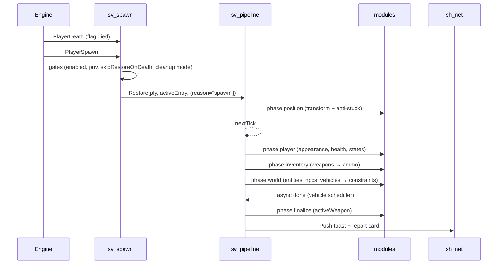
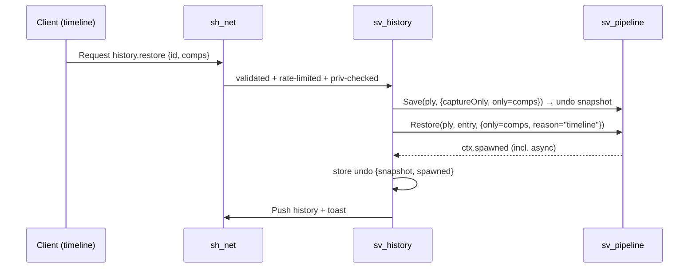

# Rareload v5 — Full Rewrite Plan

> **Status:** proposal · **Work branch:** `Rareload_Rewrite_Branch` · **Baseline:** v4 (`origin/main` @ `58a3d92`)
> **End state:** v4 archived on `legacy/v4`; v5 merged into `main` and becomes the only version.
>
> **No backward compatibility (decided 2026-09-23).** Rareload has no real user base yet, so v5 does **not** import v4 data, keep v4 convar or command names, or ship aliases. v5 starts with a fresh data folder and its own names.
>
> **Sources:** the v4 code and its 250-commit history, `docs/VEHICLE_MODULE_PLAN.md`, and the [GMod wiki](https://wiki.facepunch.com/gmod/) (§5.2).
>
> **Goal:** rebuild Rareload from scratch with **every v4 feature**, in about **half the code and a third of the files**, with exactly **one way to do each thing**.

---

## Contents

**Part I — Context**
0. [How to use this document](#0-how-to-use-this-document)
1. [TL;DR](#1-tldr)
2. [Goals, non-goals, success metrics](#2-goals-non-goals-success-metrics)
3. [Branch & release strategy](#3-branch--release-strategy)
4. [Audit of v4](#4-audit-of-v4)
5. [Lessons learned from v4 history](#5-lessons-learned-from-v4-history)

**Part II — Requirements**
6. [Feature parity inventory](#6-feature-parity-inventory)
7. [Gameplay edge cases](#7-gameplay-edge-cases)
8. [Security model](#8-security-model)
9. [Performance budgets](#9-performance-budgets)

**Part III — Design**
10. [Architecture](#10-architecture)
11. [Target file tree & line budgets](#11-target-file-tree--line-budgets)
12. [Old → new file mapping](#12-old--new-file-mapping)
13. [Core APIs](#13-core-apis)
14. [State modules](#14-state-modules)
15. [Save & restore pipeline](#15-save--restore-pipeline)
16. [Data format v5](#16-data-format-v5)
17. [Networking](#17-networking)
18. [Settings & permissions model](#18-settings--permissions-model)
19. [Anti-stuck](#19-anti-stuck)
20. [Vehicles](#20-vehicles)
21. [Client architecture](#21-client-architecture)
22. [Logging & debug](#22-logging--debug)
23. [Commands](#23-commands)
24. [Public API for other addons](#24-public-api-for-other-addons)
25. [Localization](#25-localization)

**Part IV — Execution**
26. [Coding conventions](#26-coding-conventions)
27. [Tooling & CI](#27-tooling--ci)
28. [Roadmap](#28-roadmap)
29. [Definition of done](#29-definition-of-done)
30. [Testing strategy](#30-testing-strategy)
31. [Risks & mitigations](#31-risks--mitigations)
32. [v4 bugs not to carry over](#32-v4-bugs-not-to-carry-over)
33. [Open decisions](#33-open-decisions)

**Appendices:** [A. Hook & event reference](#appendix-a--hook--event-reference) · [B. Glossary](#appendix-b--glossary)

---

# Part I — Context

## 0. How to use this document

- **Sections 6–9 are the requirements.** Nothing is "done" until it meets them.
- **Sections 10–25 are the design.** If the code has to differ from the design, update this document in the same PR. The plan and the code must never disagree.
- **Section 28 is the work queue.** Each checkbox is roughly one PR.
- IDs are stable so commits and PRs can cite them: **F**-features (§6), **E**-edge cases (§7), **S**-security rules (§8), **L**-lessons (§5.1), **G**-GMod platform facts (§5.2), **B**-v4 bugs (§32), **D**-decisions (§33).
- Commit messages and PR descriptions reference IDs, e.g. `Add ammo module (F9, L9)`.

## 1. TL;DR

| | v4 (today) | v5 (target) |
|---|---|---|
| Lua files (v4 excl. lang) | **118** (+ 9 Lua language files) | **~36** (translations become `.properties` data files, D16) |
| Lines of code (excl. lang) | **~24,100** | **~13,500** |
| Settings systems | **5** (convars, `RARELOAD.settings`, player settings, tunables, `AntiStuck.CONFIG`) | **1** registry |
| Net message names | **25** | **2** channels + opcodes |
| Console commands | **21** | **1** dispatcher (`rareload …`) |
| Include list | ~80 hand-ordered lines | auto-loader |
| Global functions | 9 | 0 (only `RARELOAD`) |
| Files touched to add a saved state | 6+ | **1** module file (+ lang keys) |
| Restore ordering | timer guesses (`0.05 / 0.1 / 0.5 / 0.6 / 1 s`) | explicit phases + dependencies + readiness waits |
| Restore implementations | 2 (respawn providers, timeline `ApplyHistoryComponents`) | 1 pipeline |
| Save storage | current save **and** history hold separate copies | current = pointer into history; heavy data deduped by hash |
| Automated checks | none | lint + offline unit tests in CI + in-game `rareload selftest` |

The three ideas that do most of the work:

1. **Module = feature.** One file declares the save, restore, settings, permissions and summary for one piece of state. The timeline, report cards, world display and inspector all use it.
2. **Setting = declaration.** One declaration generates the convar, the per-player override, the menu control, the net validation and the clamping.
3. **Pipeline = one path.** Respawn restore, timeline restore, partial restore, reload-key restore and undo all go through the same phased runner.

## 2. Goals, non-goals, success metrics

### Goals
- **100% parity** with v4 (§6). A user-visible feature can only disappear through an explicit decision in §33.
- **Clean break**: no v4 data import, no old convar or command names, no aliases. v4 files left in `data/rareload/` are simply ignored.
- **Extensible**: a new saved state is one file. A new setting is one declaration. A new vehicle base is one adapter table. Other addons can do all three through a documented API (§24).
- **Deterministic**: restores never depend on guessed delays.
- **Safe by default**: no player can affect other players' data or the map without a privilege (§8).
- **Readable**: no file over ~800 lines, most under 450, one responsibility each.

### Non-goals
- New features during the rewrite. Park them in the `v5.1` list (§28).
- A visual redesign. Keep the current look and only consolidate the code behind it.
- Any entity transport other than the duplicator.
- Any compatibility with v4: its Lua API, data files, convars, commands or settings.

### Success metrics (checked in Phase 7)
- [ ] Every F-item in §6 passes the test matrix (§30.3).
- [ ] Every L-item (§5.1) and G-item (§5.2) has a named test, checklist line or CI check.
- [ ] `find lua -name '*.lua' | wc -l` ≤ 40 (translations are `.properties` files, not Lua, D16).
- [ ] Code lines (excl. lang) ≤ 15,000.
- [ ] No `timer.Simple` in `server/sv_pipeline.lua` or `server/modules/`.
- [ ] `grep -rnE "^\s*function [A-Z]" lua` → nothing (no globals).
- [ ] `net.Start` / `net.Receive` appear only in `sh_net.lua`.
- [ ] `file.Write` / `file.Read` / `file.Delete` / `file.Rename` appear only in `sv_storage.lua`.
- [ ] CI is green: lint, unit tests, the lang key check and the platform greps (§27.2).
- [ ] A save with 50,000 JSON keys loads, and a 3 MB heavy sync causes no disconnect (E27, E28).
- [ ] Every performance budget in §9 is met on the reference scene.

---

## 3. Branch & release strategy

### 3.1 Current state (verified)

| Ref | Commit | Notes |
|---|---|---|
| `origin/main` | `58a3d92` "Update README.md" | the real last v4 commit |
| local `main` | `50c35fc` | 1 commit behind `origin/main` |
| `Rareload_Rewrite_Branch` | `50c35fc` | same as local `main`; no rewrite commits yet |
| tag `4.0` | `af80e15` | 6 commits older than `origin/main` |
| stale branches | `feat/localization`, `feat/rareload-4-phase3-timeline`, `refactor/save-restore-overhaul` | all already merged into `main`, safe to delete |

### 3.2 Branch layout

```
legacy/v4  ─────●  58a3d92  (archive, no further work)          tag: 4.0.1
                │
main       ─────●───────────────────────────────────────●  merge "Rareload v5"   tag: 5.0.0
                 \                                      /
Rareload_Rewrite_Branch ──●──●──●── … ──●── rc tags ──●
                          │
                          └─ first commit: "Remove v4 tree, add v5 skeleton"
```

### 3.3 Step by step

**Phase 0 (before any code):**
1. `git fetch origin && git switch main && git merge --ff-only origin/main`, which brings in the README commit.
2. `git branch legacy/v4 origin/main && git push -u origin legacy/v4`.
3. `git tag -a 4.0.1 origin/main -m "Final v4 release" && git push origin 4.0.1`. Existing tags use `N.N`, and `4.0.1` marks "4.0 plus the fixes that came after it".
4. On GitHub, protect `legacy/v4`: no force-push, PR required.
5. `git switch Rareload_Rewrite_Branch && git merge main` so the rewrite branch includes `58a3d92`.
6. Commit this plan, then do the "Remove v4 tree" commit.
7. Delete the stale branches once `git branch --merged main` confirms they are merged.

**During development:**
- Work in small branches (`v5/<area>`, e.g. `v5/config`, `v5/world-module`) and open PRs into `Rareload_Rewrite_Branch`. Solo work can commit directly, but keep commits PR-sized (§28).
- `main` gets **no** commits except the final merge.
- Pre-release tags on the rewrite branch: `5.0.0-alpha.N` (from Phase 3), `5.0.0-beta.N` (from Phase 6), `5.0.0-rc.N` (Phase 7).

**Cutover:**
1. Every §2 metric is ticked and `5.0.0-rc.N` has had at least one multiplayer session with no blocking issues.
2. Open the PR `Rareload_Rewrite_Branch → main` titled "Rareload v5". Use a **merge commit**, not a squash, so the rewrite history stays browsable.
3. Tag `5.0.0` on `main` and publish a GitHub release with the notes from §3.5.
4. Put a banner at the top of the `legacy/v4` README: *"Archived. Rareload v5 is on `main`."*
5. Delete `Rareload_Rewrite_Branch` after the merge. The tags keep its history.

### 3.4 Legacy branch
`legacy/v4` is an **archive** for reading the old code (L-lessons, `git log -p`). It gets no fixes and no releases.

### 3.5 Release notes template (5.0.0)
- **Fresh start**: v5 doesn't read v4 saves or settings. Players start with an empty timeline.
- **Changed defaults / security**: death cleanup and debug became server-only settings (B2, B3).
- **Commands and convars**: the new names from §23 and §6.2.
- **Removed**: only the items decided in §33.

---

## 4. Audit of v4

### 4.1 Size by area

| Area | Files | Lines | Notes |
|---|---:|---:|---|
| `client/saved_entity_display` (SED) | 22 | 5,839 | Panel content alone is 1,030 lines (`SED_panel_builder_collectors.lua`); the renderer is split into 5 files sharing one context |
| `client/` other | 13 | 3,227 | 3 theme sources, 2 widget kits |
| `anti_stuck/` | 17 | 2,026 | loader → core → system chain; 3 safe-position caches |
| `core/vehicles/` | 14 | 1,401 | Good design, too many tiny files (adapters are 37–119 lines each) |
| `ui/` | 2 | 1,352 | `rareload_tool_ui.lua` is a second widget kit |
| `debug/` | 8 | 1,134 | 3 logging APIs: `Debug.Log`, `Debug.Write`, `DebugHelpers.MakeWriter` |
| `core/` save/restore/history/settings | ~25 | ~5,000 | one concept split across providers, save_helpers and respawn_handlers |
| `utils/` | 8 | ~1,970 | grab-bag |
| `shared/` (excl. lang) | 6 | ~1,500 | convars + tunables + permissions + snapshot utils |
| `shared/lang/` | 9 | ~5,100 | fine, it's data (≈520 keys) |

### 4.2 Structural problems

1. **Five overlapping settings systems**: convars, `RARELOAD.settings`/`GetDefaultSettings`, per-player JSON (`ALLOWED_CLIENT_SETTINGS` with hand-written clamps), tunables (their own net and file), and `AntiStuck.CONFIG`. Call sites check several of them at once (`GetPlayerSetting(...) or RARELOAD.settings.retainVehicles`).
2. **A hand-ordered include list** (~80 lines) plus ad-hoc `include()` calls inside files. One example is `crossConstraints.restore`, which re-includes the duplicator bridge at restore time. Another is `SED.Require`.
3. **Two restore implementations**: providers for respawn and `ApplyHistoryComponents` for the timeline. They already behave differently (B4).
4. **Timer-driven ordering**: `restoreDelay` of `0.1 / 0.5 / 1`, `timer.Simple(0.6)` for the active weapon, and `0.1 s` + `0.15 s` to toggle solidity.
5. **Duplicated storage**: `player_positions/…` and `history/…` each hold copies, and `ActivateHistoryEntry` deep-copies between them.
6. **25 net messages**, each with its own validation, rate limit (or none) and permission check.
7. **Globals**: `GetDefaultSettings`, `SaveAddonState` (empty stub), `LoadAddonState`, `SaveGlobalInventory`, `LoadGlobalInventory`, `SyncData`, `SyncPlayerPositions`, `ShowNotification`, `ShowNextNotification`, `RareloadDeepCopySettings`, and the `SED` alias.
8. **Scattered features**: *ammo* alone touches `save_ammo.lua`, `state_providers`, `sv_rareload_history`, `permissions_def` (3 aliases), `convars`, `sv_player_settings`, `SED_panel_builder_collectors`, `SED_phantom`, `cl_history_panel`, the spawn report's `detailFor`, and 9 lang files.
9. **WAC workarounds in 3 places**: `autorun/client/cl_rareload_wac_failsafe.lua`, the client block in `rareload_init.lua`, and `sv_rareload_wac_compat.lua`.
10. **Summaries implemented 4 times**: the spawn report's `detailFor`, the save report's `countDetail`, history's `BuildSummary`, and the SED collectors.
11. **Design knowledge sits in a gitignored folder**: `docs/VEHICLE_MODULE_PLAN.md` holds important vehicle-base findings, but `/docs` is in `.gitignore`. v5 copies them into §20 and tracks `docs/`.

---

## 5. Lessons learned from v4 history

### 5.1 From v4's git history

These fixes came from 250 commits, mostly found the hard way. **Every row must be handled on purpose in v5.** The "v5 answer" column says where.

| ID | Lesson (source commit) | v5 answer |
|---|---|---|
| L1 | Anti-stuck methods returned enum values that didn't exist, so every successful unstuck was thrown away (`c0e75d5`) | Methods return `Vector` or `nil`, with no status enums. A unit test covers the resolver contract (§19) |
| L2 | A per-player `PlayerTick` hook ran for **all** players (N²) and leaked when the player left (`1ff45df`) | One `SetupMove` watcher over a `watching[ply]` table, cleared on disconnect (§15.3) |
| L3 | A deferred NPC restore used a fixed hook name, so a second player overwrote the first player's queued NPCs (`1ff45df`) | A map-ready **queue** with per-request entries (§14.3) |
| L4 | `EntIndex` gets reused across reconnects (`dc83de6`) | Key players by `SteamID64` and connections by `UserID` |
| L5 | NaN/inf reached vectors from data or commands (`dc83de6`, `f2075f9`) | `Util.ToVector` rejects non-finite values. Every command and net argument is validated against a schema (§8) |
| L6 | Plain `file.Write` could leave a truncated file (`dc83de6`) | Atomic write: tmp file → rename, plus a `.bak` copy for recovery (§16.4) |
| L7 | Re-broadcasting heavy buckets on every autosave (`dc83de6`) | Separate `saves` / `saves.heavy` topics, and heavy data is only sent when its hash changes (§17) |
| L8 | The saved model path was concatenated into a `ConCommand` (`61c06fa`) | No `ConCommand` with data. Appearance is applied server-side after sandbox's `PlayerSetModel` (§14.1, B17) |
| L9 | Invalid or missing weapon classes in saved inventories (`61c06fa`) | Check `weapons.GetStored(class)` or the engine weapon list before `Give`, and report what was skipped |
| L10 | The position cache grew without limit (`61c06fa`) | Capped, spatially bucketed cache (§19) |
| L11 | NPCs were delayed twice in queued restores (`61c06fa`) | Readiness comes from the pipeline, so there is no per-module delay |
| L12 | Displacement search caused hitches (`f2075f9`) | Each method has a time and trace budget, and the resolver has a total deadline (§19) |
| L13 | A live vehicle skipped as a duplicate kept stale seats and state (`bf9b6c3`) | Skipped IDs are re-queued into the vehicle scheduler (§20) |
| L14 | Vehicle bases reset runtime state after a duplicator paste | Adapters re-apply runtime state **after** a readiness probe (§20) |
| L15 | Vehicle health was captured but never re-applied; LVS stores HP on sub-entities | The adapter contract covers components (§20) |
| L16 | Singleplayer saves leaked into multiplayer on the same machine (`16fa060`, `7d970a5`, `153eab0`) | SP and MP live in **separate directories** (§16, D1) |
| L17 | Identical adjacent props got the same entity ID (`2e647ab`) | The ID includes `GetCreationID()`. Every captured def gets an ID at capture time (L32) |
| L18 | `Color` lost its type in the duplicator encode step (`2e647ab`) | The encoder checks for Vector/Angle/Color **before** the generic table branch. Covered by a unit test |
| L19 | Owner resolution was O(entities × undo) (`2e647ab`) | Resolve owners in a batch per save pass (`sv_ownership`) |
| L20 | The global inventory was restored twice (`2e647ab`) | Global inventory is a *source* for the `weapons` module, not a separate module (§14.2) |
| L21 | A quick death and respawn has to cancel the pending restore (`2e647ab`) | Restore token plus `ctx:isCurrent()` checked by every deferred step (§15) |
| L22 | NPC AI needs its squad set **before** spawn and portable enemy refs (`f36d5b3`) | `npcs` module: set the squad keyvalue before `Spawn`, and reapply AI state and enemies in a post pass (§14.3) |
| L23 | `env_*` helper entities must not be saved (`f36d5b3`) | `Snapshot.EXCLUDED_CLASSES` table in one place |
| L24 | Frameworks override duplicator IDs, and gravity must go through `NoGrav` (`2a20aab`) | Handled in `sv_snapshot` restore post-processing |
| L25 | Render hooks ran during depth, skybox and RT passes (`853bc4f`) | One `Render.ShouldDraw(bDepth, bSky)` guard in every world-draw hook |
| L26 | Phantoms have no physics, so `NearestPoint` fails (`693123e`, `fc71b95`) | Panel placement projects onto the OBB surface (§21.7) |
| L27 | Panels drawn every frame were too expensive (`93db1cf`, `19a5803`) | RTT baking plus a memoized layout (§21.7) |
| L28 | A full rebuild on every sync caused stutter (`772e870`) | A dirty flag with incremental reconciliation (§21.1) |
| L29 | The server read a client-only language convar (`2b88e93`) | The server never localizes. It sends keys and arguments (§25) |
| L30 | ULib's CAMI requires the callback form (from the `permissions_def` notes) | `sh_perms` always uses the callback form and captures the result synchronously |
| L31 | Two net handlers for one message broke delete (`2182f6d`) | `Net.Handle` raises an error if an opcode is registered twice |
| L32 | Entities without a Rareload ID couldn't be deleted (`9055b09`) | IDs are assigned at capture time, so no def is ever stored without one |
| L33 | Timeline teleport ignored the anti-stuck setting (`f30c46a`) | Timeline restores run through the same `transform` module |
| L34 | Chat messages appeared twice (`f30c46a`) | One `toast` topic. Callers never print directly |
| L35 | Inventory or active-weapon changes must count as a changed save (`300c45a`) | A generic "unchanged" check compares every light module's output (§15.2) |
| L36 | With the addon disabled, players spawned without weapons (`300c45a`) | When disabled, the spawn hook returns before touching anything. Covered by a test |
| L37 | WAC client hooks crashed when `lp.wac` was nil (`rareload_init.lua`) | `client/cl_wac.lua` guard, loaded only when WAC is detected |

Before a v4 file is removed from consideration, run `git log -p --follow <file>` on it and add any new lesson to this table.

### 5.2 Platform facts from the GMod wiki

These come from [wiki.facepunch.com/gmod](https://wiki.facepunch.com/gmod/) (researched 2026-09-23). They are engine behaviours v5 must design around. Several of them explain v4 bugs (§32 B19–B24). The page name is given so the source can be re-checked.

**Serialization & storage**

| ID | Fact (wiki page) | v5 impact |
|---|---|---|
| G1 | `util.JSONToTable` has a **15,000-key limit** unless `ignoreLimits = true` (`util.JSONToTable`) | Our own data files are read with `ignoreLimits = true`. Untrusted JSON (client edits) keeps the limit. v4 never passes it, so large saves or histories can fail to load (B19) |
| G2 | By default `JSONToTable` converts numeric-string **keys** to numbers, so `SteamID64` keys break (`util.JSONToTable`) | Never key a JSON table by SteamID64 (use the file name or a field). Duplicator entity lists rely on the numeric conversion, so leave `ignoreConversions` off |
| G3 | `util.TableToJSON` turns every key into a string, so `{["5"]=…, [5]=…}` collide; entities, materials and functions are dropped (`util.TableToJSON`) | Snapshot defs are sanitized before encoding. Never mix numeric and string keys in one table |
| G4 | `util.Decompress` needs `maxSize` on untrusted data, otherwise a decompression bomb can fill Lua memory (`util.Decompress`) | S11 |
| G5 | `file.Write` forces **lowercase** names, only allows some extensions (`.json`, `.txt`, `.dat`, …) and a restricted character set, and since 2025 returns a success `bool` (`file.Write`) | `Store.Path` lowercases and sanitizes. Every write checks the return value and falls back or reports |
| G6 | `file.Rename` returns `bool` and also lowercases (`file.Rename`) | The atomic write checks it (§13.5) |
| G7 | `file.AsyncRead` exists (`file.AsyncRead`) | Heavy blobs load asynchronously when a player joins, so there is no hitch on join |
| G8 | `util.SHA256` is available; `util.CRC` is a checksum, not a hash (`util.SHA256`, `util.CRC`) | Blob names and IDs use `SHA256` (truncated) |
| G9 | `sql` (SQLite in `sv.db`) is "the preferred and fastest method of storing large amounts of data", with transactions (`sql`, `sql.Begin`) | Considered as the storage backend: D14 |

**Networking**

| ID | Fact (wiki page) | v5 impact |
|---|---|---|
| G10 | A net message is ≤ 65,533 bytes. `net.WriteTable` doesn't check the limit and adds 16 bits per pair; the recommended method is JSON + `util.Compress` in **60 KB chunks** (`net.WriteTable`, `net`) | The `sh_net` design (§13.4) |
| G11 | The reliable buffer overflows at about **256 KB**, which **disconnects the client**. Reliable bandwidth is roughly **120 KB/s** (`Networking_Usage`) | Chunked sends are **scheduled**: a per-client queue with ≤ 1 chunk per tick and ≤ 96 KB in flight. v4 sends every chunk in one loop (B21) |
| G12 | `util.AddNetworkString` and every NW key share one 4,095-slot string table (`Networking_Usage`) | 2 network strings + 1 NW key (`rl_id`) instead of 25 + more |
| G13 | NWVar values are ≤ 199 chars, sent by usermessage and re-sent every 10 s; NW2 only updates inside the PVS and is buggy on Lua entities (`Entity:SetNWString`, `Entity:SetNW2String`) | Keep a single NWString `rl_id` per saved entity for client linking. Don't use NW2 |
| G14 | Net messages sent in `PlayerInitialSpawn` can arrive before the client has loaded (`LocalPlayer()` may be NULL). The wiki recommends a **client-ready handshake** (`GM:PlayerInitialSpawn`) | The client sends `ready` from `InitPostEntity`; the server sends nothing to that player before it arrives. v4 syncs from a `timer.Simple(0)` (B23) |
| G15 | "Don't trust the client": check rates, negative numbers, entity arguments; never identify the sender from the payload (`Net_Library_Usage`) | S1, S9 |

**Player lifecycle**

| ID | Fact (wiki page) | v5 impact |
|---|---|---|
| G16 | Base-derived `GM:PlayerSpawn` calls `PlayerSetModel` and `PlayerLoadout`, which override `SetModel`/`Give` done in a `PlayerSpawn` hook (`GM:PlayerSpawn`) | Appearance and weapons are applied **inside** those hooks (§15.3 phase 0) instead of on a timer afterwards |
| G17 | Returning `true` from `PlayerLoadout` prevents the default loadout (`GM:PlayerLoadout`) | When `weapons` restores, the default loadout is skipped: no strip-then-give, no extra default ammo |
| G18 | `Player:Give(class, bNoAmmo)` can skip default ammo, and `Give` fails silently when `PlayerCanPickupWeapon` returns false (`Player:Give`, `GM:PlayerCanPickupWeapon`) | `Give(class, true)` then set exact ammo. A `NULL` return is reported as "blocked" |
| G19 | `PlayerSpawn` and `PlayerSelectSpawn` receive a `transition` flag for `trigger_changelevel` spawns (`GM:PlayerSpawn`) | No restore on transition spawns (E22) |
| G20 | `PlayerDeath` isn't called for `KillSilent`; `PostPlayerDeath` is called for every death (`GM:PostPlayerDeath`, `GM:PlayerSilentDeath`) | The "died" flag is set in `PostPlayerDeath` (B22) |
| G21 | `PlayerDisconnected` **isn't called for the host** in singleplayer or on a listen server (`GM:PlayerDisconnected`) | The host is saved in `ShutDown`. v4 never saves the host on exit (B20) |
| G22 | `SteamID64` is a string; bots get unique IDs; in `-multirun` every copy returns `"0"` (`Player:SteamID64`) | IDs stay strings. `"0"` → temporary key `lan_<UserID>` with a console warning (E24) |
| G23 | `UserID` is unique per connection (`Player:UserID`); `hook.Add` accepts an **entity as identifier** and removes the hook once it's invalid (`hook.Add`) | Per-player temporary hooks use the player as identifier, so they can't leak (L2) |
| G24 | `EnterVehicle` does **not** bypass `CanPlayerEnterVehicle`; `SetEyeAngles` is relative to the vehicle while seated (`Player:EnterVehicle`, `Player:SetEyeAngles`) | Reseat failures are reported. Eye angles are applied after the seat is resolved |

**Entities, world & sandbox**

| ID | Fact (wiki page) | v5 impact |
|---|---|---|
| G25 | `ents.Iterator()` / `player.Iterator()` are cached and faster than `ents.GetAll()`, but their tables are read-only (`ents.Iterator`) | Use them everywhere (v4 calls `ents.GetAll` 18 times) and never modify the result |
| G26 | `duplicator.Paste` runs `CreateEntityFromTable` → `OnDuplicated` → entity/bone modifiers → `PostEntityPaste`; `createdEntities` is keyed by the original indexes (`duplicator.Paste`, `ENTITY:PostEntityPaste`) | Readiness and post-processing hang off this order (§20). Keep the index keys intact (G2) |
| G27 | `duplicator.IsAllowed` / `Allow`: SENTs and SWEPs are allowed automatically unless `DisableDuplicator`; most sandbox NPCs are allowed (`duplicator.Allow`) | S7 relies on it |
| G28 | `duplicator.RegisterEntityModifier` / `StoreEntityModifier` are the official way to carry custom state through a paste (`duplicator.RegisterEntityModifier`) | Rareload's own per-entity data (ID, gravity flag, NPC AI) travels as **entity modifiers** instead of fields patched in afterwards (L24) |
| G29 | Sandbox gates spawning with `PlayerSpawnProp/SENT/NPC/Vehicle` hooks and `CheckLimit`/`AddCount` (always true in singleplayer) and offers `cleanup.Add` / `undo.Create` (`SANDBOX:*`, `Player:CheckLimit`) | D10: restored entities go through those gates on multiplayer servers and are registered in the player's undo, cleanup and counts |
| G30 | `Entity:GetCreationID` wraps at 10,000,000; `MapCreationID` is stable per map and `-1` for non-map entities (`Entity:GetCreationID`, `Entity:MapCreationID`) | IDs are random hashes created at capture, not creation IDs (L17). Map-created entities are excluded from saves |
| G31 | `game.CleanUpMap(dontSendToClients, extraFilters, callback)` has a callback; `EFL_KEEP_ON_RECREATE_ENTITIES` still duplicates (`game.CleanUpMap`) | Full-map death cleanup uses the callback instead of a timer (E6) |
| G32 | `Entity:SetPersistent` + `sbox_persist` make the engine save and reload entities itself (`Entity:SetPersistent`) | Persistent entities are **excluded** from saves, otherwise they'd come back twice (E21) |
| G33 | `util.IsInWorld`, `util.TraceHull`, `navmesh.IsLoaded`, `navmesh.Find(pos, radius, step, drop)` (`util.*`, `navmesh.*`) | Anti-stuck validation and the nav method use them directly. Nav is skipped when `navmesh.IsLoaded()` is false |
| G34 | `ProtectedCall(fn, …)` runs a function without stopping the script **and still reports the error** (unlike `pcall`) (`Global.ProtectedCall`) | The pipeline wraps each module with `ProtectedCall` so errors stay visible (principle 6) |
| G35 | `properties.Add` adds context-menu (C-menu) actions on entities, gated by `CanProperty` (`properties.Add`) | v5.1: "Rareload → Inspect / Remove from save" on right-click |

**Client & rendering**

| ID | Fact (wiki page) | v5 impact |
|---|---|---|
| G36 | `ClientsideModel`s are **never garbage-collected**, can delete themselves under heavy lag, and detach from parents that leave the PVS (`Global.ClientsideModel`) | One phantom registry owns every clientside model: it re-creates invalid ones and removes all on reload/map change |
| G37 | Create fonts **once**, only the sizes you use (`surface.CreateFont`) | One font table in `cl_ui`. Scaling changes are handled by a fixed set of sizes |
| G38 | `GetRenderTargetEx` sizes must be powers of two, and names ignore extensions (`Global.GetRenderTargetEx`) | The RTT pool uses fixed power-of-two sizes and a fixed number of targets |
| G39 | `halo.Add` gets expensive with more passes (`halo.Add`) | Highlights use 1 pass and cap the number of haloed entities |
| G40 | `cvars.AddChangeCallback` doesn't fire on the client for `FCVAR_REPLICATED` convars (`cvars.AddChangeCallback`) | The menu refreshes from the `settings` topic, not convar callbacks |
| G41 | Client convars with `FCVAR_USERINFO` are readable on the server via `ply:GetInfo/GetInfoNum` (truncated to 259 bytes) (`Global.CreateClientConVar`, `Player:GetInfo`) | Player preferences can be userinfo convars: D13 |
| G42 | `CreateConVar` accepts `min`/`max`, and `FCVAR_NEVER_AS_STRING` must not be combined with `FCVAR_REPLICATED` (`Global.CreateConVar`) | The settings registry passes min/max through, so the engine clamps too |

**Loading & tooling**

| ID | Fact (wiki page) | v5 impact |
|---|---|---|
| G43 | Autorun files run alphabetically, **before** `weapons/gmod_tool/stools/` (`Lua_Loading_Order`) | The stool can use `RARELOAD` directly |
| G44 | All addons share one virtual `lua/` filesystem, so file names must be unique; an **empty** file fails to include; client files larger than 64 KB compressed may fail (`Global.include`) | Everything stays under `lua/rareload/`. Stub files are never committed empty. File budgets (§11) also protect this limit |
| G45 | `file.Find` with capital letters misbehaves on Linux (`file.Find`) | All paths are lowercase (a CI check fails on uppercase names in `lua/`) |
| G46 | Auto-refresh **doesn't work on macOS** or for dynamically included files, and re-runs a whole file (`Auto_Refresh`) | A `rareload dev reload` command re-runs the loader. Registries are idempotent (`X = X or {}`, replace by id) so reloading is safe |
| G47 | Workshop uploads need a 512×512 `.jpg` icon and `addon.json`; tools such as gmpublisher exist (`Workshop_Addon_Creation`) | §27.6 |

### 5.3 Full wiki pass

A second, systematic pass (2026-09-23) read the **complete member lists** of everything Rareload touches, then opened the promising pages in full:

- **Classes:** `Player` (270 members), `Entity` (555), `NPC` (182), `Vehicle` (49), `Weapon` (94), `PhysObj` (78), `CNavArea` (78), `ConVar`, `TOOL` + `TOOL` hooks.
- **Hooks:** all 267 `GM` hooks and all 53 `SANDBOX` hooks.
- **Libraries:** `util`, `net`, `file`, `duplicator`, `constraint`, `undo`, `cleanup`, `game`, `ents`, `player_manager`, `gameevent`, `engine`, `system`, `timer`, `hook`, `cvars`, `concommand`, `navmesh`, `ai`, `physenv`, `cam`, `draw`, `vgui`, `derma`, `spawnmenu`, `language`, `properties`, `notification`, `list`, `scripted_ents`, `weapons`, `gmsave`, `saverestore`, `sql`, `construct`, `drive`, `input`, `gui`, `chat`, `cookie`, `coroutine`, `debugoverlay`, `presets`, `controlpanel`, `markup`, `widgets`, `steamworks`, `team`, `permissions`, `table`, `string`, `os`, `resource`, `gamemode`, `gmod`, `baseclass`.
- **Globals:** the names of all 331 Global functions.
- **Guides:** `optimizationTips`, `File_Based_Storage`, `Addon_Localization`, `Tool_Information_Display`, `Lua_Hooks_Order`, `Understanding_AddCSLuaFile_and_include`, `Default_Lists`, `Blocked_ConCommands`, `Lua_Error_Logging`, `Entity_Callbacks`, `Derma_Skin_Creation`, `VGUI_Element_List`, `Workshop_Addon_Creation`, `Addon_Creation`.

**Not read:** the ~450-method `Panel` class, the `render`/`surface` member lists, the `ENTITY`/`WEAPON`/`EFFECT`/`NEXTBOT`/`PANEL`/`DRIVE` hook sets (Rareload defines no entity, weapon or panel classes of its own), enums and structures beyond the few cited, shaders, and the mapping, modelling and beginner tutorials. Read `Panel` and `render` during Phase 5–6.

**Storage, identity & lifecycle**

| ID | Fact (wiki page) | v5 impact |
|---|---|---|
| G48 | "Do not save data during `ShutDown`… some players will become invalid"; save data as soon as it changes (`File_Based_Storage`). `host_quit` is not reliable server-side (`gameevent/host_quit`) | `ShutDown` is only a best-effort flush. The host's transform is otherwise only saved by autosave if on (B20, E23). No save on `OnPauseMenuShow`: the console opens the pause menu too, so it moved the respawn point |
| G49 | **PData** now keys by SteamID64 and is safe to use (July 2024); `util.GetPData/SetPData` work for offline players; stored in `sv.db`, not networked (`File_Based_Storage`, `Player:GetPData`) | D17: small per-player records (reload-key mode, global inventory) move to PData, which removes the `players/` folder |
| G50 | `Player:IsListenServerHost()` is true in singleplayer and for the listen host (`Player:IsListenServerHost`) | Host detection for G48 |
| G51 | `game.MapLoadType()` returns `newgame`, `loadgame`, `transition` or `background` (`game.MapLoadType`) | On `loadgame` (Source save) or `transition`, the world modules don't restore, because the engine already restored the world (E30) |
| G52 | `GM:LoadGModSave` runs for `gm_load`; `SANDBOX:PersistenceLoad` runs when persistent props load; `GM:Saved` / `GM:Restored` wrap Source-engine saves (`GM_Hooks`, `SANDBOX_Hooks`) | Rareload marks the world as "externally restored" in these hooks and skips its own world restore for that load (E30, E31) |
| G53 | `game.GetMapVersion()` gives the map revision (`game`) | Stored in each entry. A mismatch shows "map was updated" in the timeline and forces anti-stuck on (E4) |
| G54 | `engine.ActiveGamemode()` and gamemode tables; team/class gamemodes spawn players through their own logic (`engine`, `team`, `player_manager`) | D19: Rareload is enabled by default only in Sandbox-derived gamemodes; others need an explicit server setting |

**Player state**

| ID | Fact (wiki page) | v5 impact |
|---|---|---|
| G55 | `Player:GetAmmo()` returns **every** ammo type the player holds (by ID); `game.GetAmmoName/GetAmmoID/GetAmmoMax` translate and cap (`Player:GetAmmo`, `game`) | `ammo` saves `{[ammoName] = count}` for all ammo plus per-weapon clips, and clamps to `GetAmmoMax`. v4 only saves ammo for held weapons and keys it by numeric IDs that can change when addons add ammo types (B27) |
| G56 | `Player:SelectWeapon` switches **outside prediction**; the recommended way is `CUserCmd:SelectWeapon` (`Player:SelectWeapon`, `CUserCmd:SelectWeapon`) | `activeWeapon` sets a pending weapon that a one-shot `StartCommand` hook applies with `cmd:SelectWeapon(wep)` |
| G57 | `Player:SetSuppressPickupNotices(true)` hides pickup notifications (`Player`) | Enabled while restoring weapons and ammo, so the HUD isn't spammed |
| G58 | `GM:PlayerNoClip` and `GM:PlayerSwitchFlashlight` can refuse those states; admin mods use them (`GM_Hooks`) | Restoring noclip/flashlight asks these hooks first. Godmode and notarget need the new privilege `rareload_restore_privileged_states` (default: admin). v4 re-grants all of them unconditionally, even from old timeline entries (B25, S14) |
| G59 | `SANDBOX:PlayerGiveSWEP` gates giving yourself a weapon (`SANDBOX_Hooks`) | Optional weapon gate under `respectSpawnLimits` (D10), off by default because map pickups also go through inventory |
| G60 | `Player:Crouching()`, `GetHullDuck()`; `GetMaxArmor/SetMaxArmor` (`Player`) | `transform` stores `crouched`; anti-stuck tests the duck hull when the save was crouched (E32). `health` also stores `maxArmor` |
| G61 | `Player:GetObserverMode()`, `GetDrivingEntity()` (`Player`) | No save while spectating; exit prop-driving before a timeline restore (E33) |

**World restore safety**

| ID | Fact (wiki page) | v5 impact |
|---|---|---|
| G62 | Only 8,192 edicts exist and `ents.Create` fails somewhere between **8,064 and 8,176** (`ents.GetEdictCount`) | Before a world restore, `GetEdictCount() + needed` must leave ≥ 256 free; otherwise restore what fits and report the rest (E29, B28) |
| G63 | `PhysObj:IsPenetrating()` (non-static objects) and `GM:OnCrazyPhysics` (`PhysObj`, `GM_Hooks`) | After a paste, objects that penetrate each other are frozen and reported instead of exploding. `OnCrazyPhysics` on a restored entity is logged to the report |
| G64 | `duplicator.FigureOutRequiredAddons` finds the Workshop addons a dupe's models/materials need; `util.IsValidModel` precaches and validates; `duplicator.WorkoutSize` gives the AABB (`duplicator`, `util.IsValidModel`) | The timeline shows "needs addon X" for entries with missing content, and those defs are skipped instead of spawning error models (E7). `WorkoutSize` frames the 3D preview |
| G65 | Sandbox fires `PlayerSpawnedProp/SENT/NPC/Vehicle/Ragdoll/Effect/SWEP` after each spawn; `GetCreator` is only set for SENTs (`SANDBOX_Hooks`, `Entity:SetCreator`) | `sv_ownership` records owners from these hooks first, then falls back to CPPI/undo. Most of v4's 659-line resolver becomes a fallback path |
| G66 | `cleanup.Register(type)` adds a cleanup type; `undo.SetCustomUndoText`, `undo.AddFunction` (`cleanup`, `undo`) | A "Rareload restores" cleanup category in the Q menu, and one undo entry per restore with readable text |
| G67 | `list.Get("Vehicles"/"NPC"/"Weapon"/"SpawnableEntities")` give display names and spawn data, but `list.Get` copies with the slow `table.Copy`; use `list.GetEntry`/`HasEntry` (`Default_Lists`, `list.Get`) | Human-readable names in summaries without a hand-written name table. Lookups use `list.GetEntry` |
| G68 | `table.Copy` is very slow and **doesn't copy Vectors/Angles** (`table.Copy`) | Never used on saves. Stored data is immutable (blobs by hash), so nothing needs deep-copying |
| G69 | `Vehicle:IsValidVehicle()` says whether a Source vehicle is fully initialized (`Vehicle`) | The default readiness probe for the Source adapter (§20) |
| G70 | `Entity:IsInWorld` only checks the origin; `util.PointContents`, `util.TraceEntityHull` test properly (`Entity:IsInWorld`, `util`) | Anti-stuck and restore placement use hull traces, not `IsInWorld` alone |
| G71 | `CNavArea:GetClosestPointOnArea`, `IsUnderwater`, `IsDamaging`, `IsBlocked`; `navmesh.GetNearestNavArea`, `navmesh.GetGroundHeight`; `ai.GetNodeCount` (`CNavArea`, `navmesh`, `ai`) | The nav method picks the closest point on the nearest safe area and skips underwater, damaging and blocked areas. The node-graph fallback only runs if `ai.GetNodeCount() > 0` |
| G72 | `coroutine.wait` is only useful inside NextBot coroutines (`coroutine.wait`) | Long captures and pastes run in coroutines resumed by our own `Tick` scheduler with a per-tick time budget, never `coroutine.wait` |

**Change detection (autosave)**

| ID | Fact (wiki page) | v5 impact |
|---|---|---|
| G73 | Events exist for every state change Rareload saves: `PlayerAmmoChanged`, `WeaponEquip`, `PlayerDroppedWeapon`, `PlayerHurt`, `PlayerSpawned*`, `OnPhysgunFreeze`, `PlayerFrozeObject`, `OnUndo`, `OnCleanup`, `EntityRemoved` (`GM_Hooks`, `SANDBOX_Hooks`) | Autosave becomes **event-driven**: hooks set per-module dirty flags, and a tick only saves dirty modules. v4 polls and compares everything |

**Client, UI & tooling**

| ID | Fact (wiki page) | v5 impact |
|---|---|---|
| G74 | Official localization: `resource/localization/<lang>/<name>.properties`, loaded for `gmod_language` with English fallback; `#key` auto-translates in Derma; `language.GetPhrase`; allowed in Workshop addons (`Addon_Localization`, `Workshop_Addon_Creation`) | D16: the 9 Lua language files and `sh_lang.lua` become `.properties` files (no Lua code). Servers call `resource.AddWorkshop` so clients get them |
| G75 | `TOOL.Information` renders the tool's HUD help (left/right/reload icons) from `tool.<name>.<key>` phrases; `TOOL:RebuildControlPanel` rebuilds the CPanel (`Tool_Information_Display`, `TOOL`) | Standard tool help instead of custom text; language changes call `RebuildControlPanel` |
| G76 | `ControlPanel:ToolPresets` / `ControlPresets` give save/load presets for a list of convars (`ControlPanel`, `presets`) | Players get setting presets for free by passing the preference convars to `ToolPresets` |
| G77 | `spawnmenu.AddToolMenuOption` adds pages under the Q menu's Utilities tab (`spawnmenu`) | Server settings get their own "Utilities › Rareload › Server" page instead of living only in the tool panel |
| G78 | A **Derma skin** (`derma.DefineSkin`, `Panel:SetSkin`, `SKIN:Paint*`) styles every stock control from one file (`Derma_Skin_Creation`) | D18: one `Rareload` skin + stock controls (`DListView`, `DTree`, `DProperties`, `DColumnSheet`, `DNumSlider`, `DCheckBoxLabel`, `DComboBox`) instead of custom `Paint` on every panel |
| G79 | `notification.AddLegacy` / `AddProgress` / `Kill` are the native toasts, including an animated progress bar (`notification`) | Simple toasts and "restoring N objects…" progress use them. The custom card stays only for the debug report |
| G80 | `string.NiceTime`, `string.NiceSize`, `os.date` (`string`, `os`) | Replace v4's hand-written "time ago" and date formatting |
| G81 | `input.LookupBinding("+reload")` returns the player's real key (`input`) | Hints show the actual bound key, not a hard-coded "R" |
| G82 | `TOOL:MakeGhostEntity` / `UpdateGhostEntity` show a ghost model at the aim point (`TOOL`) | v5.1: ghost player model where the left-click save will land |
| G83 | `debugoverlay.*` only works with `developer 1` and is only shown to the listen host (`debugoverlay.Box`) | Anti-stuck debug draws candidate boxes with `debugoverlay` for the host; dedicated servers send the same geometry over the `debug` topic |
| G84 | `optimizationTips`: cache Colors/Materials/Vectors outside hooks, use lookup tables and `player.Iterator`, avoid nested player × entity loops, send compact changes only when they happen (`optimizationTips`) | Coding rules in §26 |
| G85 | `Derma_Query` / `Derma_StringRequest` are stock confirm and input dialogs; `SetClipboardText` copies (`Global`) | Replace v4's custom confirm dialog; the inspector's copy menu uses `SetClipboardText` |

---

# Part II — Requirements

## 6. Feature parity inventory

This is the Phase-0 checklist. v5 isn't finished until every row is ticked.

### 6.1 Player-facing features

| # | Feature | v4 location | v5 owner |
|---|---|---|---|
| F1 | Save position + view angles + movetype (tool left-click = aim point, right-click = own position, `rareload save`) | stool, `save_point.lua` | `modules/player.lua`, stool |
| F2 | Respawn at the saved spot on spawn and after death | `handler_player_spawn.lua` | `sv_spawn.lua` + pipeline |
| F3 | "No custom respawn on death" | spawn handler | `sv_spawn.lua` |
| F4 | Anti-stuck on respawn (5 methods, priorities, safe-position cache, toggles kept across reboots) | `anti_stuck/*` | `sv_antistuck.lua` |
| F5 | Keep health & armor | provider | `player.lua` |
| F6 | Keep player states: god, notarget, frozen, noclip, flashlight, velocity | provider | `player.lua` |
| F7 | Keep appearance: model, skin, bodygroups, player/weapon color, material, render color | `save/restore_appearance` | `player.lua` |
| F8 | Keep inventory + active weapon | inventory files | `inventory.lua` |
| F9 | Keep ammo + clip1/clip2 | `save_ammo`, provider | `inventory.lua` |
| F10 | Global (cross-map) inventory | `handler_global_inventory`, `sv_rareload.lua` | `inventory.lua` |
| F11 | Save/restore owned props & entities (duplicator snapshot, constraints, entity health, gravity flag) | save/handler entities, dup utils, snapshot utils | `world.lua` + `sv_snapshot.lua` |
| F12 | Save/restore owned NPCs incl. health, AI state, schedule, squad, enemies, relationships | `save_npcs`, `handler_npc` | `world.lua` |
| F13 | Cross-category constraints (prop ↔ vehicle) | provider + dup bridge | `world.lua` |
| F14 | "Overwrite modified" vs "preserve existing" merge on save | `MergePreserveExisting` | `sv_snapshot.lua` |
| F15 | No duplicates of saved entities that already exist on restore (existing-ID filter) | `snapshot_restore` | `sv_snapshot.lua` |
| F16 | Vehicles: capture/restore, runtime state, component health, settle physics, reseat every occupant, per-player cap | `core/vehicles/*` | `vehicles.lua` |
| F17 | Vehicle bases: Source, simfphys, LVS, Glide, LFS, WAC (+ WAC input/exit fixes) | adapters, wac_compat, client failsafe | `vehicle_adapters.lua`, `cl_wac.lua` |
| F18 | Death cleanup: full map / owned only / saved only | spawn handler | `sv_spawn.lua` |
| F19 | Clean up owned entities on disconnect | hooks | `sv_spawn.lua` |
| F20 | Save on disconnect (position + movetype) | `rareload_core.lua` | `sv_spawn.lua` |
| F21 | Save before `game.CleanUpMap` | PreCleanupMap hooks | `sv_spawn.lua` |
| F22 | Auto-save: interval, movement/angle threshold, safe-to-save checks, tool-screen progress | `rareload_autosave.lua` | `sv_autosave.lua` |
| F23 | Save Timeline: list, pin, note (≤256 chars), delete, clear, max size, pinned entries survive pruning | history files | `sv_history.lua` |
| F24 | Timeline: make an entry the respawn point (active indicator) | history | `sv_history.lua` |
| F25 | Timeline: partial restore by component (position/health/inventory/ammo/appearance/states/world) | history | pipeline `only` |
| F26 | Timeline: undo the last restore (player state + remove spawned objects) | history | `sv_history.lua` |
| F27 | Timeline: in-world preview (player + object phantoms, green/red hull-clear, live collision recheck) | `cl_history_preview` | `cl_history.lua` |
| F28 | Tool reload key modes `set_previous` / `restore_current` / `restore_previous` + component mask, stored per player; walking back through history | stool, history | stool + `sv_history.lua` |
| F29 | Object inspector: browse the objects in any entry, freeze/gravity flags, delete (single + bulk), JSON edit, highlight, teleport, look-at, copy menu | `entity_viewer/*`, history `ObjAction` | `cl_inspector.lua` + `sv_history.lua` |
| F30 | World display: floating info panels, categories, scrolling, cam-lock interaction, sized to the entity | SED | `client/world/*` |
| F31 | World display: player phantoms at other players' saves (LOD info, seated-vehicle pose) | `SED_phantom` | `world/cl_phantoms.lua` |
| F32 | World display: object phantoms for saved-but-missing objects, vehicle sub-models | `SED_object_phantom`, `SED_shared` | `world/cl_phantoms.lua` |
| F33 | World display: piles (grouping overlapping panels, peek cards, badge) | `SED_pile` | `world/cl_interact.lua` |
| F34 | World display: RTT baking, per-frame draw budget, depth sorting | `SED_panel_rtt`, `SED_panel_queue`, `depth_sorted_renderer` | `world/cl_panels.lua` |
| F35 | Highlights: halos, beams, labels; highlight all / link live→phantom / players / clear | `SED_highlight` | `world/cl_highlight.lua` |
| F36 | Tool screen: status, auto-save progress bar, reload-state animations, permission denied, feature list | `rareload_toolscreen.lua` | `cl_toolscreen.lua` |
| F37 | Tool control panel: categories, toggles, sliders, action buttons, language dropdown | stool + `rareload_tool_ui` | `cl_menu.lua` (generated) |
| F38 | Advanced parameters (anti-stuck, world display, toast) | `cl_tunables_menu`, `tunables` | `cl_menu.lua` Advanced page |
| F39 | Localization: 9 languages, `rareload_language`, live switching | `sh_lang`, `lang/*` | `resource/localization/*/rareload.properties` (D16) |
| F40 | CAMI permissions with default tiers, `rareload_perms` listing | `permissions_def` | `sh_perms.lua` |
| F41 | Debug: report cards (save / respawn / anti-stuck), HUD toasts, watches, profiler timings, diag | `debug/*` | `sv_log.lua`, `cl_debug.lua` |
| F42 | Admin tools: teleport to coords, look-at, test anti-stuck, set anti-stuck method state | `sv_rareload_commands` | `sv_commands.lua` |
| F43 | Data maintenance: cleanup, history dump/clear | various | `sv_commands.lua` + `sv_storage` |
| F44 | Separate SP and MP saves (security isolation) | `rareload_core.lua` | `sv_storage` directory split (D1) |
| F45 | ~~Legacy data import~~ | `rareload_core.lua` | **dropped**: no backward compatibility |

### 6.2 Settings

v4 names are **not** kept. Convar names are generated from the v5 key (`keepAmmo` → `keep_ammo`): server settings become `sv_rareload_<name>`, player preferences `rareload_pref_<name>`, client settings `cl_rareload_<name>`. The first two columns below only show where each setting came from in v4.

| v4 convar | v4 key | v5 key | Default | v5 scope | Notes |
|---|---|---|---|---|---|
| `sv_rareload_enabled` | addonEnabled | `enabled` | 1 | player | |
| `sv_rareload_spawn_mode` | spawnModeEnabled | `antiStuck` | 1 | player | |
| `sv_rareload_auto_save` | autoSaveEnabled | `autoSave` | 0 | player | |
| `sv_rareload_auto_save_interval` | autoSaveInterval | `autoSaveInterval` | **5** | player | v4 convar default is 0 and settings default is 5 (B6) |
| `sv_rareload_angle_tolerance` | angleTolerance | `autoSaveAngleThreshold` | **10** | player | v4 describes it as "entity restoration", but only autosave uses it (B5) |
| `sv_rareload_no_custom_death` | nocustomrespawnatdeath | `skipRestoreOnDeath` | 0 | player | |
| `sv_rareload_debug` | debugEnabled | `debug` | 0 | **server** + `rareload_debug` | B3 |
| `sv_rareload_keep_health` | retainHealthArmor | `keepHealth` | 1 | player | |
| `sv_rareload_keep_states` | retainPlayerStates | `keepStates` | 1 | player | |
| `sv_rareload_keep_appearance` | retainAppearance | `keepAppearance` | 1 | player | |
| `sv_rareload_keep_inventory` | retainInventory | `keepInventory` | 1 | player | |
| `sv_rareload_keep_ammo` | retainAmmo | `keepAmmo` | 1 | player | |
| `sv_rareload_global_inventory` | retainGlobalInventory | `globalInventory` | 0 | player | |
| `sv_rareload_keep_map_entities` | retainMapEntities | `keepEntities` | 1 | player | |
| `sv_rareload_keep_map_npcs` | retainMapNPCs | `keepNPCs` | 1 | player | |
| `sv_rareload_keep_vehicles` | retainVehicles | `keepVehicles` | 1 | player | B8 |
| `sv_rareload_auto_overwrite` | autoOverwriteModified | `overwriteModified` | 0 | player | |
| `sv_rareload_cleanup_map` + `_owned_only` + `_only_saved` | 3 bools | `deathCleanupMode` enum `off/all/owned/saved` | off | **server** | B2; 3 bools could contradict each other |
| `sv_rareload_cleanup_on_disconnect` | cleanupOwnedEntitiesOnDisconnect | `disconnectCleanup` | 0 | server | |
| `sv_rareload_history_size` | maxHistorySize | `historySize` | 125 | player, capped by `historySizeMax` | |
| — | — | `historySizeMax` (new convar `sv_rareload_history_size_max`) | 150 | server | stops players from filling the disk |
| — | — | `respectSpawnLimits` (new, `sv_rareload_respect_spawn_limits`) | 1 in MP, 0 in SP | server | D10, G29 |
| — | — | `enableInAllGamemodes` (new, `sv_rareload_all_gamemodes`) | 0 | server | D19, G54 |
| `sv_rareload_max_vehicles` | maxRestoredVehicles | `maxVehicles` | 0 | server | |
| `sv_rareload_veh_settle_ticks` / `_interval` / `_restore_velocity` | — | `vehSettleTicks` / `vehSettleInterval` / `vehRestoreVelocity` | 8 / 0.05 / 0 | server, advanced | |
| — | maxDistance | **removed** | — | — | declared, never read (B7) |
| tunables `anti_stuck_*` (5) | — | `asMaxAttempts`, `asMaxSearchTime`, `asSafeDistance`, `asHorizontalRange`, `asMaxDistance` | as v4 | server, advanced | |
| tunables `sed_*` (7) | — | `wdMaxDrawPerFrame`, `wdDrawDistance`, `wdInteractDistance`, `wdPanelSizeRatio`, `wdPanelMinWidth`, `wdPanelMaxWidth`, `wdPanelMaxViewFactor` | as v4 | **client** | purely visual |
| tunable `toast_hold_time` | — | `toastHold` | as v4 | client | |
| `rareload_language` | — | **removed** (D16) | — | — | Rareload follows the game language (`gmod_language`) like every other addon |

### 6.3 CAMI privileges (names unchanged)

`rareload_admin` (umbrella), `rareload_manage_objects`, `rareload_teleport`, `rareload_debug`, `rareload_anti_stuck`, `rareload_data_cleanup`, `rareload_settings`, `rareload_use_tool`, `rareload_save`, `rareload_restore`, `rareload_{save,restore}_{inventory,ammo,health_armor,appearance,states,entities,npcs,vehicles}`, `rareload_global_inventory`, and one new one: `rareload_restore_privileged_states` (default `admin`) for restoring godmode and notarget (G58, S14).

The internal alias table is removed (`KEEP_/RETAIN_/RESTORE_INVENTORY` all pointed at one privilege). Call sites use privilege names directly.

### 6.4 Integrations
CAMI (ULX/SAM/ServerGuard/…), CPPI owners, the undo list and cleanup list, the duplicator (incl. Wiremod dupe info and EntityModifiers), simfphys, LVS, Glide, LFS, WAC, the nav mesh and node graph.

---

## 7. Gameplay edge cases

Each case gets a manual-test row (§30.3). "Expected" is the required v5 behaviour.

| ID | Scenario | Expected |
|---|---|---|
| E1 | Player dies and respawns within 100 ms, twice | Only the last restore finishes; nothing is duplicated (L21) |
| E2 | Player dies **inside a vehicle** they saved | Vehicle restored once and the player reseated; no second copy |
| E3 | Saved position is inside a prop that now exists | Anti-stuck moves the player to the nearest safe spot, and the report says so |
| E4 | Saved position is out of the map / in the skybox (map updated) | Resolver fallback chain ends at a spawn point; a warning toast is shown |
| E5 | Map changes while a restore is in progress | Pending steps are cancelled by the token; the store flushes on `ShutDown` |
| E6 | Two players die at the same time with `deathCleanupMode=all` | One cleanup runs, both players respawn afterwards (re-entrancy guard) |
| E7 | Save references weapons/entities/NPCs/models from an addon that was removed | Skipped entries are counted and reported; the rest restores; the save file is **not** modified |
| E8 | Hand-edited or corrupted save file | JSON decode fails, so load `.bak`; if that fails too, rename to `.corrupt-<time>` and keep going with no save |
| E9 | Bot players | Keyed by `BOT_<name>`; autosave is off for bots |
| E10 | Listen-server host vs singleplayer on the same machine | SP and MP data never mix (L16, D1) |
| E11 | Player joins while another player's heavy save is syncing | Chunked transfers stay independent (transfer IDs) |
| E12 | 500+ saved props on one player | Save < 250 ms, restore spread over ticks, sync chunked; `maxEntities` cap is respected |
| E13 | Timeline restore while seated in a vehicle | Player exits the vehicle first, then the transform is applied |
| E14 | Undo after a restore whose vehicles finish spawning later | Undo removes them anyway (`ctx.spawned` is filled by async callbacks, B13) |
| E15 | Addon disabled for a player | Spawn is completely untouched (L36) |
| E16 | Player lacks `rareload_restore_entities` but has saved entities | The entities stay in the save but are not restored; the UI shows them as locked |
| E17 | `game.CleanUpMap()` called by an admin | The world is saved for each player first (F21) unless Rareload started the cleanup |
| E18 | Player restores a save containing noclip without `keepStates` | Movetype is forced to walk |
| E19 | Duplicator-blocked or admin-only entity class in a save (`duplicator.IsAllowed` false) | Skipped and reported (S7) |
| E20 | Sandbox limits (`sbox_maxprops` …) would be exceeded on restore | Governed by D10 (G29) |
| E21 | Saved prop was made **persistent** (`sbox_persist`) | Not captured, so no double copy (G32) |
| E22 | Player spawns through a `trigger_changelevel` transition | No restore (G19) |
| E23 | Listen-server or singleplayer **host** quits the game | Host position saved in `ShutDown` (G21, B20) |
| E24 | Developer runs `-multirun` (every copy has `SteamID64 = "0"`) | Temporary `lan_<UserID>` keys, a warning, nothing written to disk |
| E25 | Player killed by `KillSilent` (admin mods, gamemode logic) | Treated as a death (G20, B22) |
| E26 | Another addon blocks `PlayerCanPickupWeapon` or `CanPlayerEnterVehicle` | Blocked items are reported; the rest restores (G18, G24) |
| E27 | Save file larger than 15,000 JSON keys (big builds, long history) | Loads fine (G1, B19); covered by a test with a 50,000-key fixture |
| E28 | Player with a 3 MB heavy save joins a full server | Stream is throttled: no client disconnect, no server hitch (G11, B21) |
| E29 | World restore on a server close to the 8,192-edict limit | Restores what fits with ≥ 256 edicts spare, reports the rest; never crashes `ents.Create` (G62) |
| E30 | Map loaded from a Source save (`loadgame`), `gm_load`, or a transition | World modules don't restore; player modules still do (G51, G52) |
| E31 | Persistent props (`sbox_persist`) load at map start | Treated as external world state, never duplicated (G32, G52) |
| E32 | Save made while crouched in a vent | Anti-stuck tests the duck hull, so the player isn't pushed out of the vent (G60) |
| E33 | Timeline restore while spectating or prop-driving | Leaves spectate/drive first; no save is taken while spectating (G61) |
| E34 | Restored props spawn overlapping each other | Penetrating objects are frozen and reported instead of flying apart (G63) |
| E35 | Server with `sbox_noclip 0` or an admin mod blocking noclip | Saved noclip is not restored (G58, B25) |

---

## 8. Security model

**Threats:** a malicious client (crafted net messages, spamming, oversized payloads); a hand-edited data file (someone with file access, or a downloaded save); a regular player using settings to affect others.

| ID | Rule | Enforced in |
|---|---|---|
| S1 | Every client→server request goes through `Net.Handle` with a privilege, rate limit and **argument schema**. Unknown opcodes are dropped and logged | `sh_net.lua` |
| S2 | A request payload can be at most 64 KB and a chunked transfer at most 4 MB. Payloads over the limit are dropped | `sh_net.lua` |
| S3 | Settings that affect other players or the world are **server scope** (`deathCleanupMode`, `debug`, `maxVehicles`, `disconnectCleanup`, `historySizeMax`) | `sh_config.lua` |
| S4 | File paths come only from `Store.Path(kind, map, sid64)`. Map names and IDs are sanitized to `[%w_%-]` | `sv_storage.lua` |
| S5 | No data value is ever concatenated into `ConCommand`, `RunConsoleCommand`, `RunString` or `game.ConsoleCommand` | review rule + grep in CI |
| S6 | `object.edit` only accepts **existing keys** of the def with the **same types**. It can't change `Class`/`Model` or add new top-level keys unless the caller has `rareload_admin` | `sv_history.lua` |
| S7 | On restore, classes rejected by `duplicator.IsAllowed` and a denylist (`lua_run`, `point_servercommand`, `point_clientcommand`, `game_*` command entities) are never created, even from a hand-edited file | `sv_snapshot.lua` |
| S8 | Players only ever read and write **their own** saves. The only exception is `rareload_manage_objects`, which is checked per request | `sv_history.lua` |
| S9 | Anything a client sends back is treated as untrusted, including entity IDs (resolved server-side, not by index) | all handlers |
| S10 | Other players' saves are only synced as light data (position, model, summary) unless the viewer has `rareload_manage_objects`. Nobody can download everyone's full inventories | `sh_net` topics |
| S11 | Every `util.Decompress` passes `maxSize` (requests: 256 KB, transfers: 16 MB) (G4) | `sh_net.lua` |
| S12 | JSON from clients (inspector edits) is decoded **with** the 15,000-key limit; only our own data files use `ignoreLimits` (G1) | `sv_history.lua`, `sv_storage.lua` |
| S13 | The server never sends a client more than 96 KB of unacknowledged reliable data from Rareload, so it can't cause a reliable-buffer overflow disconnect (G11) | `sh_net.lua` scheduler |
| S14 | Restoring a state can never grant more than the player could get right now: noclip asks `PlayerNoClip`, flashlight asks `PlayerSwitchFlashlight`, godmode/notarget need `rareload_restore_privileged_states`. This matters most for **old timeline entries**, which could otherwise re-grant a power an admin has since taken away (G58, B25) | `modules/player.lua` |

---

## 9. Performance budgets

Reference scene: gm_construct, 1 player, 200 props (40 welded), 10 NPCs, 3 vehicles (1 simfphys, 1 LVS, 1 Jeep) with 1 passenger.

| Operation | Budget | Measured with |
|---|---|---|
| Full save (server) | ≤ 100 ms (v4 entities alone: 29 ms quiet map) | `Log.Time` in the pipeline report |
| Autosave tick (light) | ≤ 2 ms | same |
| Respawn → player controllable | ≤ 1 frame after `PlayerSpawn` + anti-stuck | report |
| Respawn → world fully restored | ≤ 1.5 s (vehicle settling included) | report |
| Anti-stuck resolve (worst case) | ≤ `asMaxSearchTime` (default 1.5 s), typical < 20 ms | report |
| Join sync (light, 10 players) | ≤ 32 KB | `Net` byte counter |
| Heavy sync per player | compressed; ≤ 1 chunk (≤ 60 KB) per tick per client, ≤ 96 KB in flight, stays under the ~120 KB/s reliable bandwidth (G11) | `Net` byte counter |
| Largest save that loads | ≥ 50,000 JSON keys (G1) | unit test fixture |
| Client world display, 100 panels in view | ≤ 1.0 ms/frame CPU | `SysTime` around the draw hook, shown in debug HUD |
| Disk write after a timeline edit | debounced to at most 1 write per 0.5 s per file | storage log |
| Memory for the safe-position cache | ≤ 512 positions per map | cap |

---

# Part III — Design

## 10. Architecture

### 10.1 Principles

1. **One global**: `RARELOAD`. Everything else is `local` or a sub-table.
2. **Layered, one-way dependencies** (§10.2).
3. **Declarative registration** for settings, privileges, modules, net opcodes, commands, vehicle adapters and anti-stuck methods.
4. **Single owners**: `sv_storage` is the only file touching `file.*`, `sh_net` the only one touching `net.*`, and `sv_pipeline` the only one deciding order and gating.
5. **Pure cores, thin shells**: serialization, config resolution, merging, schema upgrades and phase ordering are pure functions with injected dependencies, so they can be tested offline (§27.3).
6. **Fail soft per item**: one bad entity, weapon or module never aborts the whole save or restore. It is skipped, counted and reported.

### 10.2 Layers

```
            ┌─────────────────────────── client ────────────────────────────┐
  UI        │ cl_menu · cl_toolscreen · cl_history · cl_inspector · world/* │
            │                      cl_ui (widgets/theme)                    │
  State     │                      cl_state (synced store)                  │
            └───────────────────────────────▲───────────────────────────────┘
                                            │  rareload.sync  /  rareload.req
            ┌─────────────────────────── server ────────────────────────────┐
  Features  │ sv_spawn · sv_history · sv_autosave · sv_commands · stool     │
  Engine    │ sv_pipeline  ◄── modules/player · inventory · world · vehicles │
  Services  │ sv_snapshot · sv_antistuck · sv_ownership · vehicle_adapters  │
  Infra     │ sv_storage · sv_log                                            │
            └───────────────────────────────────────────────────────────────┘
  Shared    sh_core · sh_util · sh_config · sh_perms · sh_net   (+ resource/localization/*.properties)
```

A file may only call its own layer or lower ones. Upward communication uses hooks (Appendix A).

### 10.3 Load order & lifecycle

1. `autorun/rareload.lua` includes the 6 shared files in a fixed order, then `server/*`, `server/modules/*`, `client/*` and `client/world/*` alphabetically.
2. At include time, files only **define and register**. They start no timers, read no files and send no net messages.
3. `hook.Run("RareloadLoaded")` runs after all includes. It freezes the registries (a late `Register` call errors, except through the public API in §24) and generates convars.
4. `Initialize` loads config and checks the data schema version. `InitPostEntity` marks the map ready, loads map data and starts timers. `ShutDown` flushes storage.

---

## 11. Target file tree & line budgets

```
addon.json ..................................... workshop metadata + ignore list (§27.6)
resource/localization/<lang>/rareload.properties  translations, one file per language (D16)
lua/
├─ autorun/rareload.lua ........................ 60   loader
├─ weapons/gmod_tool/stools/rareload_tool.lua .. 200  left/right/reload → pipeline/history; CPanel → cl_menu
└─ rareload/
   ├─ sh_core.lua ............................. 150  RARELOAD table, version, API version, registry helpers
   ├─ sh_util.lua ............................. 450  vec/ang ser, IDs, vehicle class tests, text fmt, hash, finite checks
   ├─ sh_config.lua ........................... 350  settings registry, convar gen, resolution, clamp, locks, sync
   ├─ sh_perms.lua ............................ 150  CAMI privileges, Can(ply, priv)
   ├─ sh_net.lua .............................. 350  2 channels, opcodes, schemas, chunking, compression, rate limits
   ├─ server/
   │  ├─ sv_storage.lua ....................... 500  atomic IO, .bak, debounce, paths, blobs, schema version
   │  ├─ sv_log.lua ........................... 300  loggers, sessions/report cards, ring buffer, timings, watches
   │  ├─ sv_ownership.lua ..................... 350  CPPI / undo / creator / cleanup-list, batch cache
   │  ├─ sv_snapshot.lua ...................... 700  duplicator capture/restore, IDs, merge, filters, denylist
   │  ├─ sv_pipeline.lua ...................... 350  Save(), Restore(), phases, ctx, gating, tokens, summaries
   │  ├─ sv_spawn.lua ......................... 250  spawn/death/disconnect/cleanup/PreCleanupMap/ShutDown
   │  ├─ sv_history.lua ....................... 400  timeline ops, undo, reload modes, object ops
   │  ├─ sv_autosave.lua ...................... 150
   │  ├─ sv_commands.lua ...................... 300  `rareload` dispatcher, autocomplete, selftest runner
   │  ├─ sv_antistuck.lua ..................... 700  IsStuck, Resolve, 5 methods, 1 cache, map/nav data
   │  └─ modules/
   │     ├─ player.lua ........................ 300  transform, health, states, appearance
   │     ├─ inventory.lua ..................... 300  weapons, ammo, activeWeapon, global inventory source
   │     ├─ world.lua ......................... 450  entities, npcs (+AI), constraints
   │     ├─ vehicles.lua ...................... 700  capture, restore, scheduler, seats
   │     └─ vehicle_adapters.lua .............. 450  source/simfphys/lvs/glide/lfs/wac (+WAC server fixes)
   └─ client/
      ├─ cl_state.lua ......................... 200  synced store + change hooks
      ├─ cl_ui.lua ............................ 600  theme, fonts, scale, widgets, toasts, dialogs
      ├─ cl_menu.lua .......................... 400  CPanel + Advanced page, generated from sh_config
      ├─ cl_toolscreen.lua .................... 550
      ├─ cl_history.lua ....................... 900  timeline panel + in-world preview
      ├─ cl_inspector.lua ..................... 600  object browser + JSON editor
      ├─ cl_debug.lua ......................... 200  report toasts, debug HUD
      ├─ cl_wac.lua ........................... 40   client WAC guard (L37)
      └─ world/
         ├─ cl_tracking.lua ................... 250  saved lookup, live↔saved link, dirty flag
         ├─ cl_phantoms.lua ................... 550  player + object phantoms, sub-models, LOD
         ├─ cl_panels.lua ..................... 800  formatters, layout, draw, RTT, queue, depth sort
         ├─ cl_interact.lua ................... 450  aim, focus, piles, scroll, cam-lock
         └─ cl_highlight.lua .................. 300
tests/ .......................................... offline unit tests + fixtures (§27.3)
tools/ .......................................... lang checker, fixture anonymizer (§27.4)
docs/ ........................................... ARCHITECTURE.md (short), VEHICLES.md (from VEHICLE_MODULE_PLAN)
```

**Totals:** 36 code files, ≈13,600 lines. The budgets flag possible problems but are not hard limits. A file that goes more than 25% over should be checked for doing two jobs.

---

## 12. Old → new file mapping

| v4 file(s) | → v5 |
|---|---|
| `autorun/rareload_init.lua` | `autorun/rareload.lua`; WAC client guard → `client/cl_wac.lua` |
| `autorun/client/cl_rareload_wac_failsafe.lua` | `client/cl_wac.lua` |
| `core/rareload_core.lua`, `core/sv_rareload.lua` | `sv_storage` (IO), `sh_net` (sync), `inventory.lua` (global inv) |
| `core/sv_rareload_hooks.lua` | `sv_spawn.lua` |
| `core/sv_player_settings.lua`, `client/cl_player_settings.lua`, `shared/rareload_convars.lua`, `shared/rareload_tunables.lua` | `sh_config.lua` |
| `anti_stuck/sv_anti_stuck_config.lua`, `sv_deepcopy_utils.lua` | `sh_config.lua` / removed (`table.Copy`) |
| `shared/permissions_def.lua` | `sh_perms.lua` |
| `shared/sh_lang.lua`, `shared/lang/*` | `resource/localization/*/rareload.properties` + a 10-line `L()` helper in `cl_ui.lua` (D16) |
| `core/rareload_state_registry.lua`, `core/rareload_state_providers.lua`, `save_helpers/rareload_save_point.lua` | `sv_pipeline.lua` + `modules/*` |
| `save_helpers/rareload_save_appearance.lua`, `respawn_handlers/sv_rareload_restore_appearance.lua` | `modules/player.lua` |
| `save_helpers/rareload_save_{inventory,ammo}.lua`, `respawn_handlers/sv_rareload_handler_{inventory,global_inventory}.lua`, `sv_rareload_inventory_common.lua` | `modules/inventory.lua` |
| `save_helpers/rareload_save_{entities,npcs}.lua`, `respawn_handlers/sv_rareload_handler_{entities,npc}.lua` | `modules/world.lua` |
| `save_helpers/rareload_duplicator_utils.lua`, `shared/rareload_snapshot_utils.lua`, `respawn_handlers/sv_rareload_snapshot_restore.lua`, `core/rareload_entity_identity.lua`, `core/rareload_state_utils.lua` | `sv_snapshot.lua` |
| `respawn_handlers/sv_rareload_handler_player_spawn.lua` | `sv_spawn.lua` + `sv_pipeline.lua` + `player.lua` |
| `save_helpers/rareload_position_history.lua`, `core/sv_rareload_history.lua` | `sv_storage` (persistence) + `sv_history` (ops) |
| `core/vehicles/rareload_vehicle{s,_capture,_restore,_scheduler,_schema,_seats}.lua` | `modules/vehicles.lua` |
| `core/vehicles/rareload_vehicle_adapters.lua`, `adapters/*`, `respawn_handlers/sv_rareload_wac_compat.lua` | `modules/vehicle_adapters.lua` |
| `anti_stuck/*` (17), `utils/rareload_position_cache.lua` | `sv_antistuck.lua` |
| `debug/sv_debug_{core,api,helpers,net,state}.lua` | `sv_log.lua` |
| `debug/sv_debug_commands.lua` | `sv_commands.lua` |
| `debug/cl_debug_hud.lua` | `cl_debug.lua` |
| `utils/rareload_ownership.lua` | `sv_ownership.lua` |
| `utils/rareload_autosave.lua` | `sv_autosave.lua` |
| `utils/sv_rareload_commands.lua`, `core/commands/save_position.lua` | `sv_commands.lua` |
| `utils/rareload_data_cleanup.lua` | `sv_storage` (only the parts still relevant) |
| `utils/rareload_data_utils.lua`, `utils/rareload_text_utils.lua` | `sh_util.lua` |
| `utils/rareload_fonts.lua`, `client/shared/theme_utils.lua`, `client/shared/cl_rareload_ui.lua`, `entity_viewer/cl_entity_viewer_theme.lua`, `entity_viewer/cl_entity_viewer_utils.lua`, `ui/rareload_tool_ui.lua` | `cl_ui.lua` |
| `client/cl_tunables_menu.lua`, stool `BuildCPanel` | `cl_menu.lua` |
| `ui/rareload_toolscreen.lua` | `cl_toolscreen.lua` |
| `client/cl_data_sync.lua` | `cl_state.lua` |
| `client/history_panel/*` | `cl_history.lua` |
| `entity_viewer/cl_entity_viewer_{main,json_editor}.lua` | `cl_inspector.lua` |
| `client/shared/depth_sorted_renderer.lua` | `world/cl_panels.lua` |
| `SED_init`, `SED_entity_tracking`, `SED_hooks` (tracking) | `world/cl_tracking.lua` |
| `SED_phantom`, `SED_object_phantom`, `SED_shared` (phantom helpers) | `world/cl_phantoms.lua` |
| `SED_panel_builder*`, `SED_panel_renderer*`, `SED_panel_rtt`, `SED_panel_queue`, `SED_render_utils`, `SED_shared` (placement) | `world/cl_panels.lua` |
| `SED_interaction_system`, `SED_pile`, `SED_hooks` (input) | `world/cl_interact.lua` |
| `SED_highlight` | `world/cl_highlight.lua` |

---

## 13. Core APIs

### 13.1 Loader — `autorun/rareload.lua`

```lua
RARELOAD = RARELOAD or {}
RARELOAD.version = "5.0.0"
RARELOAD.API = 1                       -- bump on breaking public-API changes (§24)

local SHARED = { "sh_core", "sh_util", "sh_config", "sh_perms", "sh_net" }

local function each(dir, fn)
    local files = file.Find("rareload/" .. dir .. "*.lua", "LUA")
    table.sort(files)
    for _, f in ipairs(files) do fn("rareload/" .. dir .. f) end
end
local function shared(p) if SERVER then AddCSLuaFile(p) end include(p) end
local function client(p) if SERVER then AddCSLuaFile(p) else include(p) end end

for _, n in ipairs(SHARED) do shared("rareload/" .. n .. ".lua") end
if SERVER then
    each("server/", include)
    each("server/modules/", include)
end
each("client/", client)
each("client/world/", client)

hook.Run("RareloadLoaded")
```

### 13.2 Settings — `sh_config.lua`

```lua
RARELOAD.Setting("keepAmmo", {
    type     = "bool",           -- bool | int | float | enum | string
    default  = true,
    scope    = "player",         -- server | player | client
    category = "inventory",      -- menu grouping
    advanced = false,            -- true → Advanced page only
})

RARELOAD.Setting("deathCleanupMode", {
    type = "enum", values = { "off", "all", "owned", "saved" }, default = "off",
    scope = "server", category = "cleanup",
})

RARELOAD.Setting("historySize", {
    type = "int", min = 1, max = 150, default = 125, scope = "player",
    capBy = "historySizeMax",    -- effective = min(player value, server cap)
})
```

Resolution: `RARELOAD.Get(ply, key)`

| scope | value |
|---|---|
| `server` | convar |
| `player` | server **lock**? → convar : (player override ?? convar) → then `capBy` |
| `client` | client convar (client realm only) |

Generated from each declaration: the convar, named from the key (§6.2), (with engine `min`/`max` so the engine clamps too, G42), the type/range/enum validation used by `settings.set`, the menu control, lang keys `setting.<key>.label` / `.help`, player-override persistence, the `rareload settings` listing and the README settings table (`rareload settings --md`).

**Player overrides as userinfo convars (D13, recommended).** For every `scope = "player"` setting, the registry also creates a client convar `rareload_pref_<key>` with `FCVAR_USERINFO` and `FCVAR_ARCHIVE`, default `-1` meaning "use the server value". The server reads it with `ply:GetInfoNum` (G41), then applies locks and caps. This removes the whole per-player settings layer from v4: `players/<sid64>.json.settings`, the `settings.set` / `settings.get` opcodes for preferences, and the settings sync. The engine persists the values (`client.vdf`) and sends them. Trade-off: a player's preferences follow them to every server that runs Rareload, which is the usual GMod behaviour (like `cl_playermodel`).

### 13.3 Permissions — `sh_perms.lua`

```lua
RARELOAD.Priv("rareload_restore_ammo", "user", "Restore saved ammo on spawn")
RARELOAD.Can(ply, "rareload_restore_ammo")   --> bool; rareload_admin always passes; console always passes
```

Uses the CAMI callback form (L30). Without CAMI it falls back by tier: `superadmin` → `IsSuperAdmin()`, `admin` → `IsAdmin()`, `user` → true.

### 13.4 Networking — `sh_net.lua`

```lua
-- server → client
RARELOAD.Net.Push(target, "saves", payload, { delta = true })   -- target: ply | {ply} | nil (all)
-- client
RARELOAD.Net.On("saves", function(payload, meta) end)

-- client → server
RARELOAD.Net.Request("history.pin", { id = 42, pinned = true })
-- server
RARELOAD.Net.Handle("history.pin", {
    priv = "rareload_restore",
    rate = 0.2,
    args = { id = "uint", pinned = "bool" },   -- uint|int|number|bool|string(max)|vector|table(schema)
    fn   = function(ply, a) ... end,
})
```

Encoding: JSON → `util.Compress` → one message if ≤ 60 KB, otherwise chunks `{transferId, index, total}` (G10). The receiver reassembles with a 10 s timeout and decompresses with `maxSize` (S11). Requests are capped at 64 KB (S2). Registering an opcode twice is an error (L31).

**Send scheduler (G11, S13).** `Push` never writes to the network directly. It adds chunks to a per-client queue, and one `Tick` hook sends at most **one chunk per client per tick** while that client has less than 96 KB unacknowledged. The client acknowledges each transfer it has fully received with a tiny `ack` request. Newer pushes of the same topic for the same player replace queued, unsent ones (for example, 5 quick saves send only the latest). v4 sends every chunk in a single loop, which can overflow the reliable buffer and disconnect the client (B21).

**Ready handshake (G14).** The client calls `Net.Request("ready")` from `InitPostEntity`. Until then, the server queues nothing for that player. On `ready` it sends the initial `settings` and `saves`, and heavy data follows through the scheduler.

### 13.5 Storage — `sv_storage.lua`

```lua
Store.PData(sid64, key [, value])       -- small per-player records via util.GetPData/SetPData (D17, G49)
Store.Saves(mode, map, sid64)           --> saves doc (§16.2), cached
Store.SaveSaves(mode, map, sid64)       -- debounced atomic write
Store.Blob.Put(mode, map, tbl) --> hash / Store.Blob.Get(mode, map, hash) / Store.Blob.GC(mode, map)
Store.Server() / Store.SaveServer()     -- server.json
Store.Flush()                           -- ShutDown
```

Write path: encode → write `x.tmp` → copy the current `x` to `x.bak` → rename `x.tmp` to `x`. `file.Write` and `file.Rename` both return a success bool (G5, G6), so each step is checked. If the rename fails, write `x` directly and report it. Read path: `x` → `x.bak` → quarantine (E8).

Rules from the wiki:
- Decode our own files with `util.JSONToTable(str, true)` (`ignoreLimits`) so big saves load (G1, B19). Leave `ignoreConversions` off because the duplicator needs numeric keys, and never use SteamID64 as a JSON key (G2).
- Paths are lowercase, `[a-z0-9_%-]` only, and end in `.json` (G5, G45). Map names go through the same sanitizer.
- Heavy blobs are read with `file.AsyncRead` when a player joins, so a large save doesn't cause a hitch (G7). Synchronous reads are only used at startup.
- Writes happen as soon as data changes (debounced 0.5 s), never deferred to `ShutDown` (G48).

### 13.6 Logging — `sv_log.lua`
See §22.

### 13.7 Utilities — `sh_util.lua`
`Util.Vec(v) → {x,y,z}`, `Util.ToVector(t|str|Vector) → Vector|nil` (finite only), the same pair for angles, `Util.Key(sid)`, `Util.SID64(ply|sid)`, `Util.IsRootVehicle(ent)`, `Util.IsVehiclePart(ent)`, `Util.CompactClass(c)`, `Util.Hash(str)` (`util.SHA256` truncated), `Util.Finite(n)`, `Util.Count(t)`.

---

## 14. State modules

### 14.0 Module contract

```lua
RARELOAD.Module({
    id          = "ammo",                     -- unique, also the key in entry.data
    phase       = "inventory",                -- position | player | inventory | world | finalize
    after       = { "weapons" },              -- same-phase dependencies
    setting     = "keepAmmo",                 -- restore gate (and save gate unless saveAlways)
    privSave    = "rareload_save_ammo",
    privRestore = "rareload_restore_ammo",
    heavy       = false,                      -- true → stored as blob, synced on heavy topic
    component   = "ammo",                     -- timeline component group (§15.4)

    save    = function(ply, ctx) return data end,         -- nil = nothing to store
    restore = function(ply, data, ctx) end,               -- sync; or call ctx:async() and later ctx:done()
    equal   = function(a, b) return bool end,             -- optional; default deep-equal (for "unchanged")
    summary = function(data) return { key = "summary.ammo", args = { n } } end,
})
```

| Field | Required | Notes |
|---|---|---|
| `id`, `phase`, `save`, `restore` | yes | |
| `after` | no | only within the same phase; cycles are an error at `RareloadLoaded` |
| `setting`, `privSave`, `privRestore` | no | when missing, the module is always on |
| `heavy` | no | entities, npcs and vehicles are heavy |
| `summary` | recommended | used by the timeline, report card and history rows |

### 14.1 `modules/player.lua`

| id | phase | data | restore |
|---|---|---|---|
| `transform` | position | `pos`, `ang`, `moveType`, `crouched`, `mapVersion` | leave vehicle, spectate or prop-drive if needed (E13, E33) → anti-stuck (if `antiStuck`, forced on when `mapVersion` differs, G53), using the duck hull if the save was crouched (E32) → `SetPos` / `SetEyeAngles` / movetype (noclip only if `keepStates` and allowed, E18, S14) → start the safe-position watcher |
| `health` | player | `hp`, `armor`, `maxHp` | |
| `states` | player | `god`, `notarget`, `frozen`, `noclip`, `flashlight`, `vel` | **symmetric**: sets and clears (B4). Each grant is checked first: `PlayerNoClip`, `PlayerSwitchFlashlight`, and `rareload_restore_privileged_states` for god/notarget (S14, G58) |
| `appearance` | **spawn** (in `PlayerSetModel`) | `model`, `skin`, `bodygroups`, `playerColor`, `weaponColor`, `material`, `color` | The model is set inside our `PlayerSetModel` hook, which then returns `true` so the gamemode doesn't overwrite it (G16). Skin, bodygroups and colors are applied right after, in phase 2. Model validated with `util.IsValidModel`. Hands via `SetupHands`. **No `ConCommand`**, so the player's own `cl_playermodel` preference is never touched (L8, B17) |

### 14.2 `modules/inventory.lua`

| id | phase | data | restore |
|---|---|---|---|
| `weapons` | **spawn** (in `PlayerLoadout`) on respawn; inventory phase for timeline restores | class list | On respawn, our `PlayerLoadout` hook gives the saved weapons with `Give(class, true)` (no default ammo) and returns `true`, so the default loadout never runs and nothing needs stripping (G17, G18). It only returns `true` when it actually restores weapons, so other addons' loadouts still work otherwise. Timeline restores strip, then give. Unknown classes are skipped (L9); a `NULL` from `Give` means another addon blocked it and is reported (E26). If `globalInventory` is on and allowed, the list comes from the global inventory PData record instead (L20) |
| `ammo` | inventory, after `weapons` | `{ reserve = {[ammoName] = n}, clips = {[class] = {c1, c2}} }`, from `ply:GetAmmo()` so ammo without a matching weapon is kept too | `SetAmmo` by `game.GetAmmoID(name)`, clamped to `game.GetAmmoMax`; clips with `SetClip1/2`. Pickup notices suppressed during the restore (G55, G57, B27) |
| `activeWeapon` | finalize | class | sets a pending weapon that a one-shot `StartCommand` hook applies with `cmd:SelectWeapon`, which stays inside prediction (G56) |

Saving with `globalInventory` on also writes the player's global inventory record with `Store.PData` (D17).

### 14.3 `modules/world.lua`

| id | phase | data | restore |
|---|---|---|---|
| `entities` | world | snapshot of owned entities that are not excluded, not vehicles, not map-created (`MapCreationID ~= -1`) and not persistent (G30, G32) | `Snapshot.Restore` with the existing-ID filter, owner = player, the denylist (S7), health and gravity (L24). Entities overlapping the player are made non-solid **only for entities spawned in this restore**, until the player's hull is clear (B12) |
| `npcs` | world | snapshot + per-NPC AI record `{state, schedule, squad, enemy="ply:<sid64>"/"npc:<id>"}` | waits for **map ready** through the queue (L3). Squad keyvalue is set before spawn, AI and enemies reapplied on the next tick (L22) |
| `constraints` | world, after `entities` + `vehicles` | cross-category constraint list | links once both ends exist (readiness wait, not a delay) |

Shared snapshot helpers live in `sv_snapshot.lua`: `Capture(ents, opts)`, `Restore(snapshot, opts)`, `Merge(old, fresh, mode)`, `RemoveById`, `Summary`.

**Carrying Rareload data through the duplicator (G28).** Rareload registers one entity modifier, `duplicator.RegisterEntityModifier("rareload", fn)`. At capture, `duplicator.StoreEntityModifier(ent, "rareload", {id, gravity, ai, health})` puts the Rareload ID and per-entity state *inside* the snapshot. On paste, the duplicator calls our function in its normal order (G26), which sets the `rl_id` NWString, the gravity flag and health, and queues the NPC AI data. This replaces v4's approach of matching IDs and patching fields after the paste (L24).

**Restore safety (G62–G66).** Before pasting: check edict headroom (`ents.GetEdictCount()`; keep ≥ 256 free, E29), validate models with `util.IsValidModel` and list missing Workshop content with `duplicator.FigureOutRequiredAddons` (E7). Pasting runs in a coroutine with a per-tick time budget (G72). After pasting: freeze any physics object where `IsPenetrating()` is true (E34), register the entities in a `rareload` cleanup type (`cleanup.Register`) and one undo entry with readable text. Ownership comes from the Sandbox `PlayerSpawned*` hooks first, with CPPI/undo lookups only as a fallback (G65).

**Sandbox gates (G29, D10).** When `respectSpawnLimits` is on (default in multiplayer), each def is checked before pasting with the matching sandbox hook (`PlayerSpawnProp`, `PlayerSpawnSENT`, `PlayerSpawnNPC`, `PlayerSpawnVehicle`) and `ply:CheckLimit(type)`. Entities that pass are registered with `ply:AddCount`, `cleanup.Add` and one `undo` entry named "Rareload restore", so players can undo a restore with Z and server limits still apply. Rejected defs are counted in the report and stay in the save.

### 14.4 `modules/vehicles.lua` — see §20.

---

## 15. Save & restore pipeline

### 15.1 Context object (`ctx`)

| Member | Meaning |
|---|---|
| `ctx.ply`, `ctx.entry`, `ctx.reason`, `ctx.only` | inputs |
| `ctx.prev` | previous active entry (saves only) |
| `ctx:isCurrent()` | false once a newer restore started for this player or they left (L21) |
| `ctx:nextTick(fn)` | the **only** "wait a frame" tool, and it's guarded by `isCurrent` |
| `ctx:waitFor(pred, timeout, fn, onTimeout)` | polls `pred` once per tick (used for readiness) |
| `ctx:async()` / `ctx:done()` / `ctx:fail(err)` | for modules that finish later |
| `ctx:step(status, title, detail)` | adds a line to the report card |
| `ctx.spawned` | every entity created by this restore, including async ones (E14) |
| `ctx.shared` | scratch space shared by modules in one run (e.g. raw capture targets for constraints) |

### 15.2 Save — `RARELOAD.Pipeline.Save(ply, opts)`

`opts = { at?, ang?, reason = "tool"|"command"|"auto"|"disconnect"|"cleanup", only?, silent?, captureOnly? }`

1. Check the gate: `enabled`, `rareload_save`, and the `RareloadCanSave` hook (§24).
2. For each module in phase order that passes its privilege and setting check: `data[id] = mod.save(ply, ctx)`, called through `ProtectedCall` so one broken module is skipped but its error is still printed and reported (principle 6, G34). Restores use the same wrapper.
3. **Unchanged check**: every light module's output is compared with `prev` using `equal`. If nothing changed and no heavy module produced new data, return `"unchanged"` (L35).
4. Heavy data: `hash = Store.Blob.Put(…)`. An identical hash reuses the existing blob.
5. `captureOnly` → return the entry (used by undo). Otherwise `History.Append` → it becomes active → pruning (pinned entries survive) → debounced write.
6. Push a light `saves` delta; push `saves.heavy` only if a heavy hash changed (L7).
7. Fire `RareloadSaved`, show a toast (unless silent), and finish the report card.

### 15.3 Restore — `RARELOAD.Pipeline.Restore(ply, entry, opts)`

| # | Phase | Modules | Starts after |
|---|---|---|---|
| 0 | `spawn` | appearance (model), weapons | **only on respawn**: runs inside the gamemode's own `PlayerSetModel` / `PlayerLoadout` calls (G16, G17). Timeline restores skip this phase and run these modules in phases 2–3 |
| 1 | `position` | transform | immediately |
| 2 | `player` | appearance (rest), health, states | `ctx:nextTick` (sandbox has applied its spawn defaults) |
| 3 | `inventory` | weapons → ammo | phase 2 done |
| 4 | `world` | entities, npcs, vehicles → constraints | phase 3 done; npcs also wait for map ready |
| 5 | `finalize` | activeWeapon, report, `RareloadRestored` | phase 4 done, or a 10 s world timeout reported as partial |

`opts = { only = {…}, reason = "spawn"|"timeline"|"reload_key"|"undo" }`

The safe-position watcher: after a successful restore the player is added to `watching[ply] = {pos, t}`. One `SetupMove` hook stores the position in the anti-stuck cache after the player moves 64 units, and removes them after 5 s (L2).

### 15.4 Timeline components → modules

| Component | Modules |
|---|---|
| `position` | transform |
| `health` | health |
| `inventory` | weapons, activeWeapon |
| `ammo` | ammo |
| `appearance` | appearance |
| `states` | states |
| `world` | entities, npcs, vehicles, constraints |

### 15.5 Sequences





### 15.6 Spawn and lifecycle hooks — `sv_spawn.lua`

```
PostPlayerDeath    → ply.rareloadDied = true                       (covers KillSilent, G20, B22)
PlayerSpawn(ply, transition)
                   → if transition → return                         (E22, G19)
                     if not Get(enabled) or not Can(rareload_restore) → return (E15)
                     entry = History.Active(ply); if none → return
                     if died and skipRestoreOnDeath → clear, return
                     if died and deathCleanupMode ~= "off" → Cleanup(mode)
                         ("all": re-entrancy guard, game.CleanUpMap callback respawns the player, E6, G31)
                     ply.rareloadPending = Pipeline.Begin(ply, entry, {reason="spawn"})   -- creates ctx, runs phase 1
PlayerSetModel     → if pending and appearance allowed → set model, return true   (phase 0)
PlayerLoadout      → if pending and weapons will restore → give weapons, return true (phase 0)
                     after the gamemode's PlayerSpawn: pipeline continues with phases 2–5
PlayerDisconnected → Pipeline.Save(ply, {only={transform}, reason="disconnect", silent=true}); disconnectCleanup
PreCleanupMap      → unless Rareload started it: Save world modules for each player (silent)  (E17)
ShutDown           → best-effort: save the host if still valid, then Store.Flush()   (G21, G48, B20)
```

Hook order note: `hook.Add` callbacks run **before** the gamemode function. Our `PlayerSpawn` hook must return nothing so the gamemode's `PlayerSpawn` still runs, and that in turn calls our `PlayerSetModel` / `PlayerLoadout` hooks. Returning a value from those two hooks stops the gamemode's default *and* any other addon's hook that hasn't run yet for that event (hook order isn't guaranteed). So we only return `true` when we actually restore something, and the manual matrix includes a popular loadout addon (E26).

### 15.7 Autosave (event-driven)
v4 polls every 0.35 s and compares state. v5 marks modules dirty from engine events (G73):

| Event | Marks dirty |
|---|---|
| `SetupMove` moved > threshold, or view turned > `autoSaveAngleThreshold` | `transform` |
| `PlayerHurt`, armor change | `health` |
| `WeaponEquip`, `PlayerDroppedWeapon` | `weapons` |
| `PlayerAmmoChanged` | `ammo` |
| `PlayerSpawned*`, `OnPhysgunFreeze`, `PlayerFrozeObject`, `EntityRemoved` of an owned entity, `OnUndo`, `OnCleanup` | `entities` / `npcs` / `vehicles` |

Every `autoSaveInterval` seconds, a player with dirty modules and a safe state (alive, on the ground, not in noclip unless `keepStates`, not spectating) gets `Pipeline.Save(ply, {only = dirty, reason = "auto"})`. No dirty modules means no work at all.

### 15.8 Undo
Undo is `{snapshot = captureOnly entry, spawned = ctx.spawned}`. Running it removes everything still valid in `spawned`, then calls `Restore(ply, snapshot, {only = same comps, reason = "undo"})`. Only one level of undo per player, the same as v4.

---

## 16. Data format v5

### 16.1 Layout

```
data/rareload/
├─ version.txt                           "5"
├─ server.json                           anti-stuck methods (order/enabled), preference locks, misc
├─ sp/<map>/<sid64>.json                 saves doc — singleplayer   (D1, L16)
├─ mp/<map>/<sid64>.json                 saves doc — multiplayer
├─ {sp,mp}/<map>/_blobs/<hash>.json      heavy buckets, content-addressed
└─ {sp,mp}/<map>/_safe_positions.json    anti-stuck cache
```

### 16.2 Saves doc

```json
{
  "v": 5,
  "sid64": "76561198000000000",
  "activeId": 42,
  "nextId": 43,
  "entries": [
    {
      "id": 42, "time": 1790000000, "reason": "tool", "pinned": false, "note": "",
      "data": {
        "transform":    { "pos": [1, 2, 3], "ang": [0, 90, 0], "moveType": 2 },
        "health":       { "hp": 100, "armor": 50, "maxHp": 100 },
        "states":       { "god": false, "noclip": false },
        "appearance":   { "model": "models/player/kleiner.mdl", "skin": 0, "bodygroups": { "1": 2 } },
        "weapons":      ["weapon_crowbar", "weapon_physgun"],
        "ammo":         { "weapon_smg1": { "p": 90, "s": 1, "c1": 45, "c2": -1 } },
        "activeWeapon": "weapon_physgun",
        "entities":     { "$blob": "a1b2c3d4e5f6" },
        "npcs":         { "$blob": "d4e5f6a1b2c3" },
        "vehicles":     { "$blob": "0719aa55bb00" }
      }
    }
  ]
}
```

- Vectors and angles are 3-element arrays.
- Unknown module ids are **kept** on load and save, so a newer v5.x file survives a downgrade.
- Summaries are **not stored**. They are computed when needed and cached in memory.

### 16.3 Blobs
- Named by content hash, so identical world snapshots across 100 entries take one file.
- GC runs on prune and delete: it scans the docs of that map and mode and deletes unreferenced blobs. It is cheap because it only runs on those events.

### 16.4 Integrity
- Atomic write with `.bak` (§13.5). If loading fails: `.bak`, then quarantine as `.corrupt-<unix>` with a console warning (E8).
- A debounced writer per path, plus `Flush()` on `ShutDown` and on map change.

### 16.5 Schema versions
There is no v4 import. v4 files in `data/rareload/` use different paths and are ignored.

Each doc carries `v`. `sv_storage` keeps an `UPGRADES[v] = fn` table for **future v5.x** format changes only; it starts empty. A file with a newer `v` than the running code is read-only (never overwritten) and reported.

---

## 17. Networking

### 17.1 Channels
| Name | Dir | Purpose |
|---|---|---|
| `rareload.sync` | S→C | topic push, chunked and compressed |
| `rareload.req` | C→S | opcode request: schema, rate limit, privilege |

### 17.2 Topics (S→C)
| Topic | Content | When | Audience |
|---|---|---|---|
| `settings` | server values + locks + effective values for the player | after `ready`, on change | self |
| `saves` | light active entry per player (transform, model, summaries) | join, save | everyone on the map (S10) |
| `saves.heavy` | heavy data of an active entry | join, heavy hash change | the owner; everyone with `rareload_manage_objects` |
| `history` | own timeline rows with summaries (≤ 512) | request, change | self |
| `history.preview` | one entry's transform + objects | request | self |
| `history.objects` | objects of an entry | request | self / managers |
| `toast` | `{key, args, kind, sound?}` | results of actions | target |
| `autosave` | progress / triggered / moved | ≤ 2 Hz | self |
| `debug` | events + report cards | debug on | subscribers with `rareload_debug` |

### 17.3 Opcodes (C→S)
| Opcode | Priv | Rate (s) | Args |
|---|---|---|---|
| `settings.set` | `rareload_settings` (server scope and locks only; player preferences are userinfo convars, D13) | 0.1 | `{key, value}` |
| `ready` | — | once per connection | — (G14) |
| `ack` | — | per transfer | `{transferId}` (S13) |
| `save` | `rareload_save` | 0.3 | `{at?, ang?}` (only from the stool or command path) |
| `history.get` / `preview` / `objects` | `rareload_restore` | 0.3 | `{id?}` |
| `history.pin` / `note` / `delete` / `clear` | `rareload_restore` | 0.2 | `{id, pinned|note(≤256)}` |
| `history.restore` / `activate` / `undo` | `rareload_restore` + component privs | 0.3 | `{id, comps}` |
| `history.reloadMode` | `rareload_use_tool` | 0.5 | `{mode, comps}` |
| `object.flag` / `delete` / `edit` | `rareload_manage_objects` | 0.2 | `{entryId, objectId, …}` (S6) |
| `admin.teleport` / `lookat` | `rareload_teleport` | 0.2 | `{pos}` finite (L5) |
| `antistuck.config` | `rareload_anti_stuck` | 0.2 | `{method, enabled?, order?}` |
| `debug.subscribe` / `diag` | `rareload_debug` | 1 | — |

---

## 18. Settings & permissions model

| Kind | Changed by | Stored | Examples |
|---|---|---|---|
| **Server policy** | admins with `rareload_settings` | convar | `deathCleanupMode`, `maxVehicles`, `debug`, `historySizeMax`, anti-stuck tuning |
| **Player preference** (default from server) | each player, for themselves | userinfo client convar `rareload_pref_<key>` (D13) | `keepAmmo`, `autoSave`, `historySize` |
| **Client visual** | each player, locally | client convar | world display distances, toast time, language |
| **Capability** | admins, in their admin mod | CAMI | `rareload_restore_ammo` |

- A feature runs when `Can(priv) AND Get(ply, setting)`.
- **Locks** (D3): admins can lock any player preference to the server value from the Advanced page. Locks are stored in `server.json`. A locked control appears disabled with a lock icon.
- Menu visibility: preferences are shown to everyone; server policy only to players with `rareload_settings`; features the player lacks the privilege for appear disabled with a tooltip explaining why.

---

## 19. Anti-stuck

One file, three sections:

1. **Validation**: `IsStuck(pos, ply) → bool, reason`. Checks a hull trace with tolerance, ground within `MIN_GROUND_DISTANCE`, map bounds, and water/skybox/`CONTENTS_PLAYERCLIP`.
2. **Methods**: an ordered registry. Each method returns `Vector|nil` (L1) and receives a `budget {deadline, traces}` (L12).
   ```lua
   AntiStuck.Method({ id = "cached",       cost = 0.3, fn = TryCached })
   AntiStuck.Method({ id = "displacement", cost = 0.5, fn = TryDisplacement })
   AntiStuck.Method({ id = "navmesh",      cost = 1.0, fn = TryNavMesh })       -- nav areas, node-graph fallback
   AntiStuck.Method({ id = "mapEntities",  cost = 0.7, fn = TryMapEntities })   -- spawn points, info_* entities
   AntiStuck.Method({ id = "emergency",    cost = 0.2, fn = TryEmergency })     -- guaranteed: a spawn point
   ```
   Enabled state and order are stored in `server.json` and edited through `antistuck.config` or `rareload antistuck method`.
3. **Resolver**: runs the enabled methods in order within `asMaxSearchTime` and `asMaxAttempts`, and returns `pos, methodId`. Map data (bounds, spawn points, nav areas) is built lazily once per map. There is **one** safe-position cache: a spatial hash with 256-unit cells, capped at 512 entries (L10), persisted through a debounced write.

Removed from v4: the stats module, `OptimizePerformance`, the method-cache invalidation, the per-method timeout multiplier table (replaced by `cost`), and the periodic memory-cleanup timer.

Engine helpers the methods rely on (G70, G71): hull traces (`util.TraceHull`, `util.TraceEntityHull`) and `util.PointContents` instead of `IsInWorld` alone; `navmesh.GetNearestNavArea` + `CNavArea:GetClosestPointOnArea`, skipping `IsUnderwater`, `IsDamaging` and `IsBlocked` areas; `navmesh.GetGroundHeight` for the displacement method; the node-graph fallback only when `ai.GetNodeCount() > 0`. In debug mode the listen host sees candidate positions via `debugoverlay` (G83).

---

## 20. Vehicles

This section brings in the findings of `docs/VEHICLE_MODULE_PLAN.md`. Move that file to `docs/VEHICLES.md` and stop gitignoring `docs/`.

### 20.1 Facts the design has to follow
- **The duplicator is the transport**: it carries the model, skin, physics, tuning, dupe data and constraints. Native spawn functions are **not** used, because they lose tuning, Wiremod info and constraints.
- **Every base wipes runtime state after a paste** (simfphys `PostEntityPaste`, LVS `sv_duping`, Glide's DT filter). Runtime state must be re-applied **after** the base has finished its own init (L14).
- **Don't re-apply what the base already restores.** Glide's `DuplicatorNetworkVariables` are tuning values and Glide restores them itself.
- **Health is component-based on some bases**: LVS keeps HP on engine, rotor and ammorack sub-entities; Glide keeps chassis, engine and tire health on the root; simfphys uses root `CurHealth`/`MaxHealth` (L15).
- **Readiness probes exist**: LVS `GetlvsReady()`, WAC `isfunction(ent.receiveInput)`, Glide/simfphys valid physics object plus one tick, Source vehicles `Vehicle:IsValidVehicle()` (G69).

### 20.2 Adapter contract

```lua
Vehicles.Adapter({
    id = "lvs", priority = 20,
    matches           = function(ent) return bool end,
    isReady           = function(ent) return bool end,                  -- default: phys valid + 1 tick
    captureRoot       = function(ent) return tbl end,                   -- runtime state the base wipes
    applyRoot         = function(ent, tbl) end,
    captureComponents = function(ent) return { [subId] = tbl } end,     -- optional
    applyComponents   = function(ent, map) end,                         -- optional
    resolveSeat       = function(ent, seatDesc) return seat end,        -- default: Seats.Resolve
    onSeatEnter       = function(ent, seat, ply) end,                   -- optional (WAC binding)
    init              = function() end,                                 -- optional one-time setup (WAC input wrapper)
})
```

### 20.3 Restore state machine (one scheduler timer)

```
PASTED → WAIT_READY (isReady, timeout 5 s) → APPLY_STATE → SETTLE (vehSettleTicks) → RESEAT (all occupants) → DONE
                    └─ timeout → DONE(partial, reported)
```

- Skipped duplicates that are still alive are re-queued at `APPLY_STATE` (L13).
- `maxVehicles` is applied before pasting, newest first.
- Every step checks `ctx:isCurrent()`. Every created entity is added to `ctx.spawned`.

---

## 21. Client architecture

### 21.1 `cl_state.lua`
One store: `RARELOAD.State = { settings, locks, saves = {[sid64] = light}, heavy = {[sid64] = {…}}, history, map }`. It merges light and heavy data, bumps a per-player revision, and fires `RareloadStateChanged(what, sid64)`. UI code only reads from the store and never listens to net directly. Consumers keep dirty flags keyed by revision (L28).

### 21.2 `cl_ui.lua`
- **One Derma skin** (`derma.DefineSkin("Rareload", …)`, D18, G78) holds the dark palette and paints every stock control. Panels call `SetSkin("Rareload")` and are built from stock controls: `DFrame`, `DColumnSheet`, `DListView`, `DTree`, `DProperties`, `DNumSlider`, `DCheckBoxLabel`, `DComboBox`, `DTextEntry`, `DScrollPanel`, `DModelPanel`. This replaces v4's custom `Paint` functions on nearly every panel.
- `UI.S` scale factor and a fixed font table created once (G37).
- `L(key, ...)`: `language.GetPhrase("rareload." .. key)` formatted with the arguments (D16).
- Stock dialogs `Derma_Query` / `Derma_StringRequest` for confirmations and input; `SetClipboardText` for copy (G85).
- Simple toasts and "restoring N objects…" progress use `notification.AddLegacy` / `AddProgress` (G79); `string.NiceTime` / `os.date` for times (G80); `input.LookupBinding` for key hints (G81).
- Rule: custom `Paint` code only exists in the skin, the tool screen and the world display.

### 21.3 `cl_menu.lua`
Built **from the settings registry**, grouped by `category` and filtered by scope, privilege and locks. The only hand-written part is a small actions table (save, timeline, advanced, highlights).
- **Tool panel** (player preferences + actions): starts with `ToolPresets` over the preference convars, so players get save/load presets for free (G76). A language change calls `TOOL:RebuildControlPanel` (G75).
- **Utilities › Rareload › Server** (`spawnmenu.AddToolMenuOption`, G77): server policy and locks, visible only with `rareload_settings`.
- **Utilities › Rareload › Client**: world display and other client-scope settings.
- **Tool HUD help** uses `TOOL.Information` with `tool.rareload_tool.*` phrases (left = save at aim point, right = save here, reload = the chosen reload mode) (G75).

### 21.4 `cl_toolscreen.lua`
Same visuals as v4. It reads from `cl_state` and the `toast` / `autosave` topics instead of four dedicated net messages. Key hints show the player's real bindings (G81).

### 21.5 `cl_history.lua`
List, detail, components, reload-mode picker, notes and pin, all using server summaries. The preview uses `world/cl_phantoms.lua`, so there is no second phantom implementation. Hull-clear coloring is rechecked at 5 Hz.

### 21.6 `cl_inspector.lua`
Object grid, detail, flags, actions (highlight, teleport, look-at, copy, delete, bulk delete) and the JSON editor (DHTML/Ace, sent in chunks as today). Opened from the timeline.

### 21.7 World display (`client/world/`)

| File | Responsibility |
|---|---|
| `cl_tracking.lua` | builds `savedById` from the store, links live entities by Rareload ID (`OnEntityCreated` / `EntityRemoved`), rebuilds on revision change only |
| `cl_phantoms.lua` | clientside models for player saves and missing objects, sub-models, LOD, reveal rules, culling |
| `cl_panels.lua` | **formatter table per module id**, layout (wrap, categories, sidebar, memoized, L27), RTT bake cache, per-frame draw budget, depth sort, OBB-surface placement (L26) |
| `cl_interact.lua` | aim hit-test, focus, piles (group, peek, badge), scroll, cam-lock, key handling |
| `cl_highlight.lua` | halos, beams, HUD labels, highlight commands |

Every world-draw hook starts with `if not Render.ShouldDraw(bDepth, bSky) then return end` (L25).

Client rendering rules from the wiki:
- **Phantom registry (G36).** Every `ClientsideModel` is created through `Phantoms.Make` and stored in one registry. The registry removes them all on `ShutDown`, on map change and on `rareload dev reload`, and each tick re-creates any that deleted themselves under lag. Phantoms are never parented to server entities (they detach outside the PVS); their position is updated instead.
- **Fonts (G37).** A fixed table of about 8 fonts created once in `cl_ui`. The UI scale picks the closest size instead of creating new fonts.
- **RTT pool (G38).** A fixed pool of power-of-two render targets (e.g. 8 × 512×256), named `rareload_panel_<n>`, reused least-recently-used.
- **Halos (G39).** 1 pass and at most 32 haloed entities. Beyond that, only beams and labels.
- **Cached iteration (G25).** Client scans use `ents.Iterator()`; the world display mostly avoids scans because of `OnEntityCreated` / `EntityRemoved`.

Formatter example (replaces the 1,030-line collectors):

```lua
Panels.Format("ammo", function(data, add)
    for class, a in SortedPairs(data) do
        add("inventory", Util.CompactClass(class), ("%d / %d"):format(a.p or 0, a.s or 0))
    end
end)
```

Unknown module ids fall back to a generic key/value formatter, so a third-party module (§24) shows up without any client code.

---

## 22. Logging & debug

```lua
local log = RARELOAD.Log("vehicles")
log:info("restored %d vehicles", n)
log:verbose("seat %s → %s", a, b)          -- formatted only if a sink wants verbose
local t = log:time("capture") ... t:stop()  -- goes into the active session / profiler

local s = RARELOAD.Log.Session("respawn", ply, "Respawn restore")
s:step("ok", "Anti-stuck", "moved 48u")
s:finish(true)                              -- report card → subscribers
RARELOAD.Log.Watch("players", function() return #player.GetAll() end)
```

- Levels: `error`, `warn`, `info`, `verbose`.
- Sinks: the server console (≥ info when `debug` is on, always ≥ warn), a ring buffer (500 events), and subscribers holding `rareload_debug`. Floods are throttled per category.
- The pipeline adds a report step for each module using its `summary`, so there is no hand-written `detailFor` (§4.2 #10).

---

## 23. Commands

A single `rareload` concommand with subcommands, help and autocomplete:

```lua
Cmd.Register("tp", { priv = "rareload_teleport", usage = "<x> <y> <z>",
    args = { "number", "number", "number" }, fn = function(ply, x, y, z) ... end })
```

| Command | Does | v4 equivalent (reference) |
|---|---|---|
| `rareload save` | save here (bindable) | `save_position` |
| `rareload timeline` | open the Save Timeline | `rareload_history` |
| `rareload history dump\|clear [map]` | dump or clear history | `rareload_history_dump/_clear` |
| `rareload tp <x y z>`, `rareload lookat <x y z>` | admin teleport / look | `rareload_teleport_to`, `rareload_look_at` |
| `rareload antistuck test\|method …` | test or configure anti-stuck | `rareload_test_antistuck`, `rareload_antistuck_method` |
| `rareload data cleanup` | remove orphaned blobs and corrupt files | `rareload_cleanup_data` |
| `rareload debug on\|off\|diag\|recent [n]` | debugging | `rareload_debug` |
| `rareload perms` | list privileges | `rareload_perms` |
| `rareload menu [advanced]` | open the settings | `rareload_tunables` |
| `rareload highlight all\|link\|players\|clear` | highlights | `rareload_highlight_*` |
| `rareload preview off` | hide the timeline preview | `rareload_preview_off` |
| `rareload settings [--md]`, `rareload selftest`, `rareload version`, `rareload dev reload\|reset` | tooling | — |

The WAC adapter still overrides `wac_air_input` inside its `init`; that's a WAC fix, not an alias. No v4 command names are registered.

---

## 24. Public API for other addons

A small, versioned surface (`RARELOAD.API = 1`) so other addons don't need to patch internals:

| API | Purpose |
|---|---|
| `RARELOAD.Module(def)` | add a saved state (e.g. a DarkRP job, a custom HUD value) |
| `RARELOAD.Vehicles.Adapter(def)` | support a new vehicle base |
| `RARELOAD.AntiStuck.Method(def)` | add a resolver method |
| `RARELOAD.Setting(key, def)` | declare settings for an extension module (prefix the key with the addon name) |
| `RARELOAD.Pipeline.Save(ply, opts)` / `.Restore(ply, entry, opts)` | trigger saves and restores |
| `RARELOAD.History.Active(ply)` / `.List(ply)` | read-only access |

Registrations after `RareloadLoaded` are allowed **only** through these functions. They re-sort the registry and log the addon name.

Hooks are listed in Appendix A. Anything not listed there is internal and may change in any release.

---

## 25. Localization

- **Format (D16, G74)**: GMod's own system. One file per language, `resource/localization/<code>/rareload.properties`, `key=value` per line, **first line empty**, `#` for comments. GMod loads the file matching `gmod_language` and falls back to English automatically.
- **Language codes** must match GMod's list, so v4's files are renamed: `en`, `fr`, `de`, `ru`, `pl`, `tr`, `es` → `es-ES`, `pt-br` → `pt-BR`, `zh-cn` → `zh-CN`.
- **Keys** are prefixed `rareload.` (the filesystem is shared by all addons), then `area.thing[.variant]`, e.g. `rareload.setting.keepAmmo.label`, `rareload.summary.ammo`. Tool strings use GMod's required `tool.rareload_tool.*` keys.
- **Usage**: Derma labels take `"#rareload.key"` directly; code uses `L(key, ...)` (a `language.GetPhrase` wrapper that formats `%s`/`%d` arguments).
- **The server never localizes** (L29). It sends `{key, args}`.
- **Multiplayer**: `.properties` files are not sent to clients like Lua files are. Rareload calls `resource.AddWorkshop("<its own Workshop id>")` on the server so joining players download it. A server running Rareload from a non-Workshop copy must make sure clients have the addon, otherwise they see raw keys.
- **Carrying over translations**: `tools/lua_to_properties.lua` converts v4's 9 Lua language files once into `.properties` files, as a starting point for the new keys. It's a one-off content conversion, not runtime compatibility.
- **CI check** (`tools/check_lang.lua`): fails on keys used in code but missing from `en/rareload.properties`, warns on unused keys and on keys missing from other languages.
- Trade-off: v4's separate `rareload_language` override disappears; Rareload follows the game's language setting like every other addon.

---

# Part IV — Execution

## 26. Coding conventions

- **File header**: 1–3 comment lines stating the file's responsibility and layer.
- **Naming**: `RARELOAD.<Area>` in PascalCase, locals in camelCase, constants in UPPER_SNAKE, hook identifiers `"Rareload.<Area>.<What>"`, own events `Rareload<Event>`.
- **Realm**: `sh_` / `sv_` / `cl_` prefixes must match the folder. A server file starts with `if not SERVER then return end` only if it could be included by mistake (the loader already separates them).
- **No** `timer.Simple` in the pipeline or modules; use `ctx:nextTick` / `ctx:waitFor`. Other timers are named `timer.Create("Rareload.X", …)`.
- **No** defensive checks on things load order guarantees (`if RARELOAD.X and RARELOAD.X.Y then …`).
- **`pcall` only around third-party code** (other addons, duplicator callbacks, JSON decoding of data files).
- **User-facing text only through `L()`**. Log text is English.
- **Data vectors** are always `Util.Vec` / `Util.ToVector`.
- **Style** follows `.editorconfig` (4 spaces, LF, max 120 columns), enforced by `glualint`.
- **Comments** explain *why*, never *what*. No commented-out code; git history keeps it.
- **Iteration**: `ents.Iterator()` / `player.Iterator()`, never `ents.GetAll()` / `player.GetAll()`, and never modify what they return (G25).
- **Per-player temporary hooks** use the player entity as the hook identifier so they remove themselves (G23).
- **Reload-safe files**: shared state is `X = X or {}`, registries replace entries by id, and hooks use fixed identifiers, so re-running a file (`rareload dev reload`) is always safe (G46).
- **Lowercase** file and folder names only (G45). No empty files (G44).
- **JSON**: our files use `util.JSONToTable(s, true)`; client-supplied JSON uses the default limits (G1, S12). No SteamID64 table keys (G2).
- **No `table.Copy`** on saved data (slow, drops Vectors/Angles, G68); no `list.Get` in hot hooks, use `list.GetEntry`/`HasEntry` (G67).
- **Hot paths** (`Tick`, `Think`, render and HUD hooks): cache Colors, Materials and Vectors outside the hook, use lookup tables instead of searches, never nest player × entity loops (G84).
- **Long work** (capturing or pasting many entities) runs in a coroutine resumed by the pipeline's `Tick` scheduler with a time budget per tick, never `coroutine.wait` (G72).
- **Weapon switching** goes through `CUserCmd:SelectWeapon`, not `Player:SelectWeapon` (G56).

## 27. Tooling & CI

### 27.1 Repository files
```
.github/workflows/ci.yml     lint + unit tests + lang check on every push/PR
.glualint.json               lint config
addon.json                   workshop metadata + ignore list
tests/                       offline unit tests, fixtures (v4 → v5 golden files)
tools/                       check_lang.lua, lang_map.lua, anonymize_fixture.lua
docs/                        ARCHITECTURE.md (1 page, links here), VEHICLES.md
```
Remove `/docs` from `.gitignore`.

### 27.2 Lint
Run `glualint` (GLuaFixer) in CI on `lua/**`. Also a grep step that fails on:
- `RunString`, and `ConCommand(` with concatenation (S5)
- `net.Start` / `net.Receive` outside `sh_net.lua`, `file.Write` outside the allowed files
- `ents.GetAll` / `player.GetAll` (G25)
- `JSONToTable(` in `sv_storage.lua` without the `ignoreLimits` argument, and `Decompress(` without `maxSize` (G1, G4)
- uppercase characters or empty files under `lua/` (G44, G45)
- `table.Copy(` in `lua/rareload/server/`, `list.Get(` anywhere, `:SelectWeapon(` on a player (G56, G67, G68)
- a `.properties` file whose first line isn't empty, or a language folder whose name isn't a GMod language code (G74)

### 27.3 Offline unit tests
- LuaJIT (the same VM GMod uses) plus `tests/stub/gmod.lua`, which provides `Vector`, `Angle`, `Color`, `util.TableToJSON/JSONToTable` (via a vendored `dkjson`, tests only), `hook`, `timer` (a manual clock), `CreateConVar`.
- Test targets are the pure parts: `sh_util`, `sh_config` resolution, `sh_net` chunk encode/decode, `sv_snapshot` encode and merge helpers, `sv_storage` read/write and schema checks (IO injected), `sv_pipeline` phase ordering, tokens, `after` cycles and unchanged detection with fake modules, and the `sv_antistuck` resolver contract with fake methods.
- Run with `luajit tests/run.lua`. The target is < 2 s.

### 27.4 In-game `rareload selftest`
A short runner that repeats a subset of the tests against the **real** engine (JSON round-trip of real Vectors, `util.Compress`, `duplicator.IsAllowed`, CAMI availability) and prints PASS/FAIL. Run it on every alpha, beta and rc build.

### 27.5 Development loop on macOS
Auto-refresh doesn't work on macOS (G46), so the plan doesn't rely on it:
- `rareload dev reload` (listen server, `rareload_admin`) re-runs `autorun/rareload.lua` on the server and tells clients to run it too with `lua_openscript_cl`. It then fires `RareloadLoaded` again. Idempotent registries (§26) make this safe.
- `rareload dev reset` removes every Rareload-spawned entity and phantom, clears pending restores and flushes storage, so tests start from a clean state.
- When testing multiplayer with `-multirun`, remember every copy has `SteamID64 = "0"` (G22, E24). Use bots (`bot` command) for multi-player save tests instead.

### 27.6 Packaging
A 512×512 `.jpg` icon is required for the Workshop (G47). Upload with `gmpublish` or gmpublisher.

`addon.json` with `"type": "tool"`, `"tags": ["build","fun"]` and `"ignore": ["*.md", "tests/*", "tools/*", "docs/*", ".github/*", ".vscode/*", ".glualint.json", ".editorconfig"]`. `gmad create` must produce an addon with only `lua/` and `resource/localization/` (plus materials if any are added). Both folders are on GMod's Workshop whitelist (G74).

---

## 28. Roadmap

Each phase ends with the addon loading cleanly and its acceptance checks passing. Each checkbox is roughly one PR or commit. IDs in brackets point to the requirements it satisfies.

### Phase 0 — Groundwork (½ day)
- [x] Branch steps 1–7 from §3.3 (`legacy/v4`, tag `4.0.1`, merge `origin/main`). Still to do by hand: protect `legacy/v4` in GitHub settings
- [x] Commit this plan; move the vehicle plan to `docs/VEHICLES.md`; un-ignore `docs/`
- [x] ~~Capture v4 fixtures~~: dropped, there is no v4 import
- [ ] Confirm B19 on v4: build a save with > 15,000 JSON keys, restart, check whether it loads (record the result in §32)
- [x] Remove the v4 `lua/rareload` tree and `autorun`; add the loader, `addon.json`, `.glualint.json`, `tools/check_rules.sh`, the CI workflow (green)
- **Accept:** the game boots and prints `Rareload 5.0.0 loaded`; CI is green.

### Phase 1 — Shared infrastructure (2 days)
- [x] `sh_util` (+ tests). No `sh_core`: nothing needed it (see deviations below)
- [x] `sh_config` with the settings Phases 1–2 read, engine min/max, userinfo preference convars (+ tests) [S3, D13, G41, G42]
- [x] `sh_perms` [F40, L30]
- [x] `sh_net` with send scheduler, acks and ready handshake (+ chunk tests) [S1, S2, S11, S13, L31, G10, G11, G14]
- [x] `resource/localization/en/rareload.properties`, `L()` helper, `tools/check_lang.lua` [F39, L29, D16, G74]. Other languages and `tools/lua_to_properties.lua` move to Phase 5, when the UI keys exist
- [x] `sv_storage` (IO, `.bak`, batched writes, lowercase paths, `ignoreLimits`, PData records, schema version check) [S4, L6, E8, E27, G1, G5, G6, G48, G49, D17]. Blobs and async reads move to Phase 3
- [x] `sv_log` [F41]
- [x] `sv_commands`: `help`, `settings`, `perms`, `version`, `save`, `selftest`, `dev reload`, `dev reset` [G46]
- **Accept:** every convar exists; a player's preference survives a reconnect; a server-scope change by a non-admin is rejected; selftest passes.

### Phase 2 — Core loop (3 days)
- [x] `sv_pipeline` (ctx, phases 0–5, tokens, unchanged check, `ProtectedCall`, report) (+ ordering tests) [L21, L35, G34]
- [x] `modules/player.lua` (model via `PlayerSetModel`, gated state grants, crouch, map version) [F1, F5–F7, L8, B4, B17, B25, G16, G53, G58, G60, S14, E32, E35]
- [x] `modules/inventory.lua` (weapons via `PlayerLoadout`, `Give(class, true)`, all ammo by name, `CUserCmd:SelectWeapon`) [F8–F10, L9, L20, G17, G18, G55–G57, B26, B27, E26]
- [x] `sv_antistuck.lua` (+ resolver tests) [F4, L1, L10, L12, G33, G70, G71]. The `debugoverlay` view (G83) moves to Phase 5 with the debug UI
- [x] `sv_spawn.lua` without world cleanup (gamemode gate) [F2, F3, F20, L2, E1, E15, E18, E22–E25, E33, G19–G23, G48, G50, G54, G61, B20, B22, D19]
- [x] Minimal stool (left/right click) + `rareload save`
- **Accept:** F1–F10 and F20 pass; E1, E3, E4, E15 and E18 pass; the respawn report card shows each module.

**Deviations in Phases 1–2** (CLAUDE.md: minimum code, nothing speculative). Later phases add these when they first need them:
- **Settings and privileges** are declared only when something reads them, so B7 ("declared, never read") can't come back. Autosave, world, vehicle and client settings arrive with their phases.
- **No `sh_core.lua`**: the version and load counter live in the loader, helpers in `sh_util`. Shared load order is `sh_util`, `sh_perms`, `sh_net`, `sh_config`, because `sh_config` registers a network request.
- **No `settings` topic**: server convars are replicated, so clients read them directly. Preference locks (D3) come with the settings UI in Phase 5.
- **Restore timing**: on a spawn, phases 1–5 all run one tick after `PlayerSpawn` (phase 0 still runs inside `PlayerSetModel`/`PlayerLoadout`). `ctx:async`, `ctx:waitFor` and the world timeout come with the world modules in Phase 3.
- **Anti-stuck** has 4 methods (cached, displacement, navmesh, spawnpoints): "map entities" and "emergency" were both "nearest spawn point". Methods return candidate points; the resolver snaps and checks them. The safe-position cache is a linear scan over at most 512 points instead of a spatial hash.
- **Data**: `transform` doesn't store `moveType` (only noclip matters, and `states` owns it). `health` doesn't store max health and clamps to the current maximum (S14).
- **Summaries** are English strings for the debug report. They switch to `{key, args}` when the timeline needs localized rows (Phase 4).
- **Deferred**: blobs and async reads (Phase 3), log ring buffer and `rareload debug recent`, `rareload settings --md` (Phase 7), command autocomplete, timeline-only restore steps (exit vehicle/spectate/drive, Phase 4).

### Phase 3 — World & vehicles (4 days) → tag `5.0.0-alpha.1`
- [x] `sv_ownership` (Sandbox `PlayerSpawned*` hooks first, CPPI/undo fallback) [L19, G65]
- [x] `sv_snapshot` with the `rareload` entity modifier and sandbox gates (+ encode/merge tests) [F14, F15, L17, L18, L23, L24, L32, S7, G26–G30, D10]
- [x] `modules/world.lua` (edict headroom, model/addon validation, penetration freeze, cleanup type, coroutine paste, external-restore skip) [F11–F13, L3, L22, B12, B28, B29, E7, E21, E29–E31, E34, G32, G51, G52, G62–G67, G72]
- [x] `modules/vehicles.lua` + `vehicle_adapters.lua` + `cl_wac.lua` [F16, F17, L13–L15, L37]
- [x] Death and disconnect cleanup, PreCleanupMap [F18, F19, F21, E6, E17, G31]
- **Accept:** the reference scene (§9) saves and restores with no duplicates after 3 respawns; the welded prop and vehicle come back welded; E2, E6, E7 and E12 pass; the performance budgets for save and restore are met.

### Phase 4 — Timeline & autosave (2–3 days)
- [x] Blob store + GC in `sv_storage`
- [x] `sv_history`: append, prune, pin, note, delete, clear, activate, restore by component, undo, reload modes [F23–F26, F28, E13, E14]
- [x] Object ops with edit validation [F29 server, S6, S8]
- [x] `sv_autosave`, event-driven dirty flags (§15.7) [F22, G73]
- **Accept:** 150 saves of an unchanged world produce one blob; undo removes the async vehicles (E14); an object edit adding a new key is rejected.

**Deviations in Phases 3–4:**
- **Paste**: `duplicator.Paste` is used as-is. It already protects each entity with `ProtectedCall` and runs `OnDuplicated`, entity and bone modifiers and `PostEntityPaste`, which v4's per-entity paste skipped (B30).
- **Not yet**: pasting spread over several ticks with a coroutine (G72). One restore pastes in a single call; the Phase 7 performance pass decides whether it's needed. The 3D preview data (`history.preview`) comes with its UI in Phase 6. Timeline summaries are still English strings.
- **Vehicles**: settling uses fixed values (8 steps, 0.05 s apart) instead of three settings. Only the restoring player is put back in a seat; v4 moved any saved occupant, which could pull other players into your vehicle. The WAC exit fix wraps `receiveInput` when a restored aircraft is ready or entered; v4's extra `wac_air_input` wrapper and emergency-exit key hook were dropped.
- **Undo** doesn't capture the world: it removes what the restore created and restores the player modules as they were.
- **Blob GC** runs at startup and with `rareload data cleanup`, not after every prune.
- **Autosave** checks movement and view once a second instead of in `SetupMove`.
- **Console**: `rareload history …` commands expose the timeline until its UI exists (Phase 6).
- **Found in game testing**: Sandbox's `gmod_admin_cleanup` removes every player's objects before `PreCleanupMap`, so the cleanup save captured nothing and erased the saved world. Cleanup saves now pass `keepMissing`. The host's pause-menu save (`flushHost`) was removed: opening the console opens the pause menu, so it kept moving the respawn point.

### Phase 5 — Client foundation (3 days)
- [x] `cl_state`, `cl_ui` with the Rareload Derma skin, `L()`, native notifications [G37, G40, G78–G81, G85, D18]
- [x] `cl_menu` generated from the registry: tool panel with `ToolPresets`, Utilities › Rareload pages, `TOOL.Information` [F37, F38, G75–G77]
- [x] `cl_toolscreen`, full stool reload key [F28, F36]
- [x] `cl_debug` [F41]
- **Accept:** every §6.2 setting is visible in the right place with correct lock and privilege behaviour; switching language updates everything live.

### Phase 6 — Rich client UI (5–7 days) → tag `5.0.0-beta.1`
- [x] `cl_history` + preview [F23–F28 UI, F27]
- [x] `cl_inspector` [F29]
- [x] `world/cl_tracking` → `cl_phantoms` (registry) → `cl_panels` (RTT pool) → `cl_interact` → `cl_highlight` [F30–F35, L25–L28, G36, G38, G39]
- **Accept:** visual parity with v4 in side-by-side screenshots; the client budget in §9 is met with 100 panels.

**Deviations in Phases 5–6:**
- **Locks** live in one replicated convar, `sv_rareload_locked` (a comma-separated list of keys), not in `server.json`. Clients read them with no extra networking.
- **Commands**: the server owns `rareload`. In singleplayer and on a listen server, a server command beats a client command of the same name (found in game), so the client-only subcommands (`timeline`, `menu`, `highlight`, `preview off`) are server commands that send a `cmd` topic back to the player's client. Autocomplete comes from the server command. `tp` and `lookat` are commands (privilege `rareload_teleport`) instead of `admin.teleport` / `admin.lookat` opcodes.
- **World display feed**: the `saves` topic (each player's respawn point with its light modules and objects) only goes to players with `rareload_debug` while `debug` is on, as in v4 where the world display was a debug feature. There is no separate `saves.heavy` topic. The timeline preview uses `history.objects` instead of `history.preview`.
- **Timeline rows** carry raw values (`info`: position, health, weapons, object counts…) that the client formats and translates, instead of server summaries. Rows are pushed after every change of the saves document.
- **Skin**: the engine loads the Default skin after autorun files run (seen in game), so the Rareload skin sets its own window, label, button and tooltip colours and reads any other colour group from the Default skin only when a panel asks for it. The tool's control panel keeps the spawn menu's own skin so it matches the rest of the menu.
- **World display, simplified**: panels list their sections one under another (scroll with the mouse wheel while locked) instead of a category sidebar. Pile cards are flipped with the strafe keys while locked. **Not yet**: RTT baking of panels (G38), vehicle sub-models and the seated pose for phantoms, phantom LOD. The Phase 7 performance pass decides whether RTT is needed.
- **JSON editor** is a plain multi-line text box instead of DHTML/Ace, and only sends the keys that changed.
- **Not yet**: `notification.AddProgress` for long restores; translations other than English (`tools/lua_to_properties.lua` is not written).
- **Loader**: `cl_ui` and `cl_state` load before the other client files, and the world display files load in dependency order, because files use each other while loading.


### Phase 6b — v4 parity (added after in-game review)
Phases 5–6 shipped simplified screens. This phase closes every gap found by reading the v4 client and server code side by side with v5. One UI kit in `cl_ui` is used by every window, the tool panel, the world display and the HUD, so they look like one product.
- [x] **UI kit**: palette with surface levels, entity-type and health colours; scaled fonts; frame with title/subtitle; buttons (primary, success, danger, ghost, icon); cards; search box; chips; dropdown; stat cards; label/value rows; badges; toggle switch; themed confirm dialog; empty and loading states; localized "time ago" and dates with translated month and weekday names.
- [x] **Tool panel**: collapsible categories with icons, toggle switches and sliders for the player's own settings (override / server value), action buttons (save, timeline, highlights for admins), debug toggle for admins, presets.
- [x] **Save Timeline** (F23–F28): sidebar with search (note, weapon, model, vehicle, position, date, type), sort (newest, oldest, health, pinned), filter chips (all, pinned, noted, world, autosaves), rich rows (time ago, date, pin/note/respawn icons, object and health badges), count and keyboard hint. Detail: header card (model, time, date, badges, health and armor bars), stat cards, info rows (position, angle, held weapon, vehicle, states, model), live clear/blocked status, preview, objects, respawn point, note, teleport/pin/delete/restore, partial restore, reload-key mode. Undo only when there is something to undo. Refresh, clear, loading state, ↑/↓/Enter/Delete keys.
- [x] **Preview** (F27): player phantom with appearance and seated pose, object phantoms with vehicle parts, tinted green (free) / red (blocked) / blue (still on the map), rechecked live; a HUD banner; panels with a preview badge.
- [x] **Object inspector** (F29): overlay above the timeline; search, sort (name, distance, health), categories; card grid with 3D previews, type colour, health bar and distance; detail with model, fields, freeze and gravity toggles, highlight, teleport, look at, copy menu, JSON editor, delete; delete all shown; refresh. JSON editor with live validation (line and column), format and reset, in Lua (v4 loaded Ace from a CDN).
- [x] **World display** (F30–F35): panels on live saved objects and on phantoms, placed on the near side of the model at eye height; category tabs with counts; on-demand details for the focused panel (full saved object, vehicle runtime, NPC AI) plus live entity data; health and armor bars; base and preview badges; hints; Shift+E interact with ↑/↓ tabs, wheel scroll, ←/→ pile flip, H highlight, L link; piles with anchor on the looked-at member, peek cards, flip animation and badge; phantom reveal rules (player moved away, object missing or moved); highlights with tracers, halos, labels and off-screen arrows.
- [x] **Debug**: animated report card (category colour, success, staggered steps, scrolling); server ring buffer and `rareload debug on|off|recent [n]|clear|diag`.
- [x] **Anti-stuck** (F4, F42): method registry with saved enabled state and order, map-entity and emergency methods and a node-graph fallback; `rareload antistuck test|method`; candidate overlay in debug.
- [x] **Admin**: `rareload history dump|clear <player>`.
- **Accept:** every v4 feature listed in the audit has a v5 equivalent or a recorded reason for dropping it.

**Differences from v4 in Phase 6b** (each is on purpose):
- **One kit, one look**: every window, the tool panel, the world display, the HUD cards and the highlight labels use the same palette, fonts and widgets from `cl_ui`. v4 had a theme per screen (the timeline, the entity viewer and the tool panel each drew their own).
- **Details on demand**: the world display gets a light summary of every object, and asks for the full saved object (physics bodies, network vars, modifiers, vehicle runtime, NPC AI) only for the panel under the crosshair (`object.detail`). v4 sent everything to every client and read many hard-coded per-base fields; v5 shows whatever the saved object contains, humanized, so new vehicle bases need no client code.
- **JSON editor** runs in Lua with a syntax checker that reports line and column (`Util.CheckJSON`, unit-tested), plus format and reset. v4 loaded the Ace editor from a CDN, which needs internet and runs remote code in the game.
- **Inspector cards** use GMod's cached spawn icons instead of one live model panel per card.
- **Found in game testing (tool panel)**: the v4-style panel was hard to read in the narrow spawn menu (labels ran under the switches and markers). The menus were redone: labels wrap, each row has an icon column (a reset arrow when the player changed a setting, click it to use the server's value; a lock when the server decides), buttons centre their icon and text, and icons are drawn at whole multiples of their 16 px size so they stay sharp. The spawn menu's stock presets control is dropped.
- **Found in game testing (panels)**: a panel stands on the near side of its own model, the phantom when one shows (v4 anchored to the live object, which left moved objects' phantoms without a panel), at eye height but never below the model's bottom nor above just over its top, and fades out towards the draw distance. Big models are measured to their edge, not their centre, so their panel stays up close; when the viewer stands inside a model's box the panel is drawn over the model. A pile's panel stands by its biggest model. Titles are readable names (spawn-menu name, or the model's file name for props) instead of the class.
- **Found in game testing (settings)**: each setting shows in one place: player settings in the tool panel, server settings and player defaults in Utilities › Rareload › Server (a lock on each default forces it on every player, replacing the separate locks list), display settings in Utilities › Rareload › Client. Menu rows re-read their value and lock four times a second, so a lock or a value changed by an admin shows at once (a change callback on a replicated convar doesn't fire reliably on clients, and rebuilding the page collapsed its sections). The cleanup, vehicle limit and spawn-limit settings moved to Map Entities, as in v4. The tool's right click (save where you stand) no longer shows the tool beam.
- **Found in game testing (JSON editor)**: the object editor is Ace in a DHTML page, like v4, with JSON colours, folding, search, Ctrl+S, the error line marked as you type and a count of changed keys; Save only turns on with a valid change. Without internet it falls back to the plain text box.
- **Found in game testing (save speed)**: capturing copied every welded contraption once per member (`duplicator.Copy` walks the whole contraption), now each object once; blobs are JSON-encoded once; the client acknowledged a push only once all of it arrived, so a push over ~120 KB stalled 30 s at a time, now every chunk is acknowledged; several small pushes share a tick and toasts go first.
- **Found in game testing (respawn click)**: weapons were given in alphabetical order, so `gmod_camera` was held for a moment and the click that respawned the player took a screenshot (in singleplayer the camera runs `jpeg`). The saved held weapon is now given first, and the client ignores attack buttons after a respawn until they are released.
- **Anti-stuck**: v4's "node graph" method actually walked the navmesh, which the navmesh method covers; there is no Lua access to AI node positions. v4's per-player "testing mode" is replaced by `rareload antistuck test [player]`, which draws every candidate with `debugoverlay` while debug is on.
- **Highlights** work on the world display's records and on the inspector's objects; they need the world display (debug) except the inspector's, which draw from the saved position alone.
- **Not carried over**: RTT baking of panels (performance only; Phase 7 measures whether it's needed), the language dropdown (D16), v4's periodic data-cleanup timer and permission backups (v5 cleans blobs at startup and with `rareload data cleanup`).
- **Translations**: only English exists; the other eight languages are still to be written for the v5 keys.


### Phase 7 — Hardening & release (2–3 days) → tag `5.0.0-rc.1` → cutover
- [ ] Full manual matrix (§30.3), including a multiplayer session with 3 or more players and ULX
- [ ] Performance pass against §9
- [ ] Security pass against §8 (try every opcode with bad arguments, oversized and compressed-bomb payloads)
- [ ] Network pass: 3 MB heavy save joining a full server without disconnects (E28)
- [ ] README rewrite (settings table from `rareload settings --md`), release notes (§3.5)
- [ ] Cutover (§3.3)
- **Accept:** every §2 metric is ticked.

**Total:** about 22–28 focused days.

**`v5.1` parking lot** (ideas that come up during the rewrite, not done now): named save slots, save sharing between players, restoring a snapshot for another player (admin), a server-wide world snapshot, per-map settings.

## 29. Definition of done

A PR or commit is done when:
- [ ] It does one thing and references its IDs (F/E/S/L/G/B/D).
- [ ] CI is green (lint, unit tests, lang check).
- [ ] New pure logic has unit tests; new behaviour has a manual-matrix row.
- [ ] No new globals, no `timer.Simple` in pipeline or module code, no `net`/`file` calls outside their owner files.
- [ ] User-facing strings are added to `en.lua`.
- [ ] This plan is updated if the design changed.
- [ ] The file is within budget, or the overrun is explained in the PR.

## 30. Testing strategy

### 30.1 Offline unit tests
See §27.3. They run on every push.

### 30.2 In-game selftest
See §27.4. Run it on every tagged build and after each phase.

### 30.3 Manual matrix (`tests/MATRIX.md`, one tick column per release candidate)

| Environment | Covers |
|---|---|
| Singleplayer, no admin mod | all F-items, E1–E5, E7, E8, E12–E15, E18 |
| Listen server + 1 client | S10, phantoms of the other player, E10, E11 |
| Dedicated + ULX with a restricted group | every `rareload_*` privilege denied → feature off, UI locked (E16) |
| Dedicated, 3+ players | E6, E9, E17, sync sizes (§9) |
| Each vehicle base installed / none installed | F16, F17, graceful degradation |
| Map change mid-restore | E5 |
| Upgrade from v4 fixtures and a live v4 install | F44, F45 |

### 30.4 Regression rule
Any bug found after alpha gets a unit test, if the logic is pure, or a matrix row before it is fixed.

## 31. Risks & mitigations

| Risk | Impact | Mitigation |
|---|---|---|
| Hidden v4 behaviour is lost | regressions | the §5 lessons table + per-file `git log -p` review + tag `4.0.1` for comparison |
| Engine timing needs appear (models, physics, AI init) | flaky restores | only `ctx:nextTick` / `ctx:waitFor` with a documented reason per wait; a 10 s phase timeout reports a partial restore instead of hanging |
| Vehicle bases change their APIs | broken adapters | `pcall` around base calls, readiness timeouts, adapter-level failure reported but not fatal |
| Scope creep | never finishes | the v5.1 parking lot; phase acceptance gates |
| World display performance regresses | FPS loss | client budget in §9 measured in Phase 6; RTT and draw budget kept |
| Offline stubs drift from the real engine | false confidence | the in-game selftest repeats the key checks with real engine functions |
| Burnout on a 5–6 week solo rewrite | it stalls halfway | alpha after Phase 3 is already playable |

## 32. v4 bugs not to carry over

| ID | Bug | v5 fix |
|---|---|---|
| B1 | The spawn handler includes `rareload/anti_stuck/sv_anti_stuck_init.lua`, which does not exist | the loader owns all includes |
| B2 | **Any player can enable full-map cleanup on their own death** (`cleanupMapAfterDeath` is in `ALLOWED_CLIENT_SETTINGS`) | server scope (S3) |
| B3 | Any player can turn on debug mode (`debugEnabled` is a player setting) | server scope + `rareload_debug` |
| B4 | Respawn restore only *enables* god/notarget/frozen; timeline restore also *disables* them | one symmetric `states` module |
| B5 | `angleTolerance` is described as "entity restoration" (default 100) but only autosave uses it (fallback 10) | renamed `autoSaveAngleThreshold`, one default |
| B6 | `autoSaveInterval`: convar default 0, settings default 5 | one declaration |
| B7 | `maxDistance` is declared and clamped but never read | removed |
| B8 | `GetPlayerSetting(ply,"retainVehicles",true) or RARELOAD.settings.retainVehicles`: players can't turn vehicles off when the server has them on | normal resolution |
| B9 | `SaveAddonState` is an empty stub that still gets called | removed |
| B10 | `LoadGlobalInventory` always rewrites the file after a successful read | storage only writes on change |
| B11 | `object.edit` merges any client table into saved defs | S6 |
| B12 | Solidity toggling after restore affects **every** Rareload entity on the map, including other players' | only `ctx.spawned` near the player |
| B13 | Undo diffs `ents.GetAll()` synchronously, so vehicles spawned later are never removed | `ctx.spawned` includes async entities |
| B14 | `RARELOAD.version` is set in two places; the README says 3.9 | one constant; README generated at release |
| B15 | Three safe-position caches with different formats (`SavePositionToCache` and `AntiStuck.CacheSafePosition` both exist) | one cache |
| B16 | Permission aliases lead to mixed checks (`GLOBAL_INVENTORY` vs `RETAIN_GLOBAL_INVENTORY`, `KEEP_` + `RETAIN_`) | privilege names directly |
| B17 | Appearance restore runs `ConCommand("cl_playermodel …")`, which **permanently changes the player's own playermodel preference** | apply the model server-side after `PlayerSetModel`; never touch client convars |
| B18 | v4 restores the world even when a player can't spawn those classes on this server (ignores `duplicator.IsAllowed`) | S7 + D10 |
| B19 | **Likely data loss on big saves.** None of v4's 17 `util.JSONToTable` calls pass `ignoreLimits`, so a file with more than 15,000 keys returns `nil` (G1). Duplicator payloads are nested inside the save and history files, so large builds or long histories can hit this and look like "no save". Confirm by loading a large fixture in v4 during Phase 0 | `JSONToTable(s, true)` for our files; test with a 50,000-key fixture (E27) |
| B20 | The singleplayer or listen-server **host** is never saved on exit, because `PlayerDisconnected` doesn't fire for the host (G21) | save in `ShutDown` (E23) |
| B21 | `SendPlayerPositionsChunked` sends **every chunk in one loop**. A large heavy sync can overflow the ~256 KB reliable buffer and disconnect the client (G11) | send scheduler (§13.4, S13) |
| B22 | The "was killed" flag uses `PlayerDeath`, which doesn't fire for `KillSilent` (G20) | `PostPlayerDeath` |
| B23 | Data is synced from `PlayerInitialSpawn` + `timer.Simple(0)`, before the client has loaded (G14) | ready handshake |
| B24 | Appearance and weapons are applied on timers after spawn and can race the gamemode's `PlayerSetModel` / `PlayerLoadout` (G16), which is why v4 strips and re-gives weapons | phase 0 inside those hooks |
| B25 | **Privilege re-grant.** v4 restores noclip, godmode and notarget without asking `PlayerNoClip` or any permission. On a server with noclip disabled, or after an admin removes a player's godmode, restoring an older save (or just respawning) gives it back (G58) | S14 |
| B26 | The active weapon is restored with `Player:SelectWeapon`, which switches outside prediction and can glitch the client's weapon (G56) | `CUserCmd:SelectWeapon` |
| B27 | Ammo is saved only for weapon types the player holds, and stored by numeric ammo ID, which can change when addons add ammo types. Grenades or ammo picked up without the weapon are lost (G55) | save all ammo by name |
| B28 | No edict check before a world restore: a big save on a busy server can hit the ~8,100-entity `ents.Create` limit (G62) | headroom check (E29) |
| B29 | The world restore also runs after `gm_load`, a Source save load or a map transition, duplicating entities the engine already restored (G51, G52) | skip on external restores (E30) |
| B30 | Entities were pasted one by one with `duplicator.CreateEntityFromTable`, which skips `OnDuplicated`, entity and bone modifiers and `PostEntityPaste` (only `duplicator.Paste` runs them). Modifier data (material tool, Wiremod) was lost, and bases that initialize in `PostEntityPaste` never ran it | `duplicator.Paste` (§14.3) |

## 33. Open decisions

| # | Question | Options | Recommendation |
|---|---|---|---|
| D1 | SP vs MP save separation | field per entry · **separate directories** · none | **Separate directories.** It was added for security (L16), and separate folders isolate the data by construction |
| D2 | Keep v4 convar names? | keep · rename | **Rename** (decided: no backward compatibility). Names are generated from the setting key (§6.2) |
| D3 | How admins lock player preferences | per-setting lock convars · lock list in `server.json` | **Lock list**, edited from the Advanced page |
| D4 | World display scope for 5.0 | full parity · drop piles/RTT until 5.1 | **Full parity**, built last so it can't block the core |
| D5 | Where summaries and formatters live | server-sent summaries + client formatter table · shared module files | **Server summaries + client formatters**, with a generic fallback |
| D6 | Global name | `RARELOAD` · `Rareload` | **Keep `RARELOAD`** |
| D7 | Rewrite strategy | clean slate · replace v4 one subsystem at a time | **Clean slate.** v4's globals and include-order coupling make piecemeal replacement cost more than it saves |
| D8 | Heavy data storage | blob files · inline | **Blob files** (small docs, dedupe, fast timeline sync) |
| D9 | Old command aliases | forever · one major version · none | **None** (decided: no backward compatibility) |
| D10 | Respect sandbox spawn hooks and limits (`PlayerSpawnProp`/`SENT`/`NPC`/`Vehicle`, `sbox_max*`) on restore? | never · always · server setting | **Server setting `respectSpawnLimits`**, default **on in multiplayer, off in singleplayer** |
| D11 | Import v4 data? | full importer · none | **None.** The addon has no real user base yet, so no data loss is expected |
| D12 | Should the rewrite branch be renamed (e.g. `v5`)? | keep `Rareload_Rewrite_Branch` · rename | **Keep.** Renaming changes nothing, and the branch is deleted after the merge |
| D13 | Where do player preferences live? | server JSON per player + net sync (v4) · **userinfo client convars** (G41) | **Userinfo convars.** Removes a file type, 2 opcodes and a sync path; the engine persists and transmits them. Server-side locks and caps still apply |
| D14 | Storage backend | JSON files (+ blobs) · SQLite `sv.db` (G9) · hybrid | **JSON files.** They are easy to inspect, back up and copy between servers, and G1/G7 remove their main weaknesses. Revisit SQLite in v5.x only if timeline listing gets slow with many players; the `sv_storage` API hides the backend, so the switch would touch one file |
| D15 | Apply model and weapons inside `PlayerSetModel` / `PlayerLoadout` (phase 0) or on a tick after spawn (v4) | hooks · timers | **Hooks** (G16, G17). Fewer visual glitches, no strip/re-give, correct ammo. The risk that another loadout addon doesn't run is limited by only returning `true` when restoring |
| D16 | Translations | keep Lua language files + own `rareload_language` · **GMod `.properties` files** (G74) | **`.properties`.** Removes `sh_lang.lua` and 9 Lua files (~5,200 lines of code the Lua VM loads), gives automatic English fallback and `#key` in Derma, and matches how GMod itself and translators work. Costs the separate language override and requires `resource.AddWorkshop` for multiplayer |
| D17 | Small per-player records (reload-key mode, global inventory) | `players/<sid64>.json` · **PData** (G49) | **PData.** Now keyed by SteamID64 and safe; transactional in `sv.db`; removes a folder and its IO code. Large data (saves, blobs) stays in files (D14) |
| D18 | UI styling | custom `Paint` per panel (v4) · **one Derma skin + stock controls** (G78) | **Skin.** The biggest single reduction in client code; stock controls also bring keyboard navigation, sorting (`DListView`) and property editors (`DProperties`) for free. Keep custom drawing only for the tool screen and world display |
| D19 | Non-Sandbox gamemodes (DarkRP, TTT, …) | always on · **Sandbox-derived only by default** (G54) | **Sandbox-derived only**, with a server setting `enableInAllGamemodes`. Restoring positions and weapons in role or economy gamemodes can break their rules |

---

## Appendix A — Hook & event reference

**Public (stable within `RARELOAD.API = 1`):**

| Hook | Realm | Args | Return |
|---|---|---|---|
| `RareloadLoaded` | shared | — | — |
| `RareloadCanSave` | server | `ply, reason` | `false` blocks the save |
| `RareloadPreSave` | server | `ply, entry, ctx` | — (may add `entry.data[myId]`) |
| `RareloadSaved` | server | `ply, entry` | — |
| `RareloadCanRestore` | server | `ply, entry, reason` | `false` blocks the restore |
| `RareloadRestored` | server | `ply, entry, report` | — |
| `RareloadShouldCaptureEntity` | server | `ply, ent` | `false` excludes the entity |
| `RareloadVehiclesRestored` | server | `ply, stats` | — (kept from v4) |
| `RareloadStateChanged` | client | `what, sid64` | — |
| `RareloadLanguageChanged` | client | `code` | — |

**Internal (may change):** `Rareload.Pipeline.*`, `Rareload.Store.*`, and every `hook.Add` identifier of the form `"Rareload.<Area>.<What>"`.

## Appendix B — Glossary

| Term | Meaning |
|---|---|
| **Entry** | one save in a player's timeline (§16.2) |
| **Active entry** | the entry used for respawn and the reload key; replaces v4's separate "current save" |
| **Module** | a declared unit of saved state with save/restore/summary (§14) |
| **Light / heavy** | light = small player data synced to everyone; heavy = world snapshots stored as blobs and synced on demand |
| **Blob** | content-addressed file holding one heavy bucket |
| **Phase** | one of the five ordered restore stages (§15.3) |
| **Token** | per-player restore counter used to cancel outdated restores |
| **Phantom** | clientside model showing a saved player or object that isn't live |
| **World display** | v4's "SED" (saved entity display): in-world panels, phantoms, piles and highlights |
| **Adapter** | per-vehicle-base implementation of the vehicle contract (§20.2) |
